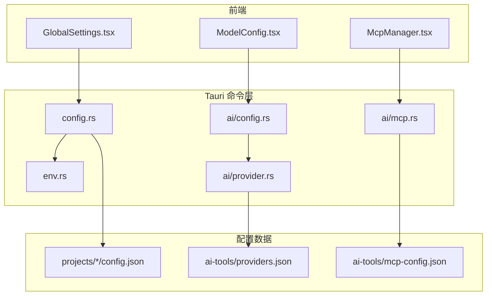
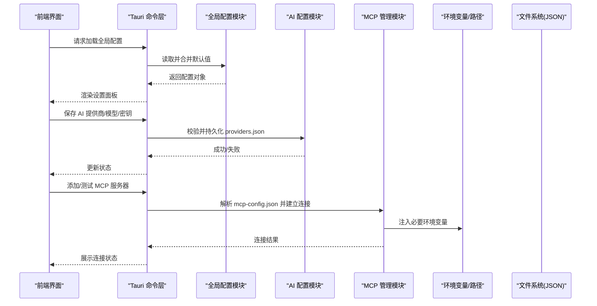
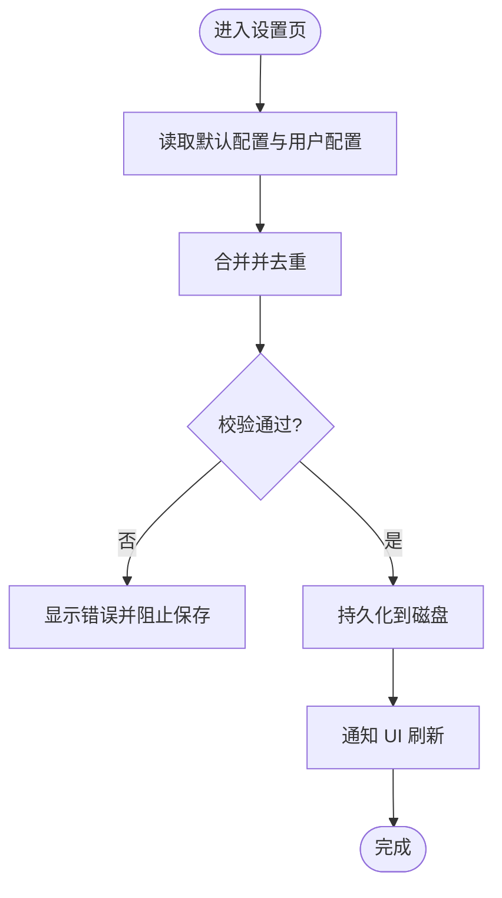
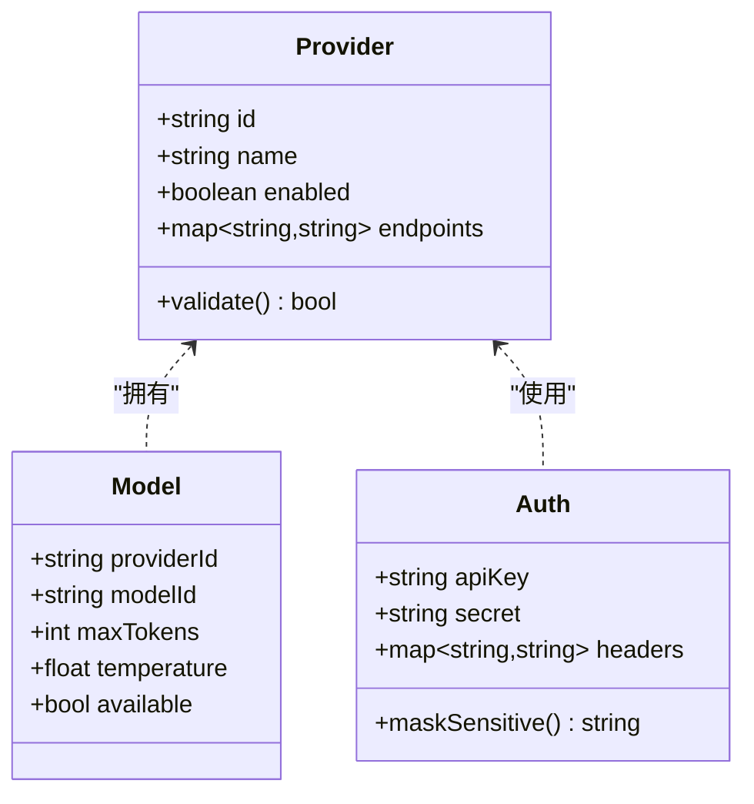
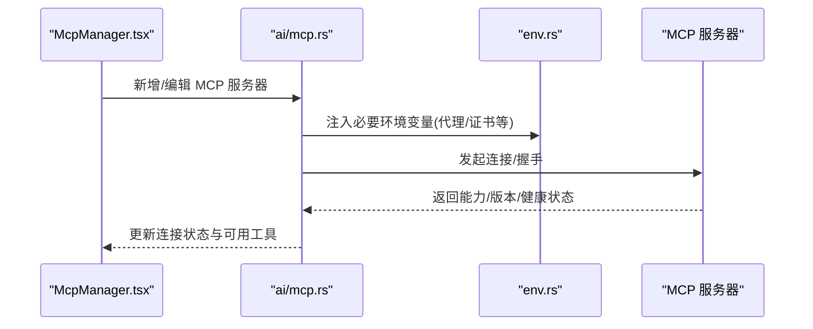
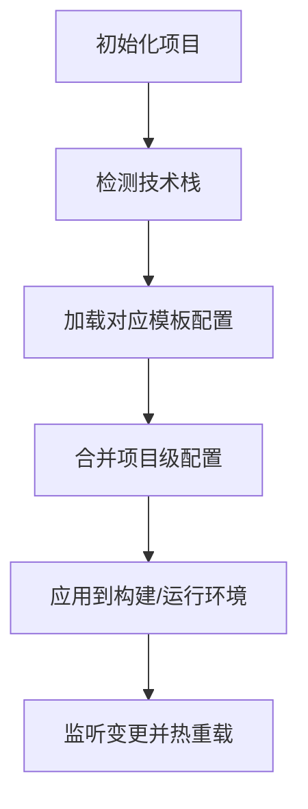
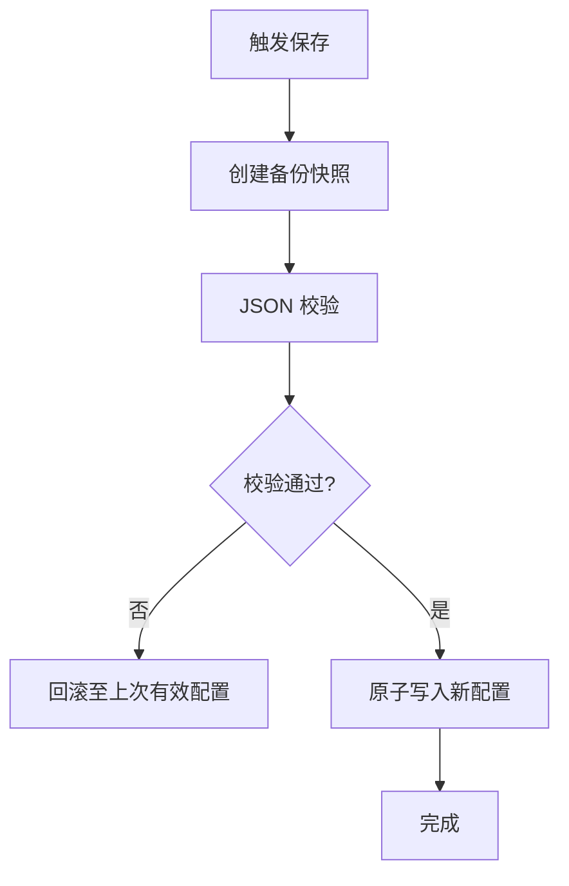
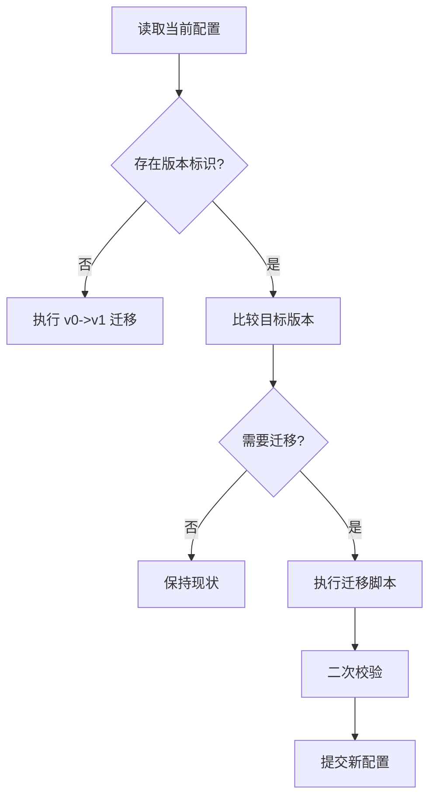
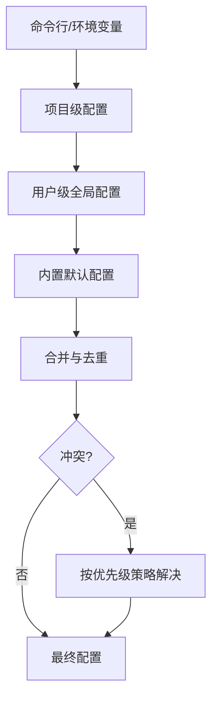
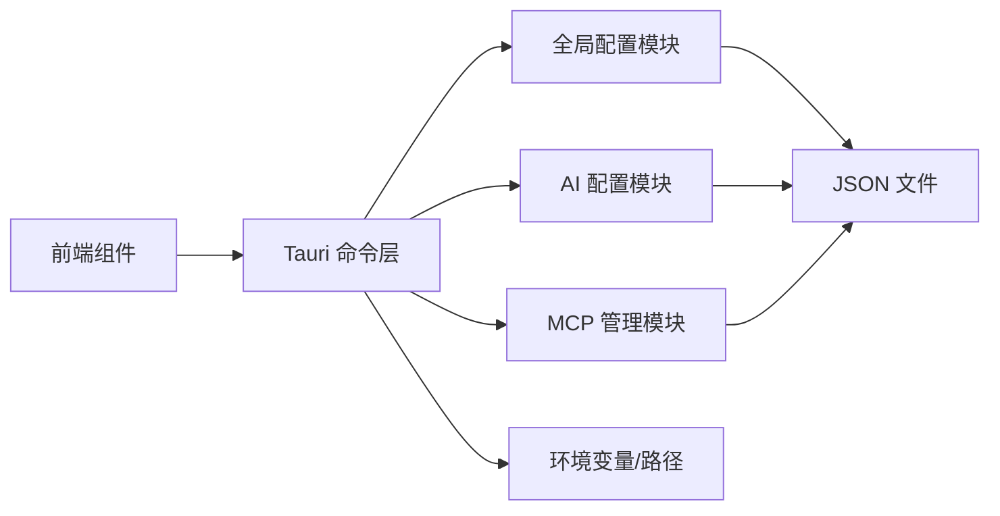

# 配置管理

<cite>
**本文引用的文件**   
- [src-tauri/src/commands/config.rs](file://src-tauri/src/commands/config.rs)
- [src-tauri/src/commands/ai/config.rs](file://src-tauri/src/commands/ai/config.rs)
- [src-tauri/src/commands/ai/mcp.rs](file://src-tauri/src/commands/ai/mcp.rs)
- [src-tauri/src/commands/ai/provider.rs](file://src-tauri/src/commands/ai/provider.rs)
- [src-tauri/src/commands/env.rs](file://src-tauri/src/commands/env.rs)
- [src/components/GlobalSettings.tsx](file://src/components/GlobalSettings.tsx)
- [src/components/ai/McpManager.tsx](file://src/components/ai/McpManager.tsx)
- [src/components/ai/ModelConfig.tsx](file://src/components/ai/ModelConfig.tsx)
- [ai-tools/mcp-config.json](file://ai-tools/mcp-config.json)
- [ai-tools/providers.json](file://ai-tools/providers.json)
- [projects/nodejs/config.json](file://projects/nodejs/config.json)
- [projects/python/config.json](file://projects/python/config.json)
- [projects/go/config.json](file://projects/go/config.json)
</cite>

## 目录
1. [简介](#简介)
2. [项目结构](#项目结构)
3. [核心组件](#核心组件)
4. [架构总览](#架构总览)
5. [详细组件分析](#详细组件分析)
6. [依赖关系分析](#依赖关系分析)
7. [性能考虑](#性能考虑)
8. [故障排查指南](#故障排查指南)
9. [结论](#结论)
10. [附录](#附录)

## 简介
本文件面向配置管理系统，系统性说明全局配置、项目级配置与 AI 工具配置的体系结构与管理机制。内容覆盖：
- 全局配置的结构与选项（应用设置、用户偏好、主题等）
- 项目级配置与配置文件管理机制
- AI 工具配置（提供商设置、API 密钥管理、权限配置）
- MCP 协议配置与服务器连接设置
- 配置文件的验证、备份与恢复
- 配置迁移与版本兼容性处理
- 配置优先级与继承机制
- 初学者基础配置指导与高级用户的自定义/自动化脚本开发指南

## 项目结构
配置相关的前后端组织方式如下：
- 前端 UI 层提供全局设置、AI 模型与 MCP 管理的可视化界面
- Tauri 命令层暴露配置读写、AI 配置、MCP 管理等能力
- ai-tools 与 projects 目录存放 JSON 格式的运行时配置与项目模板配置

图表来源
- [src/components/GlobalSettings.tsx](file://src/components/GlobalSettings.tsx)
- [src/components/ai/ModelConfig.tsx](file://src/components/ai/ModelConfig.tsx)
- [src/components/ai/McpManager.tsx](file://src/components/ai/McpManager.tsx)
- [src-tauri/src/commands/config.rs](file://src-tauri/src/commands/config.rs)
- [src-tauri/src/commands/ai/config.rs](file://src-tauri/src/commands/ai/config.rs)
- [src-tauri/src/commands/ai/mcp.rs](file://src-tauri/src/commands/ai/mcp.rs)
- [src-tauri/src/commands/ai/provider.rs](file://src-tauri/src/commands/ai/provider.rs)
- [src-tauri/src/commands/env.rs](file://src-tauri/src/commands/env.rs)
- [ai-tools/mcp-config.json](file://ai-tools/mcp-config.json)
- [ai-tools/providers.json](file://ai-tools/providers.json)
- [projects/nodejs/config.json](file://projects/nodejs/config.json)
- [projects/python/config.json](file://projects/python/config.json)
- [projects/go/config.json](file://projects/go/config.json)

章节来源
- [src-tauri/src/commands/config.rs](file://src-tauri/src/commands/config.rs)
- [src-tauri/src/commands/ai/config.rs](file://src-tauri/src/commands/ai/config.rs)
- [src-tauri/src/commands/ai/mcp.rs](file://src-tauri/src/commands/ai/mcp.rs)
- [src-tauri/src/commands/ai/provider.rs](file://src-tauri/src/commands/ai/provider.rs)
- [src-tauri/src/commands/env.rs](file://src-tauri/src/commands/env.rs)
- [src/components/GlobalSettings.tsx](file://src/components/GlobalSettings.tsx)
- [src/components/ai/ModelConfig.tsx](file://src/components/ai/ModelConfig.tsx)
- [src/components/ai/McpManager.tsx](file://src/components/ai/McpManager.tsx)
- [ai-tools/mcp-config.json](file://ai-tools/mcp-config.json)
- [ai-tools/providers.json](file://ai-tools/providers.json)
- [projects/nodejs/config.json](file://projects/nodejs/config.json)
- [projects/python/config.json](file://projects/python/config.json)
- [projects/go/config.json](file://projects/go/config.json)

## 核心组件
- 全局配置模块
  - 负责读取/写入全局应用设置、用户偏好、主题等
  - 提供校验、默认值合并、持久化与回滚能力
- AI 配置模块
  - 管理 AI 提供商、模型、鉴权信息（如 API Key）
  - 支持多提供商并存与按场景切换
- MCP 管理模块
  - 维护 MCP 服务器列表、连接参数、生命周期
  - 提供连接测试、状态同步与错误上报
- 环境变量与路径管理
  - 统一注入 PATH、代理、镜像源等运行期环境
- 项目级配置
  - 为不同技术栈提供标准化配置模板与扩展点

章节来源
- [src-tauri/src/commands/config.rs](file://src-tauri/src/commands/config.rs)
- [src-tauri/src/commands/ai/config.rs](file://src-tauri/src/commands/ai/config.rs)
- [src-tauri/src/commands/ai/mcp.rs](file://src-tauri/src/commands/ai/mcp.rs)
- [src-tauri/src/commands/ai/provider.rs](file://src-tauri/src/commands/ai/provider.rs)
- [src-tauri/src/commands/env.rs](file://src-tauri/src/commands/env.rs)

## 架构总览
系统采用“前端 UI + Tauri 命令 + JSON 配置”的分层架构。前端通过 Tauri 命令调用后端能力，后端对 JSON 配置进行读写、校验与持久化；AI 与 MCP 配置分别由独立模块管理，并通过共享的环境变量与路径策略协同工作。

图表来源
- [src/components/GlobalSettings.tsx](file://src/components/GlobalSettings.tsx)
- [src/components/ai/ModelConfig.tsx](file://src/components/ai/ModelConfig.tsx)
- [src/components/ai/McpManager.tsx](file://src/components/ai/McpManager.tsx)
- [src-tauri/src/commands/config.rs](file://src-tauri/src/commands/config.rs)
- [src-tauri/src/commands/ai/config.rs](file://src-tauri/src/commands/ai/config.rs)
- [src-tauri/src/commands/ai/mcp.rs](file://src-tauri/src/commands/ai/mcp.rs)
- [src-tauri/src/commands/env.rs](file://src-tauri/src/commands/env.rs)
- [ai-tools/mcp-config.json](file://ai-tools/mcp-config.json)
- [ai-tools/providers.json](file://ai-tools/providers.json)

## 详细组件分析

### 全局配置（应用设置、用户偏好、主题）
- 职责
  - 定义全局配置的数据结构与默认值
  - 提供读取、写入、校验、合并与持久化接口
  - 支持主题、语言、行为开关等用户偏好
- 关键流程
  - 启动时加载默认配置与用户配置，合并后缓存
  - 变更时触发校验，成功后持久化并通知 UI 刷新
- 建议的字段分组
  - 应用设置：窗口、日志、代理、镜像源
  - 用户偏好：语言、字体、快捷键、自动保存
  - 主题配置：浅色/深色、高对比度、自定义样式

章节来源
- [src-tauri/src/commands/config.rs](file://src-tauri/src/commands/config.rs)
- [src/components/GlobalSettings.tsx](file://src/components/GlobalSettings.tsx)

### AI 工具配置（提供商、模型、鉴权、权限）
- 职责
  - 管理多个 AI 提供商的配置与凭据
  - 维护模型选择、上下文长度、重试策略等
  - 提供权限控制（是否允许访问敏感信息、是否启用自动补全等）
- 关键文件
  - 提供商清单与模型映射：providers.json
  - AI 配置读写命令：ai/config.rs、ai/provider.rs
- 安全建议
  - 敏感字段（如 API Key）应加密或走系统钥匙串
  - 提供最小权限原则与按需授权

图表来源
- [ai-tools/providers.json](file://ai-tools/providers.json)
- [src-tauri/src/commands/ai/config.rs](file://src-tauri/src/commands/ai/config.rs)
- [src-tauri/src/commands/ai/provider.rs](file://src-tauri/src/commands/ai/provider.rs)
- [src/components/ai/ModelConfig.tsx](file://src/components/ai/ModelConfig.tsx)

章节来源
- [src-tauri/src/commands/ai/config.rs](file://src-tauri/src/commands/ai/config.rs)
- [src-tauri/src/commands/ai/provider.rs](file://src-tauri/src/commands/ai/provider.rs)
- [ai-tools/providers.json](file://ai-tools/providers.json)
- [src/components/ai/ModelConfig.tsx](file://src/components/ai/ModelConfig.tsx)

### MCP 协议配置与服务器连接
- 职责
  - 维护 MCP 服务器列表、连接参数、认证信息
  - 提供连接测试、状态轮询与错误诊断
- 关键文件
  - MCP 配置：mcp-config.json
  - MCP 管理命令：ai/mcp.rs
  - 前端管理界面：McpManager.tsx
- 连接流程
  - 解析配置 -> 注入环境变量 -> 发起握手 -> 返回健康状态

图表来源
- [src/components/ai/McpManager.tsx](file://src/components/ai/McpManager.tsx)
- [src-tauri/src/commands/ai/mcp.rs](file://src-tauri/src/commands/ai/mcp.rs)
- [src-tauri/src/commands/env.rs](file://src-tauri/src/commands/env.rs)
- [ai-tools/mcp-config.json](file://ai-tools/mcp-config.json)

章节来源
- [src-tauri/src/commands/ai/mcp.rs](file://src-tauri/src/commands/ai/mcp.rs)
- [src-tauri/src/commands/env.rs](file://src-tauri/src/commands/env.rs)
- [ai-tools/mcp-config.json](file://ai-tools/mcp-config.json)
- [src/components/ai/McpManager.tsx](file://src/components/ai/McpManager.tsx)

### 项目级配置与配置文件管理
- 目标
  - 为不同技术栈提供一致的配置入口与扩展点
  - 支持包管理器、环境变量、远程版本等元数据
- 典型结构
  - config.json：项目类型、构建/运行参数、插件开关
  - env_vars.json：项目级环境变量
  - package_managers.json：包管理器与镜像源
  - find_rules.json / remote_versions_config.json：规则与版本策略
- 示例路径
  - Node.js：projects/nodejs/config.json
  - Python：projects/python/config.json
  - Go：projects/go/config.json

章节来源
- [projects/nodejs/config.json](file://projects/nodejs/config.json)
- [projects/python/config.json](file://projects/python/config.json)
- [projects/go/config.json](file://projects/go/config.json)

### 配置文件的验证、备份与恢复
- 验证
  - 在保存前执行 schema 校验，返回具体错误位置与修复建议
- 备份
  - 保存前生成时间戳快照，保留最近 N 份历史
- 恢复
  - 从历史快照一键恢复，支持选择性回滚
- 建议实现要点
  - 原子写入（先写临时文件再替换）
  - 幂等保存（重复保存不产生额外副本）
  - 校验失败不覆盖旧配置

[本节为通用设计说明，无需代码来源]

### 配置迁移与版本兼容性
- 版本标记
  - 在配置根节点记录版本号，便于升级判断
- 迁移策略
  - 向后兼容：旧字段在新版本仍被识别并提示弃用
  - 向前兼容：新版本字段在旧版本忽略并降级
- 迁移脚本
  - 提供 CLI 或命令式迁移函数，批量转换字段名/结构
  - 迁移前后输出差异报告，支持人工确认

[本节为通用设计说明，无需代码来源]

### 配置优先级与继承机制
- 优先级顺序（从高到低）
  - 命令行参数/环境变量
  - 项目级配置
  - 用户级全局配置
  - 内置默认配置
- 继承规则
  - 子级未设置的字段继承父级
  - 数组型字段支持追加而非覆盖
  - 布尔开关优先采用显式声明
- 冲突解决
  - 明确标注可覆盖字段与只读字段
  - 对敏感字段禁止从低优先级覆盖

[本节为通用设计说明，无需代码来源]

### 初学者基础配置指导
- 快速上手
  - 打开全局设置，选择主题与语言
  - 在 AI 配置中添加一个提供商并填入 API Key
  - 在 MCP 管理中添加本地或远程服务器并测试连接
- 常见问题
  - 网络问题：检查代理与镜像源设置
  - 权限问题：确认密钥范围与访问白名单
  - 连接失败：查看 MCP 健康状态与错误日志

[本节为通用指导，无需代码来源]

### 高级用户自定义与自动化脚本
- 自定义配置
  - 基于现有 JSON 模板扩展字段，并在命令层增加校验与迁移逻辑
- 自动化脚本
  - 编写批量导入/导出脚本，结合 CI/CD 进行配置分发
  - 使用 diff 工具生成变更报告，配合审批流程
- 最佳实践
  - 将敏感信息放入系统钥匙串或外部密钥管理服务
  - 使用不可变配置（CI 生成，运行时只读）

[本节为通用指导，无需代码来源]

## 依赖关系分析
- 组件耦合
  - 前端仅依赖 Tauri 命令接口，降低与实现的耦合
  - AI 与 MCP 模块通过环境变量与文件系统交互，边界清晰
- 外部依赖
  - JSON 配置文件作为持久化载体
  - 系统环境变量用于注入运行时参数
- 潜在风险
  - 循环依赖应避免（命令层不应反向依赖 UI）
  - 大配置文件的读写需考虑异步与锁机制

图表来源
- [src/components/GlobalSettings.tsx](file://src/components/GlobalSettings.tsx)
- [src/components/ai/ModelConfig.tsx](file://src/components/ai/ModelConfig.tsx)
- [src/components/ai/McpManager.tsx](file://src/components/ai/McpManager.tsx)
- [src-tauri/src/commands/config.rs](file://src-tauri/src/commands/config.rs)
- [src-tauri/src/commands/ai/config.rs](file://src-tauri/src/commands/ai/config.rs)
- [src-tauri/src/commands/ai/mcp.rs](file://src-tauri/src/commands/ai/mcp.rs)
- [src-tauri/src/commands/env.rs](file://src-tauri/src/commands/env.rs)

章节来源
- [src-tauri/src/commands/config.rs](file://src-tauri/src/commands/config.rs)
- [src-tauri/src/commands/ai/config.rs](file://src-tauri/src/commands/ai/config.rs)
- [src-tauri/src/commands/ai/mcp.rs](file://src-tauri/src/commands/ai/mcp.rs)
- [src-tauri/src/commands/env.rs](file://src-tauri/src/commands/env.rs)

## 性能考虑
- 配置加载
  - 启动时懒加载非关键配置，减少首屏耗时
- 文件 IO
  - 使用原子写入与增量保存，避免频繁全量写入
- 并发访问
  - 引入读写锁，防止竞态条件
- 缓存策略
  - 内存中缓存已校验的配置对象，变更时失效并重建

[本节为通用指导，无需代码来源]

## 故障排查指南
- 常见错误
  - JSON 格式错误：定位行号与键名，使用格式化器修复
  - 权限不足：检查文件读写权限与密钥存储
  - MCP 连接失败：核对地址、端口、证书与代理
- 诊断步骤
  - 查看命令层日志与返回码
  - 比对备份快照与当前配置差异
  - 逐步禁用功能以隔离问题

章节来源
- [src-tauri/src/commands/config.rs](file://src-tauri/src/commands/config.rs)
- [src-tauri/src/commands/ai/mcp.rs](file://src-tauri/src/commands/ai/mcp.rs)
- [src-tauri/src/commands/env.rs](file://src-tauri/src/commands/env.rs)

## 结论
本配置管理体系通过分层设计与清晰的职责划分，实现了全局与项目级配置的统一管理，同时为 AI 工具与 MCP 提供了可扩展的配置与连接能力。借助验证、备份、迁移与优先级机制，系统在易用性与可靠性之间取得平衡，适合从入门到高级的多层次用户需求。

## 附录
- 术语
  - MCP：Model Context Protocol，模型上下文协议
  - 提供商：AI 服务提供方（如 OpenAI、Claude 等）
  - 原子写入：先写临时文件再替换，保证一致性
- 参考路径
  - 全局配置命令：src-tauri/src/commands/config.rs
  - AI 配置命令：src-tauri/src/commands/ai/config.rs、src-tauri/src/commands/ai/provider.rs
  - MCP 管理命令：src-tauri/src/commands/ai/mcp.rs
  - 环境变量管理：src-tauri/src/commands/env.rs
  - 前端界面：src/components/GlobalSettings.tsx、src/components/ai/ModelConfig.tsx、src/components/ai/McpManager.tsx
  - 配置文件样例：ai-tools/mcp-config.json、ai-tools/providers.json、projects/*/config.json