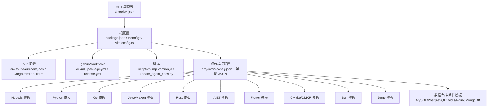
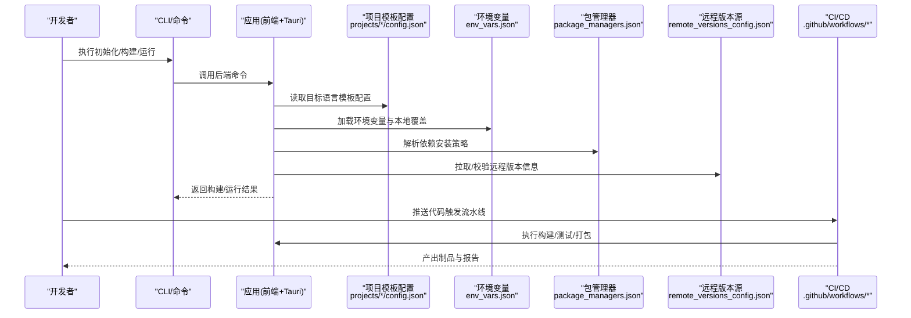
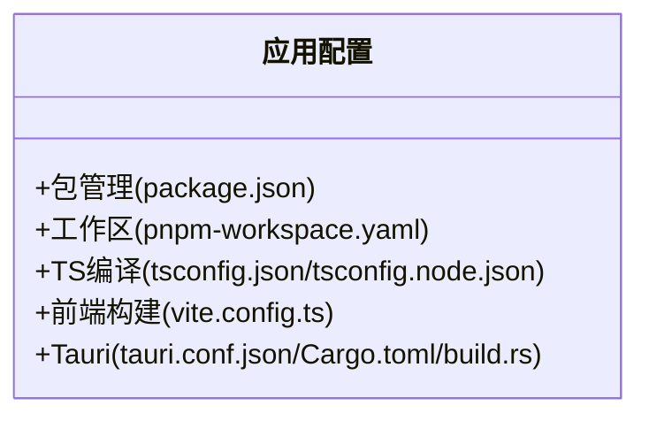
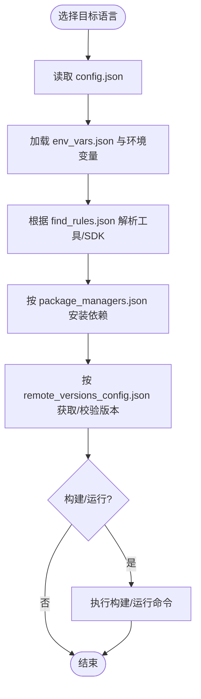
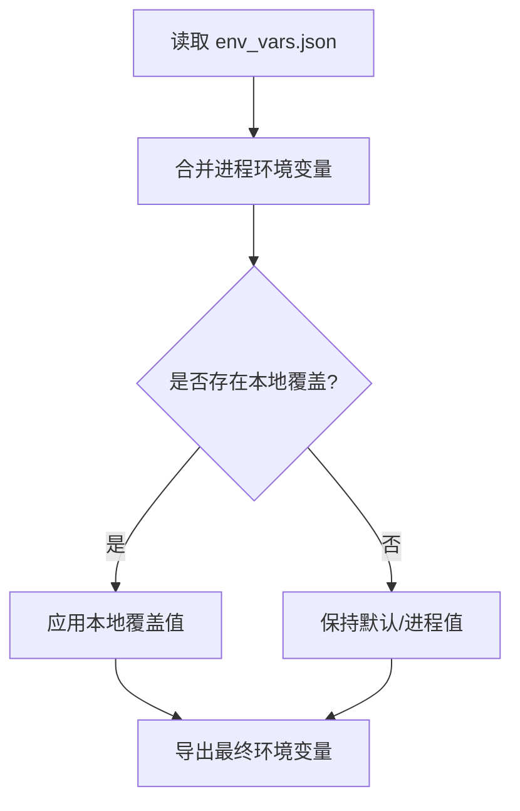
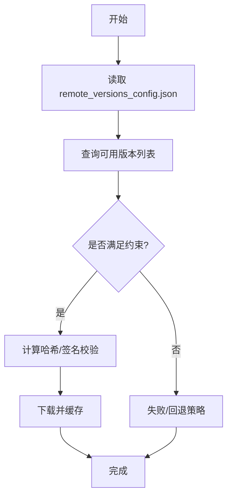
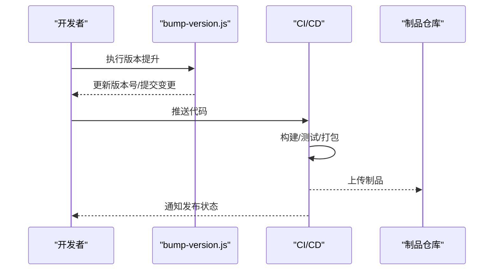
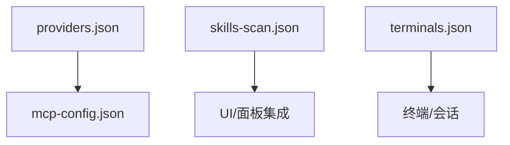
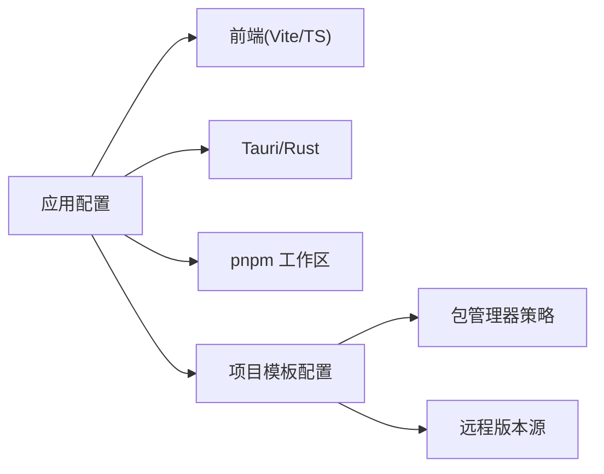

# 项目配置

<cite>
**本文引用的文件**   
- [package.json](file://package.json)
- [pnpm-workspace.yaml](file://pnpm-workspace.yaml)
- [tsconfig.json](file://tsconfig.json)
- [tsconfig.node.json](file://tsconfig.node.json)
- [vite.config.ts](file://vite.config.ts)
- [tauri.conf.json](file://src-tauri/tauri.conf.json)
- [Cargo.toml](file://src-tauri/Cargo.toml)
- [build.rs](file://src-tauri/build.rs)
- [ci.yml](file://.github/workflows/ci.yml)
- [package.yml](file://.github/workflows/package.yml)
- [release.yml](file://.github/workflows/release.yml)
- [projects/nodejs/config.json](file://projects/nodejs/config.json)
- [projects/nodejs/env_vars.json](file://projects/nodejs/env_vars.json)
- [projects/nodejs/find_rules.json](file://projects/nodejs/find_rules.json)
- [projects/nodejs/package_managers.json](file://projects/nodejs/package_managers.json)
- [projects/nodejs/remote_versions_config.json](file://projects/nodejs/remote_versions_config.json)
- [projects/python/config.json](file://projects/python/config.json)
- [projects/python/env_vars.json](file://projects/python/env_vars.json)
- [projects/python/find_rules.json](file://projects/python/find_rules.json)
- [projects/python/package_managers.json](file://projects/python/package_managers.json)
- [projects/python/remote_versions_config.json](file://projects/python/remote_versions_config.json)
- [projects/go/config.json](file://projects/go/config.json)
- [projects/go/env_vars.json](file://projects/go/env_vars.json)
- [projects/go/find_rules.json](file://projects/go/find_rules.json)
- [projects/go/package_managers.json](file://projects/go/package_managers.json)
- [projects/go/remote_versions_config.json](file://projects/go/remote_versions_config.json)
- [projects/java/config.json](file://projects/java/config.json)
- [projects/java/env_vars.json](file://projects/java/env_vars.json)
- [projects/java/find_rules.json](file://projects/java/find_rules.json)
- [projects/java/remote_versions_config.json](file://projects/java/remote_versions_config.json)
- [projects/maven/config.json](file://projects/maven/config.json)
- [projects/maven/env_vars.json](file://projects/maven/env_vars.json)
- [projects/maven/find_rules.json](file://projects/maven/find_rules.json)
- [projects/maven/package_managers.json](file://projects/maven/remote_versions_config.json)
- [projects/rust/config.json](file://projects/rust/config.json)
- [projects/rust/env_vars.json](file://projects/rust/env_vars.json)
- [projects/rust/find_rules.json](file://projects/rust/find_rules.json)
- [projects/rust/package_managers.json](file://projects/rust/package_managers.json)
- [projects/rust/remote_versions_config.json](file://projects/rust/remote_versions_config.json)
- [projects/dotnet/config.json](file://projects/dotnet/config.json)
- [projects/dotnet/env_vars.json](file://projects/dotnet/env_vars.json)
- [projects/dotnet/find_rules.json](file://projects/dotnet/package_managers.json)
- [projects/dotnet/remote_versions_config.json](file://projects/dotnet/remote_versions_config.json)
- [projects/flutter/config.json](file://projects/flutter/config.json)
- [projects/flutter/env_vars.json](file://projects/flutter/env_vars.json)
- [projects/flutter/find_rules.json](file://projects/flutter/package_managers.json)
- [projects/flutter/remote_versions_config.json](file://projects/flutter/remote_versions_config.json)
- [projects/cmake/config.json](file://projects/cmake/config.json)
- [projects/cmake/find_rules.json](file://projects/cmake/find_rules.json)
- [projects/cmake/package_managers.json](file://projects/cmake/package_managers.json)
- [projects/cmkr/config.json](file://projects/cmkr/config.json)
- [projects/cmkr/find_rules.json](file://projects/cmkr/find_rules.json)
- [projects/bun/config.json](file://projects/bun/config.json)
- [projects/bun/find_rules.json](file://projects/bun/find_rules.json)
- [projects/bun/package_managers.json](file://projects/bun/package_managers.json)
- [projects/bun/remote_versions_config.json](file://projects/bun/remote_versions_config.json)
- [projects/deno/config.json](file://projects/deno/config.json)
- [projects/deno/env_vars.json](file://projects/deno/env_vars.json)
- [projects/deno/find_rules.json](file://projects/deno/find_rules.json)
- [projects/deno/package_managers.json](file://projects/deno/package_managers.json)
- [projects/deno/remote_versions_config.json](file://projects/deno/remote_versions_config.json)
- [projects/mysql/config.json](file://projects/mysql/config.json)
- [projects/mysql/find_rules.json](file://projects/mysql/find_rules.json)
- [projects/mysql/remote_versions_config.json](file://projects/mysql/remote_versions_config.json)
- [projects/postgresql/config.json](file://projects/postgresql/config.json)
- [projects/postgresql/find_rules.json](file://projects/postgresql/find_rules.json)
- [projects/postgresql/remote_versions_config.json](file://projects/postgresql/remote_versions_config.json)
- [projects/redis/config.json](file://projects/redis/config.json)
- [projects/redis/find_rules.json](file://projects/redis/find_rules.json)
- [projects/redis/remote_versions_config.json](file://projects/redis/remote_versions_config.json)
- [projects/nginx/config.json](file://projects/nginx/config.json)
- [projects/nginx/find_rules.json](file://projects/nginx/find_rules.json)
- [projects/nginx/remote_versions_config.json](file://projects/nginx/remote_versions_config.json)
- [projects/mongodb/config.json](file://projects/mongodb/config.json)
- [projects/mongodb/find_rules.json](file://projects/mongodb/find_rules.json)
- [projects/mongodb/remote_versions_config.json](file://projects/mongodb/remote_versions_config.json)
- [projects/frpc/config.json](file://projects/frpc/config.json)
- [projects/frpc/find_rules.json](file://projects/frpc/find_rules.json)
- [projects/frps/config.json](file://projects/frps/config.json)
- [projects/frps/find_rules.json](file://projects/frps/find_rules.json)
- [projects/vcpkg/config.json](file://projects/vcpkg/config.json)
- [projects/vcpkg/find_rules.json](file://projects/vcpkg/find_rules.json)
- [projects/vcpkg/package_managers.json](file://projects/vcpkg/package_managers.json)
- [ai-tools/providers.json](file://ai-tools/providers.json)
- [ai-tools/mcp-config.json](file://ai-tools/mcp-config.json)
- [ai-tools/skills-scan.json](file://ai-tools/skills-scan.json)
- [ai-tools/terminals.json](file://ai-tools/terminals.json)
- [scripts/bump-version.js](file://scripts/bump-version.js)
- [scripts/update_agent_docs.py](file://scripts/update_agent_docs.py)
- [CLAUDE.md](file://CLAUDE.md)
</cite>

## 目录
1. [简介](#简介)
2. [项目结构](#项目结构)
3. [核心组件](#核心组件)
4. [架构总览](#架构总览)
5. [详细组件分析](#详细组件分析)
6. [依赖分析](#依赖分析)
7. [性能考虑](#性能考虑)
8. [故障排查指南](#故障排查指南)
9. [结论](#结论)
10. [附录](#附录)

## 简介
本文件面向“项目配置系统”，系统化说明本项目中多语言、多工具链的配置结构与语法，覆盖环境定义、版本管理、依赖配置、构建脚本、继承与优先级规则、环境变量与敏感信息管理、验证与排错、迁移与兼容性策略，以及最佳实践与自动化脚本开发指导。文档以仓库内实际配置文件为依据，结合可视化图示帮助读者快速理解并落地使用。

## 项目结构
本项目采用“前端（Vite+TS）+ Tauri（Rust）”的桌面应用形态，并通过集中化的“项目模板配置”目录为不同技术栈提供统一的项目级配置能力。根级配置负责应用自身构建与发布；子目录 projects/* 为各语言/框架提供可复用的项目级配置模板；ai-tools 目录用于 AI 工具生态的配置；scripts 提供版本与文档自动化脚本；.github/workflows 提供 CI/CD 流水线。

图表来源
- [package.json:1-200](file://package.json#L1-L200)
- [tsconfig.json:1-200](file://tsconfig.json#L1-L200)
- [tsconfig.node.json:1-200](file://tsconfig.node.json#L1-L200)
- [vite.config.ts:1-200](file://vite.config.ts#L1-L200)
- [src-tauri/tauri.conf.json:1-200](file://src-tauri/tauri.conf.json#L1-L200)
- [src-tauri/Cargo.toml:1-200](file://src-tauri/Cargo.toml#L1-L200)
- [src-tauri/build.rs:1-200](file://src-tauri/build.rs#L1-L200)
- [.github/workflows/ci.yml:1-200](file://.github/workflows/ci.yml#L1-L200)
- [.github/workflows/package.yml:1-200](file://.github/workflows/package.yml#L1-L200)
- [.github/workflows/release.yml:1-200](file://.github/workflows/release.yml#L1-L200)
- [projects/nodejs/config.json:1-200](file://projects/nodejs/config.json#L1-L200)
- [projects/python/config.json:1-200](file://projects/python/config.json#L1-L200)
- [projects/go/config.json:1-200](file://projects/go/config.json#L1-L200)
- [projects/java/config.json:1-200](file://projects/java/config.json#L1-L200)
- [projects/rust/config.json:1-200](file://projects/rust/config.json#L1-L200)
- [projects/dotnet/config.json:1-200](file://projects/dotnet/config.json#L1-L200)
- [projects/flutter/config.json:1-200](file://projects/flutter/config.json#L1-L200)
- [projects/cmake/config.json:1-200](file://projects/cmake/config.json#L1-L200)
- [projects/bun/config.json:1-200](file://projects/bun/config.json#L1-L200)
- [projects/deno/config.json:1-200](file://projects/deno/config.json#L1-L200)
- [ai-tools/providers.json:1-200](file://ai-tools/providers.json#L1-L200)

章节来源
- [package.json:1-200](file://package.json#L1-L200)
- [pnpm-workspace.yaml:1-200](file://pnpm-workspace.yaml#L1-L200)
- [tsconfig.json:1-200](file://tsconfig.json#L1-L200)
- [tsconfig.node.json:1-200](file://tsconfig.node.json#L1-L200)
- [vite.config.ts:1-200](file://vite.config.ts#L1-L200)
- [src-tauri/tauri.conf.json:1-200](file://src-tauri/tauri.conf.json#L1-L200)
- [src-tauri/Cargo.toml:1-200](file://src-tauri/Cargo.toml#L1-L200)
- [src-tauri/build.rs:1-200](file://src-tauri/build.rs#L1-L200)
- [.github/workflows/ci.yml:1-200](file://.github/workflows/ci.yml#L1-L200)
- [.github/workflows/package.yml:1-200](file://.github/workflows/package.yml#L1-L200)
- [.github/workflows/release.yml:1-200](file://.github/workflows/release.yml#L1-L200)

## 核心组件
- 应用级配置
  - 包管理与工作区：package.json、pnpm-workspace.yaml
  - TypeScript 编译：tsconfig.json、tsconfig.node.json
  - 前端构建：vite.config.ts
  - Tauri 桌面端：src-tauri/tauri.conf.json、src-tauri/Cargo.toml、src-tauri/build.rs
- 项目模板配置（跨语言）
  - 每个技术栈在 projects/<lang>/ 下提供 config.json 及可选 env_vars.json、find_rules.json、package_managers.json、remote_versions_config.json
- AI 工具配置
  - ai-tools/providers.json、mcp-config.json、skills-scan.json、terminals.json
- 自动化与 CI/CD
  - scripts/bump-version.js、scripts/update_agent_docs.py
  - .github/workflows/ci.yml、package.yml、release.yml

章节来源
- [package.json:1-200](file://package.json#L1-L200)
- [pnpm-workspace.yaml:1-200](file://pnpm-workspace.yaml#L1-L200)
- [tsconfig.json:1-200](file://tsconfig.json#L1-L200)
- [tsconfig.node.json:1-200](file://tsconfig.node.json#L1-L200)
- [vite.config.ts:1-200](file://vite.config.ts#L1-L200)
- [src-tauri/tauri.conf.json:1-200](file://src-tauri/tauri.conf.json#L1-L200)
- [src-tauri/Cargo.toml:1-200](file://src-tauri/Cargo.toml#L1-L200)
- [src-tauri/build.rs:1-200](file://src-tauri/build.rs#L1-L200)
- [projects/nodejs/config.json:1-200](file://projects/nodejs/config.json#L1-L200)
- [projects/python/config.json:1-200](file://projects/python/config.json#L1-L200)
- [projects/go/config.json:1-200](file://projects/go/config.json#L1-L200)
- [projects/java/config.json:1-200](file://projects/java/config.json#L1-L200)
- [projects/rust/config.json:1-200](file://projects/rust/config.json#L1-L200)
- [projects/dotnet/config.json:1-200](file://projects/dotnet/config.json#L1-L200)
- [projects/flutter/config.json:1-200](file://projects/flutter/config.json#L1-L200)
- [projects/cmake/config.json:1-200](file://projects/cmake/config.json#L1-L200)
- [projects/bun/config.json:1-200](file://projects/bun/config.json#L1-L200)
- [projects/deno/config.json:1-200](file://projects/deno/config.json#L1-L200)
- [ai-tools/providers.json:1-200](file://ai-tools/providers.json#L1-L200)
- [ai-tools/mcp-config.json:1-200](file://ai-tools/mcp-config.json#L1-L200)
- [ai-tools/skills-scan.json:1-200](file://ai-tools/skills-scan.json#L1-L200)
- [ai-tools/terminals.json:1-200](file://ai-tools/terminals.json#L1-L200)
- [scripts/bump-version.js:1-200](file://scripts/bump-version.js#L1-L200)
- [scripts/update_agent_docs.py:1-200](file://scripts/update_agent_docs.py#L1-L200)
- [.github/workflows/ci.yml:1-200](file://.github/workflows/ci.yml#L1-L200)
- [.github/workflows/package.yml:1-200](file://.github/workflows/package.yml#L1-L200)
- [.github/workflows/release.yml:1-200](file://.github/workflows/release.yml#L1-L200)

## 架构总览
下图展示从“应用启动/构建”到“项目模板解析与环境装配”的整体流程，以及 CI/CD 如何驱动版本与打包。

图表来源
- [src-tauri/tauri.conf.json:1-200](file://src-tauri/tauri.conf.json#L1-L200)
- [src-tauri/Cargo.toml:1-200](file://src-tauri/Cargo.toml#L1-L200)
- [src-tauri/build.rs:1-200](file://src-tauri/build.rs#L1-L200)
- [projects/nodejs/config.json:1-200](file://projects/nodejs/config.json#L1-L200)
- [projects/nodejs/env_vars.json:1-200](file://projects/nodejs/env_vars.json#L1-L200)
- [projects/nodejs/package_managers.json:1-200](file://projects/nodejs/package_managers.json#L1-L200)
- [projects/nodejs/remote_versions_config.json:1-200](file://projects/nodejs/remote_versions_config.json#L1-L200)
- [.github/workflows/ci.yml:1-200](file://.github/workflows/ci.yml#L1-L200)
- [.github/workflows/package.yml:1-200](file://.github/workflows/package.yml#L1-L200)
- [.github/workflows/release.yml:1-200](file://.github/workflows/release.yml#L1-L200)

## 详细组件分析

### 应用级配置（前端与 Tauri）
- 包管理与工作区
  - package.json：声明应用元数据、脚本、依赖与工作区入口
  - pnpm-workspace.yaml：定义工作区范围与包发现规则
- TypeScript 编译
  - tsconfig.json：全局 TS 编译选项与路径映射
  - tsconfig.node.json：Node 侧编译选项（如 Tauri 后端或脚本）
- 前端构建
  - vite.config.ts：Vite 构建、插件、代理、输出等
- Tauri 桌面端
  - src-tauri/tauri.conf.json：窗口、权限、资源、构建产物等
  - src-tauri/Cargo.toml：Rust 依赖、特性、二进制名等
  - src-tauri/build.rs：构建期脚本（如生成配置、拷贝资源）

图表来源
- [package.json:1-200](file://package.json#L1-L200)
- [pnpm-workspace.yaml:1-200](file://pnpm-workspace.yaml#L1-L200)
- [tsconfig.json:1-200](file://tsconfig.json#L1-L200)
- [tsconfig.node.json:1-200](file://tsconfig.node.json#L1-L200)
- [vite.config.ts:1-200](file://vite.config.ts#L1-L200)
- [src-tauri/tauri.conf.json:1-200](file://src-tauri/tauri.conf.json#L1-L200)
- [src-tauri/Cargo.toml:1-200](file://src-tauri/Cargo.toml#L1-L200)
- [src-tauri/build.rs:1-200](file://src-tauri/build.rs#L1-L200)

章节来源
- [package.json:1-200](file://package.json#L1-L200)
- [pnpm-workspace.yaml:1-200](file://pnpm-workspace.yaml#L1-L200)
- [tsconfig.json:1-200](file://tsconfig.json#L1-L200)
- [tsconfig.node.json:1-200](file://tsconfig.node.json#L1-L200)
- [vite.config.ts:1-200](file://vite.config.ts#L1-L200)
- [src-tauri/tauri.conf.json:1-200](file://src-tauri/tauri.conf.json#L1-L200)
- [src-tauri/Cargo.toml:1-200](file://src-tauri/Cargo.toml#L1-L200)
- [src-tauri/build.rs:1-200](file://src-tauri/build.rs#L1-L200)

### 项目模板配置（跨语言）
每个语言/框架在 projects/<lang>/ 下提供一套标准化配置：
- config.json：项目模板主配置（包含环境、SDK/运行时、构建命令、IDE 集成等）
- env_vars.json：默认环境变量集合（可按环境覆盖）
- find_rules.json：工具/SDK 查找规则（路径、版本匹配、回退策略）
- package_managers.json：包管理器策略（镜像、缓存、安装参数）
- remote_versions_config.json：远程版本源与校验策略（签名、哈希、镜像）

图表来源
- [projects/nodejs/config.json:1-200](file://projects/nodejs/config.json#L1-L200)
- [projects/nodejs/env_vars.json:1-200](file://projects/nodejs/env_vars.json#L1-L200)
- [projects/nodejs/find_rules.json:1-200](file://projects/nodejs/find_rules.json#L1-L200)
- [projects/nodejs/package_managers.json:1-200](file://projects/nodejs/package_managers.json#L1-L200)
- [projects/nodejs/remote_versions_config.json:1-200](file://projects/nodejs/remote_versions_config.json#L1-L200)
- [projects/python/config.json:1-200](file://projects/python/config.json#L1-L200)
- [projects/go/config.json:1-200](file://projects/go/config.json#L1-L200)
- [projects/java/config.json:1-200](file://projects/java/config.json#L1-L200)
- [projects/rust/config.json:1-200](file://projects/rust/config.json#L1-L200)
- [projects/dotnet/config.json:1-200](file://projects/dotnet/config.json#L1-L200)
- [projects/flutter/config.json:1-200](file://projects/flutter/config.json#L1-L200)
- [projects/cmake/config.json:1-200](file://projects/cmake/config.json#L1-L200)
- [projects/bun/config.json:1-200](file://projects/bun/config.json#L1-L200)
- [projects/deno/config.json:1-200](file://projects/deno/config.json#L1-L200)

章节来源
- [projects/nodejs/config.json:1-200](file://projects/nodejs/config.json#L1-L200)
- [projects/nodejs/env_vars.json:1-200](file://projects/nodejs/env_vars.json#L1-L200)
- [projects/nodejs/find_rules.json:1-200](file://projects/nodejs/find_rules.json#L1-L200)
- [projects/nodejs/package_managers.json:1-200](file://projects/nodejs/package_managers.json#L1-L200)
- [projects/nodejs/remote_versions_config.json:1-200](file://projects/nodejs/remote_versions_config.json#L1-L200)
- [projects/python/config.json:1-200](file://projects/python/config.json#L1-L200)
- [projects/python/env_vars.json:1-200](file://projects/python/env_vars.json#L1-L200)
- [projects/python/find_rules.json:1-200](file://projects/python/find_rules.json#L1-L200)
- [projects/python/package_managers.json:1-200](file://projects/python/package_managers.json#L1-L200)
- [projects/python/remote_versions_config.json:1-200](file://projects/python/remote_versions_config.json#L1-L200)
- [projects/go/config.json:1-200](file://projects/go/config.json#L1-L200)
- [projects/go/env_vars.json:1-200](file://projects/go/env_vars.json#L1-L200)
- [projects/go/find_rules.json:1-200](file://projects/go/find_rules.json#L1-L200)
- [projects/go/package_managers.json:1-200](file://projects/go/package_managers.json#L1-L200)
- [projects/go/remote_versions_config.json:1-200](file://projects/go/remote_versions_config.json#L1-L200)
- [projects/java/config.json:1-200](file://projects/java/config.json#L1-L200)
- [projects/java/env_vars.json:1-200](file://projects/java/env_vars.json#L1-L200)
- [projects/java/find_rules.json:1-200](file://projects/java/find_rules.json#L1-L200)
- [projects/java/remote_versions_config.json:1-200](file://projects/java/remote_versions_config.json#L1-L200)
- [projects/maven/config.json:1-200](file://projects/maven/config.json#L1-L200)
- [projects/maven/env_vars.json:1-200](file://projects/maven/env_vars.json#L1-L200)
- [projects/maven/find_rules.json:1-200](file://projects/maven/find_rules.json#L1-L200)
- [projects/maven/package_managers.json:1-200](file://projects/maven/package_managers.json#L1-L200)
- [projects/rust/config.json:1-200](file://projects/rust/config.json#L1-L200)
- [projects/rust/env_vars.json:1-200](file://projects/rust/env_vars.json#L1-L200)
- [projects/rust/find_rules.json:1-200](file://projects/rust/find_rules.json#L1-L200)
- [projects/rust/package_managers.json:1-200](file://projects/rust/package_managers.json#L1-L200)
- [projects/rust/remote_versions_config.json:1-200](file://projects/rust/remote_versions_config.json#L1-L200)
- [projects/dotnet/config.json:1-200](file://projects/dotnet/config.json#L1-L200)
- [projects/dotnet/env_vars.json:1-200](file://projects/dotnet/env_vars.json#L1-L200)
- [projects/dotnet/find_rules.json:1-200](file://projects/dotnet/find_rules.json#L1-L200)
- [projects/dotnet/package_managers.json:1-200](file://projects/dotnet/package_managers.json#L1-L200)
- [projects/dotnet/remote_versions_config.json:1-200](file://projects/dotnet/remote_versions_config.json#L1-L200)
- [projects/flutter/config.json:1-200](file://projects/flutter/config.json#L1-L200)
- [projects/flutter/env_vars.json:1-200](file://projects/flutter/env_vars.json#L1-L200)
- [projects/flutter/find_rules.json:1-200](file://projects/flutter/find_rules.json#L1-L200)
- [projects/flutter/package_managers.json:1-200](file://projects/flutter/package_managers.json#L1-L200)
- [projects/flutter/remote_versions_config.json:1-200](file://projects/flutter/remote_versions_config.json#L1-L200)
- [projects/cmake/config.json:1-200](file://projects/cmake/config.json#L1-L200)
- [projects/cmake/find_rules.json:1-200](file://projects/cmake/find_rules.json#L1-L200)
- [projects/cmake/package_managers.json:1-200](file://projects/cmake/package_managers.json#L1-L200)
- [projects/cmkr/config.json:1-200](file://projects/cmkr/config.json#L1-L200)
- [projects/cmkr/find_rules.json:1-200](file://projects/cmkr/find_rules.json#L1-L200)
- [projects/bun/config.json:1-200](file://projects/bun/config.json#L1-L200)
- [projects/bun/find_rules.json:1-200](file://projects/bun/find_rules.json#L1-L200)
- [projects/bun/package_managers.json:1-200](file://projects/bun/package_managers.json#L1-L200)
- [projects/bun/remote_versions_config.json:1-200](file://projects/bun/remote_versions_config.json#L1-L200)
- [projects/deno/config.json:1-200](file://projects/deno/config.json#L1-L200)
- [projects/deno/env_vars.json:1-200](file://projects/deno/env_vars.json#L1-L200)
- [projects/deno/find_rules.json:1-200](file://projects/deno/find_rules.json#L1-L200)
- [projects/deno/package_managers.json:1-200](file://projects/deno/package_managers.json#L1-L200)
- [projects/deno/remote_versions_config.json:1-200](file://projects/deno/remote_versions_config.json#L1-L200)

### 环境变量与敏感信息管理
- 默认变量集：env_vars.json 提供各语言的默认环境变量
- 覆盖机制：支持按环境（开发/测试/生产）或用户本地覆盖
- 安全建议：避免将密钥提交至仓库，优先通过 CI/CD 注入或本地安全存储

图表来源
- [projects/nodejs/env_vars.json:1-200](file://projects/nodejs/env_vars.json#L1-L200)
- [projects/python/env_vars.json:1-200](file://projects/python/env_vars.json#L1-L200)
- [projects/go/env_vars.json:1-200](file://projects/go/env_vars.json#L1-L200)
- [projects/java/env_vars.json:1-200](file://projects/java/env_vars.json#L1-L200)
- [projects/rust/env_vars.json:1-200](file://projects/rust/env_vars.json#L1-L200)
- [projects/dotnet/env_vars.json:1-200](file://projects/dotnet/env_vars.json#L1-L200)
- [projects/flutter/env_vars.json:1-200](file://projects/flutter/env_vars.json#L1-L200)
- [projects/deno/env_vars.json:1-200](file://projects/deno/env_vars.json#L1-L200)

章节来源
- [projects/nodejs/env_vars.json:1-200](file://projects/nodejs/env_vars.json#L1-L200)
- [projects/python/env_vars.json:1-200](file://projects/python/env_vars.json#L1-L200)
- [projects/go/env_vars.json:1-200](file://projects/go/env_vars.json#L1-L200)
- [projects/java/env_vars.json:1-200](file://projects/java/env_vars.json#L1-L200)
- [projects/rust/env_vars.json:1-200](file://projects/rust/env_vars.json#L1-L200)
- [projects/dotnet/env_vars.json:1-200](file://projects/dotnet/env_vars.json#L1-L200)
- [projects/flutter/env_vars.json:1-200](file://projects/flutter/env_vars.json#L1-L200)
- [projects/deno/env_vars.json:1-200](file://projects/deno/env_vars.json#L1-L200)

### 版本管理与远程源
- 远程版本配置：remote_versions_config.json 定义版本源、镜像、校验策略
- 版本解析：find_rules.json 指定工具/SDK 查找顺序与版本匹配规则
- 一致性保障：结合 CI 固定版本与缓存，确保构建可重现

图表来源
- [projects/nodejs/remote_versions_config.json:1-200](file://projects/nodejs/remote_versions_config.json#L1-L200)
- [projects/python/remote_versions_config.json:1-200](file://projects/python/remote_versions_config.json#L1-L200)
- [projects/go/remote_versions_config.json:1-200](file://projects/go/remote_versions_config.json#L1-L200)
- [projects/java/remote_versions_config.json:1-200](file://projects/java/remote_versions_config.json#L1-L200)
- [projects/rust/remote_versions_config.json:1-200](file://projects/rust/remote_versions_config.json#L1-L200)
- [projects/dotnet/remote_versions_config.json:1-200](file://projects/dotnet/remote_versions_config.json#L1-L200)
- [projects/flutter/remote_versions_config.json:1-200](file://projects/flutter/remote_versions_config.json#L1-L200)
- [projects/bun/remote_versions_config.json:1-200](file://projects/bun/remote_versions_config.json#L1-L200)
- [projects/deno/remote_versions_config.json:1-200](file://projects/deno/remote_versions_config.json#L1-L200)

章节来源
- [projects/nodejs/remote_versions_config.json:1-200](file://projects/nodejs/remote_versions_config.json#L1-L200)
- [projects/python/remote_versions_config.json:1-200](file://projects/python/remote_versions_config.json#L1-L200)
- [projects/go/remote_versions_config.json:1-200](file://projects/go/remote_versions_config.json#L1-L200)
- [projects/java/remote_versions_config.json:1-200](file://projects/java/remote_versions_config.json#L1-L200)
- [projects/rust/remote_versions_config.json:1-200](file://projects/rust/remote_versions_config.json#L1-L200)
- [projects/dotnet/remote_versions_config.json:1-200](file://projects/dotnet/remote_versions_config.json#L1-L200)
- [projects/flutter/remote_versions_config.json:1-200](file://projects/flutter/remote_versions_config.json#L1-L200)
- [projects/bun/remote_versions_config.json:1-200](file://projects/bun/remote_versions_config.json#L1-L200)
- [projects/deno/remote_versions_config.json:1-200](file://projects/deno/remote_versions_config.json#L1-L200)

### 构建脚本与 CI/CD
- 版本升级脚本：scripts/bump-version.js 用于统一版本号提升
- 文档更新脚本：scripts/update_agent_docs.py 用于同步/更新文档索引
- CI/CD 流水线：
  - ci.yml：常规构建与测试
  - package.yml：打包制品
  - release.yml：发布流程

图表来源
- [scripts/bump-version.js:1-200](file://scripts/bump-version.js#L1-L200)
- [scripts/update_agent_docs.py:1-200](file://scripts/update_agent_docs.py#L1-L200)
- [.github/workflows/ci.yml:1-200](file://.github/workflows/ci.yml#L1-L200)
- [.github/workflows/package.yml:1-200](file://.github/workflows/package.yml#L1-L200)
- [.github/workflows/release.yml:1-200](file://.github/workflows/release.yml#L1-L200)

章节来源
- [scripts/bump-version.js:1-200](file://scripts/bump-version.js#L1-L200)
- [scripts/update_agent_docs.py:1-200](file://scripts/update_agent_docs.py#L1-L200)
- [.github/workflows/ci.yml:1-200](file://.github/workflows/ci.yml#L1-L200)
- [.github/workflows/package.yml:1-200](file://.github/workflows/package.yml#L1-L200)
- [.github/workflows/release.yml:1-200](file://.github/workflows/release.yml#L1-L200)

### AI 工具配置
- providers.json：模型/提供商注册与路由
- mcp-config.json：MCP 服务器配置
- skills-scan.json：技能扫描清单
- terminals.json：终端会话配置

图表来源
- [ai-tools/providers.json:1-200](file://ai-tools/providers.json#L1-L200)
- [ai-tools/mcp-config.json:1-200](file://ai-tools/mcp-config.json#L1-L200)
- [ai-tools/skills-scan.json:1-200](file://ai-tools/skills-scan.json#L1-L200)
- [ai-tools/terminals.json:1-200](file://ai-tools/terminals.json#L1-L200)

章节来源
- [ai-tools/providers.json:1-200](file://ai-tools/providers.json#L1-L200)
- [ai-tools/mcp-config.json:1-200](file://ai-tools/mcp-config.json#L1-L200)
- [ai-tools/skills-scan.json:1-200](file://ai-tools/skills-scan.json#L1-L200)
- [ai-tools/terminals.json:1-200](file://ai-tools/terminals.json#L1-L200)

## 依赖分析
- 应用层依赖
  - 前端：Vite、TypeScript、React（由 tsconfig/vite.config 推断）
  - 桌面端：Tauri、Rust（Cargo.toml）
- 工作区依赖
  - pnpm-workspace.yaml 统一管理子包
- 项目模板依赖
  - 各语言模板通过 package_managers.json 与 remote_versions_config.json 解耦具体包源与版本策略

图表来源
- [package.json:1-200](file://package.json#L1-L200)
- [pnpm-workspace.yaml:1-200](file://pnpm-workspace.yaml#L1-L200)
- [tsconfig.json:1-200](file://tsconfig.json#L1-L200)
- [vite.config.ts:1-200](file://vite.config.ts#L1-L200)
- [src-tauri/Cargo.toml:1-200](file://src-tauri/Cargo.toml#L1-L200)
- [projects/nodejs/package_managers.json:1-200](file://projects/nodejs/package_managers.json#L1-L200)
- [projects/nodejs/remote_versions_config.json:1-200](file://projects/nodejs/remote_versions_config.json#L1-L200)

章节来源
- [package.json:1-200](file://package.json#L1-L200)
- [pnpm-workspace.yaml:1-200](file://pnpm-workspace.yaml#L1-L200)
- [tsconfig.json:1-200](file://tsconfig.json#L1-L200)
- [vite.config.ts:1-200](file://vite.config.ts#L1-L200)
- [src-tauri/Cargo.toml:1-200](file://src-tauri/Cargo.toml#L1-L200)
- [projects/nodejs/package_managers.json:1-200](file://projects/nodejs/package_managers.json#L1-L200)
- [projects/nodejs/remote_versions_config.json:1-200](file://projects/nodejs/remote_versions_config.json#L1-L200)

## 性能考虑
- 构建优化
  - 启用增量构建与缓存（Vite、Rust/Cargo）
  - 合理划分工作区，减少不必要的重建
- 依赖与版本
  - 锁定版本与镜像加速，降低网络抖动对构建的影响
  - 预缓存常用 SDK/工具，缩短冷启动时间
- 并行化
  - CI 中并行任务与缓存共享，缩短流水线时长

[本节为通用指导，不直接分析具体文件]

## 故障排查指南
- 常见问题定位
  - 环境变量缺失或冲突：检查 env_vars.json 与进程环境合并逻辑
  - 工具/SDK 未找到：核对 find_rules.json 的路径与版本匹配
  - 依赖安装失败：确认 package_managers.json 的镜像与参数
  - 远程版本不可用：检查 remote_versions_config.json 的源与校验
- 日志与调试
  - 在关键步骤增加日志输出（构建、解析、下载、校验）
  - 使用最小复现工程隔离问题
- 回滚与恢复
  - 保留上一稳定版本的制品与锁文件
  - 提供一键回滚脚本与提示

章节来源
- [projects/nodejs/env_vars.json:1-200](file://projects/nodejs/env_vars.json#L1-L200)
- [projects/nodejs/find_rules.json:1-200](file://projects/nodejs/find_rules.json#L1-L200)
- [projects/nodejs/package_managers.json:1-200](file://projects/nodejs/package_managers.json#L1-L200)
- [projects/nodejs/remote_versions_config.json:1-200](file://projects/nodejs/remote_versions_config.json#L1-L200)

## 结论
本项目通过“应用级配置 + 项目模板配置 + 自动化脚本 + CI/CD”的组合，实现了跨语言、跨平台的一致化项目管理体验。围绕 config.json、env_vars.json、find_rules.json、package_managers.json、remote_versions_config.json 的标准化结构，配合版本与镜像策略，显著提升了可维护性与可重现性。建议在团队内推广该模式，并结合 CI 与脚本实现端到端的自动化。

[本节为总结，不直接分析具体文件]

## 附录

### 配置模板与自定义方法
- 新增语言/框架模板
  - 在 projects/<lang>/ 下创建 config.json 与必要辅助 JSON
  - 参考现有模板（nodejs/python/go/java/rust/dotnet/flutter/cmake/bun/deno）的结构与字段
- 自定义覆盖
  - 通过本地环境变量或用户级覆盖文件调整默认行为
  - 在 CI 中使用受管密钥与镜像，避免硬编码

章节来源
- [projects/nodejs/config.json:1-200](file://projects/nodejs/config.json#L1-L200)
- [projects/python/config.json:1-200](file://projects/python/config.json#L1-L200)
- [projects/go/config.json:1-200](file://projects/go/config.json#L1-L200)
- [projects/java/config.json:1-200](file://projects/java/config.json#L1-L200)
- [projects/rust/config.json:1-200](file://projects/rust/config.json#L1-L200)
- [projects/dotnet/config.json:1-200](file://projects/dotnet/config.json#L1-L200)
- [projects/flutter/config.json:1-200](file://projects/flutter/config.json#L1-L200)
- [projects/cmake/config.json:1-200](file://projects/cmake/config.json#L1-L200)
- [projects/bun/config.json:1-200](file://projects/bun/config.json#L1-L200)
- [projects/deno/config.json:1-200](file://projects/deno/config.json#L1-L200)

### 继承机制与优先级规则
- 继承关系
  - 模板默认值 < 用户本地覆盖 < 进程环境变量 < CI 注入
- 优先级
  - 越靠近运行时的配置优先级越高
  - 明确记录覆盖来源，便于审计与回溯

章节来源
- [projects/nodejs/env_vars.json:1-200](file://projects/nodejs/env_vars.json#L1-L200)
- [projects/python/env_vars.json:1-200](file://projects/python/env_vars.json#L1-L200)
- [projects/go/env_vars.json:1-200](file://projects/go/env_vars.json#L1-L200)
- [projects/java/env_vars.json:1-200](file://projects/java/env_vars.json#L1-L200)
- [projects/rust/env_vars.json:1-200](file://projects/rust/env_vars.json#L1-L200)
- [projects/dotnet/env_vars.json:1-200](file://projects/dotnet/env_vars.json#L1-L200)
- [projects/flutter/env_vars.json:1-200](file://projects/flutter/env_vars.json#L1-L200)
- [projects/deno/env_vars.json:1-200](file://projects/deno/env_vars.json#L1-L200)

### 环境变量与敏感信息管理
- 推荐做法
  - 使用 CI/CD 注入敏感信息（密钥、令牌）
  - 本地仅保存非敏感默认值，必要时使用安全存储
- 校验与告警
  - 在构建前校验必需环境变量存在且格式正确
  - 对异常值进行告警与阻断

章节来源
- [projects/nodejs/env_vars.json:1-200](file://projects/nodejs/env_vars.json#L1-L200)
- [projects/python/env_vars.json:1-200](file://projects/python/env_vars.json#L1-L200)
- [projects/go/env_vars.json:1-200](file://projects/go/env_vars.json#L1-L200)
- [projects/java/env_vars.json:1-200](file://projects/java/env_vars.json#L1-L200)
- [projects/rust/env_vars.json:1-200](file://projects/rust/env_vars.json#L1-L200)
- [projects/dotnet/env_vars.json:1-200](file://projects/dotnet/env_vars.json#L1-L200)
- [projects/flutter/env_vars.json:1-200](file://projects/flutter/env_vars.json#L1-L200)
- [projects/deno/env_vars.json:1-200](file://projects/deno/env_vars.json#L1-L200)

### 验证工具与错误排查
- 验证清单
  - JSON 语法校验
  - 必填字段完整性检查
  - 版本约束与可用性探测
- 排错步骤
  - 逐步禁用覆盖项定位冲突
  - 切换镜像/源排除网络问题
  - 使用最小复现工程隔离问题

章节来源
- [projects/nodejs/config.json:1-200](file://projects/nodejs/config.json#L1-L200)
- [projects/nodejs/find_rules.json:1-200](file://projects/nodejs/find_rules.json#L1-L200)
- [projects/nodejs/package_managers.json:1-200](file://projects/nodejs/package_managers.json#L1-L200)
- [projects/nodejs/remote_versions_config.json:1-200](file://projects/nodejs/remote_versions_config.json#L1-L200)

### 迁移与版本兼容性
- 迁移策略
  - 提供向后兼容的默认值与降级路径
  - 分阶段废弃旧字段，给出迁移指引
- 兼容性处理
  - 在 CI 中同时验证新旧配置格式
  - 对破坏性变更进行显式标注与公告

章节来源
- [scripts/bump-version.js:1-200](file://scripts/bump-version.js#L1-L200)
- [scripts/update_agent_docs.py:1-200](file://scripts/update_agent_docs.py#L1-L200)
- [.github/workflows/ci.yml:1-200](file://.github/workflows/ci.yml#L1-L200)
- [.github/workflows/package.yml:1-200](file://.github/workflows/package.yml#L1-L200)
- [.github/workflows/release.yml:1-200](file://.github/workflows/release.yml#L1-L200)

### 最佳实践与自动化脚本开发指导
- 最佳实践
  - 单一事实来源：以模板配置为准，避免分散配置
  - 可重现构建：锁定版本、镜像与缓存
  - 安全优先：敏感信息不进仓库，CI 注入
- 自动化脚本
  - bump-version.js：统一版本提升，保证语义化版本
  - update_agent_docs.py：同步文档索引，保持文档与配置一致

章节来源
- [scripts/bump-version.js:1-200](file://scripts/bump-version.js#L1-L200)
- [scripts/update_agent_docs.py:1-200](file://scripts/update_agent_docs.py#L1-L200)
- [CLAUDE.md:1-200](file://CLAUDE.md#L1-L200)