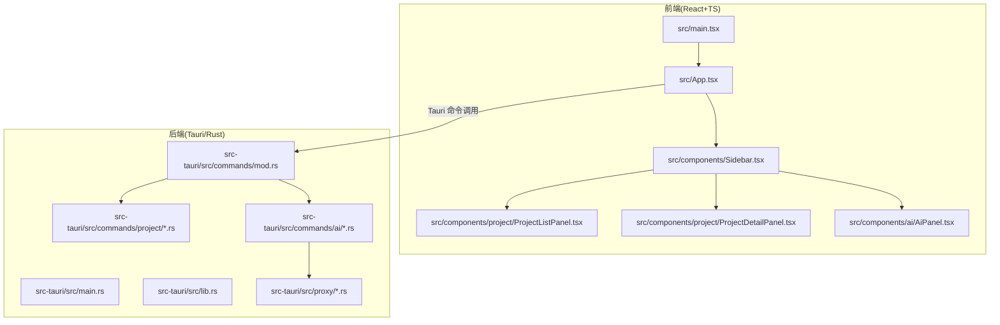
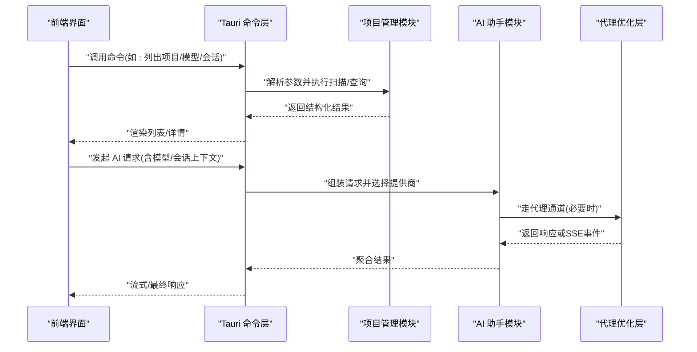
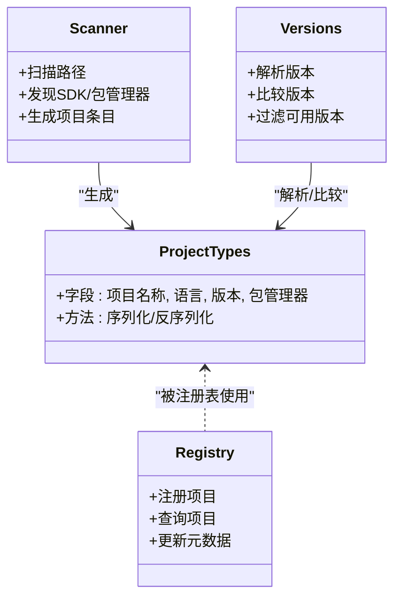
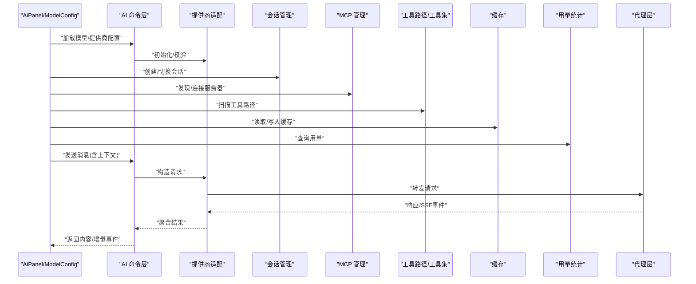
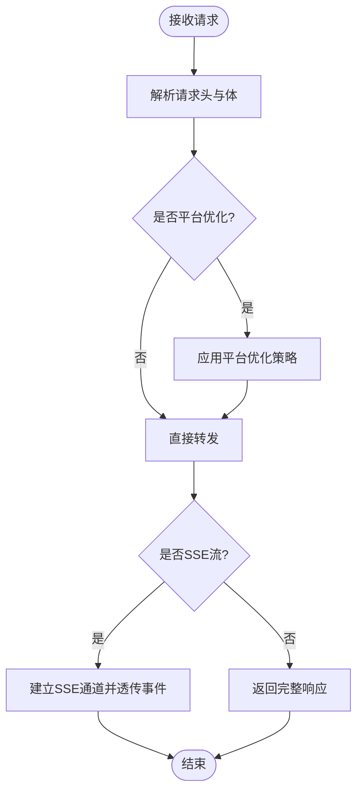
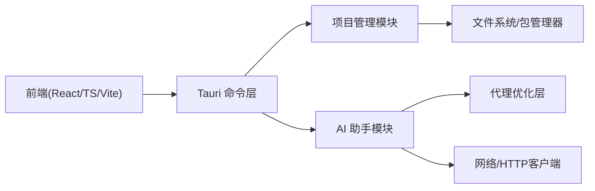

# 项目概述

<cite>
**本文引用的文件**   
- [README.md](file://README.md)
- [package.json](file://package.json)
- [vite.config.ts](file://vite.config.ts)
- [src/main.tsx](file://src/main.tsx)
- [src/App.tsx](file://src/App.tsx)
- [src-tauri/Cargo.toml](file://src-tauri/Cargo.toml)
- [src-tauri/tauri.conf.json](file://src-tauri/tauri.conf.json)
- [src-tauri/src/lib.rs](file://src-tauri/src/lib.rs)
- [src-tauri/src/main.rs](file://src-tauri/src/main.rs)
- [src-tauri/src/tray.rs](file://src-tauri/src/tray.rs)
- [src-tauri/src/commands/mod.rs](file://src-tauri/src/commands/mod.rs)
- [src-tauri/src/commands/project/mod.rs](file://src-tauri/src/commands/project/mod.rs)
- [src-tauri/src/commands/project/types.rs](file://src-tauri/src/commands/project/types.rs)
- [src-tauri/src/commands/project/registry.rs](file://src-tauri/src/commands/project/registry.rs)
- [src-tauri/src/commands/project/scanner.rs](file://src-tauri/src/commands/project/scanner.rs)
- [src-tauri/src/commands/project/versions.rs](file://src-tauri/src/commands/project/versions.rs)
- [src-tauri/src/commands/ai/mod.rs](file://src-tauri/src/commands/ai/mod.rs)
- [src-tauri/src/commands/ai/provider.rs](file://src-tauri/src/commands/ai/provider.rs)
- [src-tauri/src/commands/ai/models.rs](file://src-tauri/src/commands/ai/models.rs)
- [src-tauri/src/commands/ai/sessions.rs](file://src-tauri/src/commands/ai/sessions.rs)
- [src-tauri/src/commands/ai/mcp.rs](file://src-tauri/src/commands/ai/mcp.rs)
- [src-tauri/src/commands/ai/tool_paths.rs](file://src-tauri/src/commands/ai/tool_paths.rs)
- [src-tauri/src/commands/ai/tools.rs](file://src-tauri/src/commands/ai/tools.rs)
- [src-tauri/src/commands/ai/cache.rs](file://src-tauri/src/commands/ai/cache.rs)
- [src-tauri/src/commands/ai/usage.rs](file://src-tauri/src/commands/ai/usage.rs)
- [src-tauri/src/proxy/mod.rs](file://src-tauri/src/proxy/mod.rs)
- [src-tauri/src/proxy/server.rs](file://src-tauri/src/proxy/server.rs)
- [src-tauri/src/proxy/optimizers.rs](file://src-tauri/src/proxy/optimizers.rs)
- [src-tauri/src/proxy/google.rs](file://src-tauri/src/proxy/google.rs)
- [src-tauri/src/proxy/sse.rs](file://src-tauri/src/proxy/sse.rs)
- [src-tauri/src/proxy/transform.rs](file://src-tauri/src/proxy/transform.rs)
- [src-tauri/src/proxy/types.rs](file://src-tauri/src/proxy/types.rs)
- [src/components/Sidebar.tsx](file://src/components/Sidebar.tsx)
- [src/components/project/ProjectListPanel.tsx](file://src/components/project/ProjectListPanel.tsx)
- [src/components/project/ProjectDetailPanel.tsx](file://src/components/project/ProjectDetailPanel.tsx)
- [src/components/project/ProjectSubTabs.tsx](file://src/components/project/ProjectSubTabs.tsx)
- [src/components/project/tabs/PackageManagerTab.tsx](file://src/components/project/tabs/PackageManagerTab.tsx)
- [src/components/ai/AiPanel.tsx](file://src/components/ai/AiPanel.tsx)
- [src/components/ai/McpManager.tsx](file://src/components/ai/McpManager.tsx)
- [src/components/ai/ToolLauncher.tsx](file://src/components/ai/ToolLauncher.tsx)
- [src/components/ai/ModelConfig.tsx](file://src/components/ai/ModelConfig.tsx)
- [src/components/ai/SkillManager.tsx](file://src/components/ai/SkillManager.tsx)
- [src/components/ai/UsageStats.tsx](file://src/components/ai/UsageStats.tsx)
- [src/components/EnvBackupManager.tsx](file://src/components/EnvBackupManager.tsx)
- [src/components/PathEnvManager.tsx](file://src/components/PathEnvManager.tsx)
- [src/components/PkgManager.tsx](file://src/components/PkgManager.tsx)
- [src/components/MirrorManager.tsx](file://src/components/MirrorManager.tsx)
- [projects/nodejs/config.json](file://projects/nodejs/config.json)
- [projects/python/config.json](file://projects/python/config.json)
- [projects/go/config.json](file://projects/go/config.json)
- [projects/rust/config.json](file://src-tauri/src/commands/project/types.rs)
</cite>

## 目录
1. [简介](#简介)
2. [项目结构](#项目结构)
3. [核心组件](#核心组件)
4. [架构总览](#架构总览)
5. [详细组件分析](#详细组件分析)
6. [依赖关系分析](#依赖关系分析)
7. [性能考量](#性能考量)
8. [故障排查指南](#故障排查指南)
9. [结论](#结论)
10. [附录：快速开始](#附录快速开始)

## 简介
Any-Version 是一个基于 Tauri（Rust + React）构建的跨平台桌面应用，聚焦于“多版本 SDK/工具管理、AI 助手集成与代理优化”，为开发者提供统一的项目环境管理与 AI 工作流编排能力。其核心价值在于：
- 统一管理多语言运行时与包管理器版本，降低环境切换成本
- 内置 AI 助手面板，支持模型配置、会话管理、MCP 工具链与技能管理
- 提供本地代理优化层，提升网络访问稳定性与可观测性
- 通过 Tauri 命令桥接前端 UI 与后端 Rust 逻辑，实现高性能、安全的系统级操作

本概述既适合初学者理解整体概念，也为有经验的开发者提供技术细节与架构图示。

## 项目结构
仓库采用前后端分离的 Tauri 工程组织方式：
- 前端：React + TypeScript + Vite，位于 src 目录，包含侧边栏导航、项目管理面板、AI 助手面板等模块
- 后端：Tauri Rust 插件与命令，位于 src-tauri/src，按功能域划分 commands 与 proxy 子模块
- 项目模板与规则：projects 目录下以语言/工具为单位维护 config.json、find_rules.json、package_managers.json 等元数据
- 文档与脚本：docs 与 scripts 目录存放设计文档、Agent 文档清单与自动化脚本

图表来源
- [src/main.tsx:1-200](file://src/main.tsx#L1-L200)
- [src/App.tsx:1-200](file://src/App.tsx#L1-L200)
- [src/components/Sidebar.tsx:1-200](file://src/components/Sidebar.tsx#L1-L200)
- [src-tauri/src/main.rs:1-200](file://src-tauri/src/main.rs#L1-L200)
- [src-tauri/src/lib.rs:1-200](file://src-tauri/src/lib.rs#L1-L200)
- [src-tauri/src/commands/mod.rs:1-200](file://src-tauri/src/commands/mod.rs#L1-L200)

章节来源
- [README.md:1-200](file://README.md#L1-L200)
- [package.json:1-200](file://package.json#L1-L200)
- [vite.config.ts:1-200](file://vite.config.ts#L1-L200)
- [src-tauri/tauri.conf.json:1-200](file://src-tauri/tauri.conf.json#L1-L200)

## 核心组件
- 项目管理子系统
  - 负责扫描、注册与展示各语言/工具的版本信息，提供包管理器标签页与详情面板
  - 关键类型与注册表在 Rust 后端定义，前端通过命令接口获取并渲染
- AI 助手子系统
  - 提供模型配置、会话管理、MCP 服务器与工具路径发现、缓存与用量统计
  - 与代理优化层协作，增强请求转发与 SSE 流式输出体验
- 代理优化子系统
  - 封装通用代理逻辑、SSE 透传、Google 特定优化与转换策略
- 系统与工具管理
  - 环境变量备份/恢复、PATH 管理、镜像源管理、端口扫描、HTTP 服务、图片转 Base64 等实用工具

章节来源
- [src-tauri/src/commands/project/types.rs:1-200](file://src-tauri/src/commands/project/types.rs#L1-L200)
- [src-tauri/src/commands/project/registry.rs:1-200](file://src-tauri/src/commands/project/registry.rs#L1-L200)
- [src-tauri/src/commands/project/scanner.rs:1-200](file://src-tauri/src/commands/project/scanner.rs#L1-L200)
- [src-tauri/src/commands/project/versions.rs:1-200](file://src-tauri/src/commands/project/versions.rs#L1-L200)
- [src-tauri/src/commands/ai/provider.rs:1-200](file://src-tauri/src/commands/ai/provider.rs#L1-L200)
- [src-tauri/src/commands/ai/models.rs:1-200](file://src-tauri/src/commands/ai/models.rs#L1-L200)
- [src-tauri/src/commands/ai/sessions.rs:1-200](file://src-tauri/src/commands/ai/sessions.rs#L1-L200)
- [src-tauri/src/commands/ai/mcp.rs:1-200](file://src-tauri/src/commands/ai/mcp.rs#L1-L200)
- [src-tauri/src/commands/ai/tool_paths.rs:1-200](file://src-tauri/src/commands/ai/tool_paths.rs#L1-L200)
- [src-tauri/src/commands/ai/tools.rs:1-200](file://src-tauri/src/commands/ai/tools.rs#L1-L200)
- [src-tauri/src/commands/ai/cache.rs:1-200](file://src-tauri/src/commands/ai/cache.rs#L1-L200)
- [src-tauri/src/commands/ai/usage.rs:1-200](file://src-tauri/src/commands/ai/usage.rs#L1-L200)
- [src-tauri/src/proxy/mod.rs:1-200](file://src-tauri/src/proxy/mod.rs#L1-L200)
- [src-tauri/src/proxy/server.rs:1-200](file://src-tauri/src/proxy/server.rs#L1-L200)
- [src-tauri/src/proxy/optimizers.rs:1-200](file://src-tauri/src/proxy/optimizers.rs#L1-L200)
- [src-tauri/src/proxy/google.rs:1-200](file://src-tauri/src/proxy/google.rs#L1-L200)
- [src-tauri/src/proxy/sse.rs:1-200](file://src-tauri/src/proxy/sse.rs#L1-L200)
- [src-tauri/src/proxy/transform.rs:1-200](file://src-tauri/src/proxy/transform.rs#L1-L200)
- [src-tauri/src/proxy/types.rs:1-200](file://src-tauri/src/proxy/types.rs#L1-L200)

## 架构总览
Any-Version 采用“前端 UI + Tauri 命令 + 领域服务”的分层架构：
- 前端通过 Tauri 暴露的命令与后端交互，完成项目扫描、AI 配置、代理设置等操作
- 后端将命令路由到具体领域模块（project、ai、proxy），保证高内聚低耦合
- 代理层作为独立子系统，提供通用的请求转发、SSE 透传与平台优化能力

图表来源
- [src-tauri/src/commands/mod.rs:1-200](file://src-tauri/src/commands/mod.rs#L1-L200)
- [src-tauri/src/commands/project/mod.rs:1-200](file://src-tauri/src/commands/project/mod.rs#L1-L200)
- [src-tauri/src/commands/ai/mod.rs:1-200](file://src-tauri/src/commands/ai/mod.rs#L1-L200)
- [src-tauri/src/proxy/mod.rs:1-200](file://src-tauri/src/proxy/mod.rs#L1-L200)

## 详细组件分析

### 项目管理子系统
- 职责
  - 扫描本地已安装的多语言运行时与包管理器
  - 维护项目注册表与版本映射
  - 提供包管理器标签页与项目详情视图
- 数据结构与流程
  - 使用 types.rs 定义核心类型，registry.rs 维护注册表，scanner.rs 负责发现，versions.rs 处理版本解析
- 前端交互
  - ProjectListPanel 与 ProjectDetailPanel 通过命令获取数据并渲染；PackageManagerTab 展示包管理器相关操作

图表来源
- [src-tauri/src/commands/project/types.rs:1-200](file://src-tauri/src/commands/project/types.rs#L1-L200)
- [src-tauri/src/commands/project/registry.rs:1-200](file://src-tauri/src/commands/project/registry.rs#L1-L200)
- [src-tauri/src/commands/project/scanner.rs:1-200](file://src-tauri/src/commands/project/scanner.rs#L1-L200)
- [src-tauri/src/commands/project/versions.rs:1-200](file://src-tauri/src/commands/project/versions.rs#L1-L200)

章节来源
- [src/components/project/ProjectListPanel.tsx:1-200](file://src/components/project/ProjectListPanel.tsx#L1-L200)
- [src/components/project/ProjectDetailPanel.tsx:1-200](file://src/components/project/ProjectDetailPanel.tsx#L1-L200)
- [src/components/project/ProjectSubTabs.tsx:1-200](file://src/components/project/ProjectSubTabs.tsx#L1-L200)
- [src/components/project/tabs/PackageManagerTab.tsx:1-200](file://src/components/project/tabs/PackageManagerTab.tsx#L1-L200)

### AI 助手子系统
- 职责
  - 管理模型配置与提供商
  - 维护会话状态与历史
  - 发现 MCP 服务器与工具路径，管理工具集
  - 提供缓存与用量统计
- 与代理层的协作
  - 通过代理层进行请求转发、SSE 流式传输与平台优化（如 Google 特定策略）

图表来源
- [src-tauri/src/commands/ai/provider.rs:1-200](file://src-tauri/src/commands/ai/provider.rs#L1-L200)
- [src-tauri/src/commands/ai/models.rs:1-200](file://src-tauri/src/commands/ai/models.rs#L1-L200)
- [src-tauri/src/commands/ai/sessions.rs:1-200](file://src-tauri/src/commands/ai/sessions.rs#L1-L200)
- [src-tauri/src/commands/ai/mcp.rs:1-200](file://src-tauri/src/commands/ai/mcp.rs#L1-L200)
- [src-tauri/src/commands/ai/tool_paths.rs:1-200](file://src-tauri/src/commands/ai/tool_paths.rs#L1-L200)
- [src-tauri/src/commands/ai/tools.rs:1-200](file://src-tauri/src/commands/ai/tools.rs#L1-L200)
- [src-tauri/src/commands/ai/cache.rs:1-200](file://src-tauri/src/commands/ai/cache.rs#L1-L200)
- [src-tauri/src/commands/ai/usage.rs:1-200](file://src-tauri/src/commands/ai/usage.rs#L1-L200)
- [src-tauri/src/proxy/mod.rs:1-200](file://src-tauri/src/proxy/mod.rs#L1-L200)
- [src-tauri/src/proxy/sse.rs:1-200](file://src-tauri/src/proxy/sse.rs#L1-L200)
- [src-tauri/src/proxy/google.rs:1-200](file://src-tauri/src/proxy/google.rs#L1-L200)

章节来源
- [src/components/ai/AiPanel.tsx:1-200](file://src/components/ai/AiPanel.tsx#L1-L200)
- [src/components/ai/ModelConfig.tsx:1-200](file://src/components/ai/ModelConfig.tsx#L1-L200)
- [src/components/ai/McpManager.tsx:1-200](file://src/components/ai/McpManager.tsx#L1-L200)
- [src/components/ai/ToolLauncher.tsx:1-200](file://src/components/ai/ToolLauncher.tsx#L1-L200)
- [src/components/ai/SkillManager.tsx:1-200](file://src/components/ai/SkillManager.tsx#L1-L200)
- [src/components/ai/UsageStats.tsx:1-200](file://src/components/ai/UsageStats.tsx#L1-L200)

### 代理优化子系统
- 职责
  - 提供通用代理服务器能力、SSE 透传、请求/响应转换
  - 针对特定平台（如 Google）提供优化策略
- 关键模块
  - server.rs 启动与监听、types.rs 定义协议、sse.rs 处理流式事件、transform.rs 做数据转换、google.rs 平台优化

图表来源
- [src-tauri/src/proxy/server.rs:1-200](file://src-tauri/src/proxy/server.rs#L1-L200)
- [src-tauri/src/proxy/types.rs:1-200](file://src-tauri/src/proxy/types.rs#L1-L200)
- [src-tauri/src/proxy/sse.rs:1-200](file://src-tauri/src/proxy/sse.rs#L1-L200)
- [src-tauri/src/proxy/transform.rs:1-200](file://src-tauri/src/proxy/transform.rs#L1-L200)
- [src-tauri/src/proxy/google.rs:1-200](file://src-tauri/src/proxy/google.rs#L1-L200)

章节来源
- [src-tauri/src/proxy/mod.rs:1-200](file://src-tauri/src/proxy/mod.rs#L1-L200)
- [src-tauri/src/proxy/optimizers.rs:1-200](file://src-tauri/src/proxy/optimizers.rs#L1-L200)

### 系统与工具管理
- 环境变量备份与恢复、PATH 管理、镜像源管理、端口扫描、HTTP 服务、图片转 Base64 等
- 这些工具通过独立组件暴露，便于在侧边栏中快速访问

章节来源
- [src/components/EnvBackupManager.tsx:1-200](file://src/components/EnvBackupManager.tsx#L1-L200)
- [src/components/PathEnvManager.tsx:1-200](file://src/components/PathEnvManager.tsx#L1-L200)
- [src/components/MirrorManager.tsx:1-200](file://src/components/MirrorManager.tsx#L1-L200)
- [src/components/PkgManager.tsx:1-200](file://src/components/PkgManager.tsx#L1-L200)

## 依赖关系分析
- 前端依赖
  - React + TypeScript + Vite，通过 Tauri 命令与后端通信
- 后端依赖
  - Tauri 框架、Rust 生态库（网络、文件系统、JSON 序列化等）
- 外部集成
  - AI 提供商 API、MCP 服务器、系统工具与包管理器

图表来源
- [package.json:1-200](file://package.json#L1-L200)
- [vite.config.ts:1-200](file://vite.config.ts#L1-L200)
- [src-tauri/Cargo.toml:1-200](file://src-tauri/Cargo.toml#L1-L200)
- [src-tauri/tauri.conf.json:1-200](file://src-tauri/tauri.conf.json#L1-L200)

章节来源
- [src-tauri/Cargo.toml:1-200](file://src-tauri/Cargo.toml#L1-L200)
- [src-tauri/tauri.conf.json:1-200](file://src-tauri/tauri.conf.json#L1-L200)

## 性能考量
- 前端渲染
  - 使用虚拟列表与懒加载减少大列表渲染开销
  - 合理拆分组件与按需加载页面
- 后端处理
  - 并发扫描与异步 I/O 提升项目发现速度
  - 对 AI 请求使用流式传输与缓存命中，降低延迟
- 代理层
  - 复用连接池与缓冲策略，避免频繁握手
  - 针对 SSE 场景优化事件分发与背压控制

[本节为通用指导，不直接分析具体文件]

## 故障排查指南
- 常见问题定位
  - 项目扫描失败：检查扫描路径权限与 find_rules.json 配置
  - AI 请求超时：确认代理设置与提供商鉴权
  - 包管理器不可用：验证 PATH 与环境变量
- 日志与调试
  - 查看 Tauri 控制台输出与系统托盘日志
  - 启用代理层调试模式，观察请求/响应转换过程

章节来源
- [src-tauri/src/tray.rs:1-200](file://src-tauri/src/tray.rs#L1-L200)
- [src-tauri/src/commands/utils.rs:1-200](file://src-tauri/src/commands/utils.rs#L1-L200)

## 结论
Any-Version 通过清晰的模块化设计与 Tauri 的高性能桥接，实现了“多版本 SDK/工具管理 + AI 助手 + 代理优化”的一体化桌面体验。对于初学者，它降低了环境配置与 AI 工具集成的门槛；对于资深开发者，它提供了可扩展的架构与丰富的自定义空间。

[本节为总结性内容，不直接分析具体文件]

## 附录：快速开始
- 系统要求
  - 操作系统：Windows / macOS / Linux
  - Node.js 与 pnpm（用于前端构建）
  - Rust 工具链（用于 Tauri 后端构建）
- 安装步骤
  - 克隆仓库并进入项目根目录
  - 安装前端依赖并构建前端资源
  - 构建并运行 Tauri 应用
- 基本使用流程
  - 打开侧边栏，进入“项目管理”查看已识别的语言与包管理器
  - 进入“AI 助手”配置模型与提供商，创建会话并开始对话
  - 如需优化网络访问，可在“代理设置”中启用并配置代理策略
- 参考配置文件
  - projects/nodejs/config.json、projects/python/config.json、projects/go/config.json 等定义了各语言的默认规则与包管理器

章节来源
- [README.md:1-200](file://README.md#L1-L200)
- [package.json:1-200](file://package.json#L1-L200)
- [projects/nodejs/config.json:1-200](file://projects/nodejs/config.json#L1-L200)
- [projects/python/config.json:1-200](file://projects/python/config.json#L1-L200)
- [projects/go/config.json:1-200](file://projects/go/config.json#L1-L200)