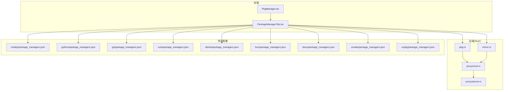
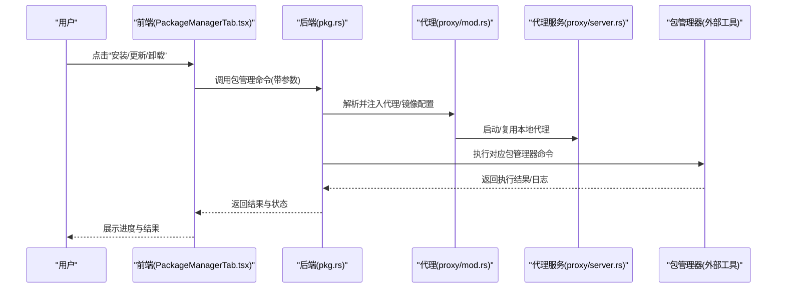
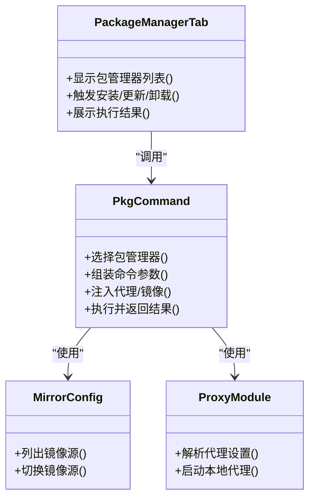
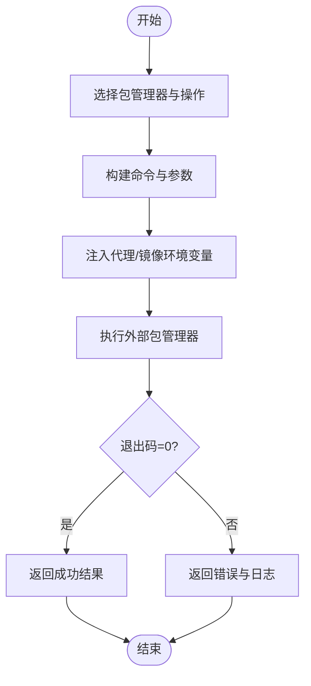
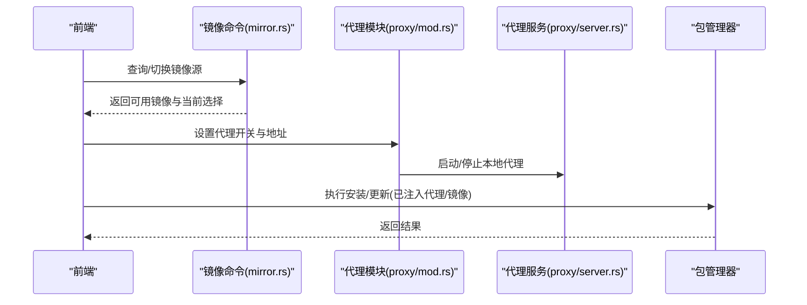
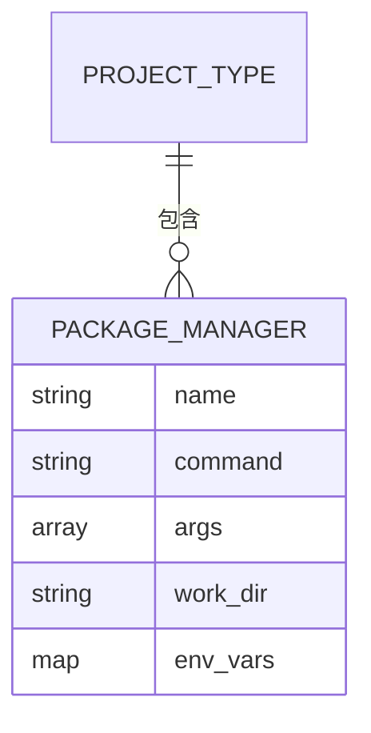
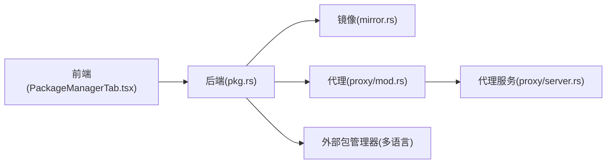

# 依赖管理

<cite>
**本文引用的文件**   
- [src/components/PkgManager.tsx](file://src/components/PkgManager.tsx)
- [src/components/project/tabs/PackageManagerTab.tsx](file://src/components/project/tabs/PackageManagerTab.tsx)
- [src-tauri/src/commands/pkg.rs](file://src-tauri/src/commands/pkg.rs)
- [src-tauri/src/commands/mirror.rs](file://src-tauri/src/commands/mirror.rs)
- [src-tauri/src/proxy/mod.rs](file://src-tauri/src/proxy/mod.rs)
- [src-tauri/src/proxy/server.rs](file://src-tauri/src/proxy/server.rs)
- [projects/nodejs/package_managers.json](file://projects/nodejs/package_managers.json)
- [projects/python/package_managers.json](file://projects/python/package_managers.json)
- [projects/go/package_managers.json](file://projects/go/package_managers.json)
- [projects/rust/package_managers.json](file://projects/rust/package_managers.json)
- [projects/dotnet/package_managers.json](file://projects/dotnet/package_managers.json)
- [projects/bun/package_managers.json](file://projects/bun/package_managers.json)
- [projects/deno/package_managers.json](file://projects/deno/package_managers.json)
- [projects/cmake/package_managers.json](file://projects/cmake/package_managers.json)
- [projects/vcpkg/package_managers.json](file://projects/vcpkg/package_managers.json)
</cite>

## 目录
1. [简介](#简介)
2. [项目结构](#项目结构)
3. [核心组件](#核心组件)
4. [架构总览](#架构总览)
5. [详细组件分析](#详细组件分析)
6. [依赖分析](#依赖分析)
7. [性能考虑](#性能考虑)
8. [故障排查指南](#故障排查指南)
9. [结论](#结论)
10. [附录](#附录)

## 简介
本章节面向“依赖管理”能力，系统性说明包管理器集成机制与操作流程。内容覆盖：
- 主流包管理器支持：npm、pip、cargo、go mod、dotnet、bun、deno、cmake、vcpkg 等
- 依赖安装、更新、卸载操作
- 版本锁定与冲突解决策略
- 代理配置与镜像源设置对依赖管理的影响
- 依赖优化与缓存管理最佳实践
- 依赖安全检查与漏洞扫描（概念性说明）
- 多语言项目的差异与统一处理方式
- 初学者基础操作指导与高级用户自定义扩展

## 项目结构
依赖管理功能由前端 UI 与后端命令层协同实现：
- 前端提供可视化面板与交互入口
- 后端通过 Tauri 命令暴露包管理操作
- 各语言项目通过 package_managers.json 声明其包管理器能力与参数
- 镜像与代理相关能力由独立模块提供

图表来源
- [src/components/PkgManager.tsx](file://src/components/PkgManager.tsx)
- [src/components/project/tabs/PackageManagerTab.tsx](file://src/components/project/tabs/PackageManagerTab.tsx)
- [src-tauri/src/commands/pkg.rs](file://src-tauri/src/commands/pkg.rs)
- [src-tauri/src/commands/mirror.rs](file://src-tauri/src/commands/mirror.rs)
- [src-tauri/src/proxy/mod.rs](file://src-tauri/src/proxy/mod.rs)
- [src-tauri/src/proxy/server.rs](file://src-tauri/src/proxy/server.rs)
- [projects/nodejs/package_managers.json](file://projects/nodejs/package_managers.json)
- [projects/python/package_managers.json](file://projects/python/package_managers.json)
- [projects/go/package_managers.json](file://projects/go/package_managers.json)
- [projects/rust/package_managers.json](file://projects/rust/package_managers.json)
- [projects/dotnet/package_managers.json](file://projects/dotnet/package_managers.json)
- [projects/bun/package_managers.json](file://projects/bun/package_managers.json)
- [projects/deno/package_managers.json](file://projects/deno/package_managers.json)
- [projects/cmake/package_managers.json](file://projects/cmake/package_managers.json)
- [projects/vcpkg/package_managers.json](file://projects/vcpkg/package_managers.json)

章节来源
- [src/components/PkgManager.tsx](file://src/components/PkgManager.tsx)
- [src/components/project/tabs/PackageManagerTab.tsx](file://src/components/project/tabs/PackageManagerTab.tsx)
- [src-tauri/src/commands/pkg.rs](file://src-tauri/src/commands/pkg.rs)
- [src-tauri/src/commands/mirror.rs](file://src-tauri/src/commands/mirror.rs)
- [src-tauri/src/proxy/mod.rs](file://src-tauri/src/proxy/mod.rs)
- [src-tauri/src/proxy/server.rs](file://src-tauri/src/proxy/server.rs)
- [projects/nodejs/package_managers.json](file://projects/nodejs/package_managers.json)
- [projects/python/package_managers.json](file://projects/python/package_managers.json)
- [projects/go/package_managers.json](file://projects/go/package_managers.json)
- [projects/rust/package_managers.json](file://projects/rust/package_managers.json)
- [projects/dotnet/package_managers.json](file://projects/dotnet/package_managers.json)
- [projects/bun/package_managers.json](file://projects/bun/package_managers.json)
- [projects/deno/package_managers.json](file://projects/deno/package_managers.json)
- [projects/cmake/package_managers.json](file://projects/cmake/package_managers.json)
- [projects/vcpkg/package_managers.json](file://projects/vcpkg/package_managers.json)

## 核心组件
- 前端包管理面板
  - PkgManager.tsx：作为包管理功能的容器组件，负责挂载与状态管理
  - PackageManagerTab.tsx：具体标签页，展示包管理器列表、操作按钮与结果输出
- 后端命令层
  - pkg.rs：封装包管理的安装、更新、卸载等操作命令
  - mirror.rs：镜像源管理与切换命令
- 代理与网络
  - proxy/mod.rs：代理能力抽象与组合
  - proxy/server.rs：本地代理服务实现，用于加速或转发依赖下载
- 项目级包管理器定义
  - projects/<lang>/package_managers.json：声明该语言可用的包管理器、命令、参数、工作目录、环境变量等

章节来源
- [src/components/PkgManager.tsx](file://src/components/PkgManager.tsx)
- [src/components/project/tabs/PackageManagerTab.tsx](file://src/components/project/tabs/PackageManagerTab.tsx)
- [src-tauri/src/commands/pkg.rs](file://src-tauri/src/commands/pkg.rs)
- [src-tauri/src/commands/mirror.rs](file://src-tauri/src/commands/mirror.rs)
- [src-tauri/src/proxy/mod.rs](file://src-tauri/src/proxy/mod.rs)
- [src-tauri/src/proxy/server.rs](file://src-tauri/src/proxy/server.rs)
- [projects/nodejs/package_managers.json](file://projects/nodejs/package_managers.json)
- [projects/python/package_managers.json](file://projects/python/package_managers.json)
- [projects/go/package_managers.json](file://projects/go/package_managers.json)
- [projects/rust/package_managers.json](file://projects/rust/package_managers.json)
- [projects/dotnet/package_managers.json](file://projects/dotnet/package_managers.json)
- [projects/bun/package_managers.json](file://projects/bun/package_managers.json)
- [projects/deno/package_managers.json](file://projects/deno/package_managers.json)
- [projects/cmake/package_managers.json](file://projects/cmake/package_managers.json)
- [projects/vcpkg/package_managers.json](file://projects/vcpkg/package_managers.json)

## 架构总览
整体采用前后端分离的桌面应用架构：前端通过 Tauri 调用后端命令执行包管理操作；镜像与代理能力作为横切关注点被复用。

图表来源
- [src/components/project/tabs/PackageManagerTab.tsx](file://src/components/project/tabs/PackageManagerTab.tsx)
- [src-tauri/src/commands/pkg.rs](file://src-tauri/src/commands/pkg.rs)
- [src-tauri/src/proxy/mod.rs](file://src-tauri/src/proxy/mod.rs)
- [src-tauri/src/proxy/server.rs](file://src-tauri/src/proxy/server.rs)

## 详细组件分析

### 包管理器集成机制
- 多语言包管理器声明
  - 每个语言目录下存在 package_managers.json，用于描述可用包管理器及其运行参数、工作目录、环境变量等
  - 支持的生态包括 Node.js(npm)、Python(pip)、Go(go mod)、Rust(cargo)、.NET(dotnet)、Bun、Deno、CMake、vcpkg 等
- 前端读取与渲染
  - PackageManagerTab.tsx 根据当前项目类型加载对应的包管理器清单，渲染为可操作项
- 后端执行
  - pkg.rs 接收前端请求，按所选包管理器拼装命令并执行，同时注入代理/镜像配置

图表来源
- [src/components/project/tabs/PackageManagerTab.tsx](file://src/components/project/tabs/PackageManagerTab.tsx)
- [src-tauri/src/commands/pkg.rs](file://src-tauri/src/commands/pkg.rs)
- [src-tauri/src/commands/mirror.rs](file://src-tauri/src/commands/mirror.rs)
- [src-tauri/src/proxy/mod.rs](file://src-tauri/src/proxy/mod.rs)

章节来源
- [src/components/project/tabs/PackageManagerTab.tsx](file://src/components/project/tabs/PackageManagerTab.tsx)
- [src-tauri/src/commands/pkg.rs](file://src-tauri/src/commands/pkg.rs)
- [src-tauri/src/commands/mirror.rs](file://src-tauri/src/commands/mirror.rs)
- [src-tauri/src/proxy/mod.rs](file://src-tauri/src/proxy/mod.rs)
- [projects/nodejs/package_managers.json](file://projects/nodejs/package_managers.json)
- [projects/python/package_managers.json](file://projects/python/package_managers.json)
- [projects/go/package_managers.json](file://projects/go/package_managers.json)
- [projects/rust/package_managers.json](file://projects/rust/package_managers.json)
- [projects/dotnet/package_managers.json](file://projects/dotnet/package_managers.json)
- [projects/bun/package_managers.json](file://projects/bun/package_managers.json)
- [projects/deno/package_managers.json](file://projects/deno/package_managers.json)
- [projects/cmake/package_managers.json](file://projects/cmake/package_managers.json)
- [projects/vcpkg/package_managers.json](file://projects/vcpkg/package_managers.json)

### 依赖安装、更新与卸载
- 安装
  - 前端选择目标包与版本范围，调用后端安装命令
  - 后端根据包管理器类型生成相应命令，并在执行前注入代理/镜像配置
- 更新
  - 支持全局更新与指定包更新，后端将更新策略传递给对应包管理器
- 卸载
  - 前端提交卸载请求，后端执行对应包管理器的移除命令
- 结果反馈
  - 后端将标准输出/错误输出与退出码回传前端，便于用户查看与诊断

图表来源
- [src-tauri/src/commands/pkg.rs](file://src-tauri/src/commands/pkg.rs)
- [src-tauri/src/proxy/mod.rs](file://src-tauri/src/proxy/mod.rs)

章节来源
- [src-tauri/src/commands/pkg.rs](file://src-tauri/src/commands/pkg.rs)
- [src-tauri/src/proxy/mod.rs](file://src-tauri/src/proxy/mod.rs)

### 版本锁定与冲突解决策略
- 版本锁定
  - 不同包管理器采用各自的锁定机制（如 npm lockfile、pip 冻结、cargo 锁文件、go mod 校验等）
  - 建议在 CI 中强制校验锁定文件一致性，确保可重现构建
- 冲突解决
  - 当出现版本冲突时，优先遵循包管理器的默认策略（如提升兼容版本、降级到满足约束的版本）
  - 若需人工干预，可通过显式指定版本或调整依赖声明来消除冲突
- 建议
  - 在团队内统一锁定策略，避免频繁变更导致的不稳定

[本节为通用策略说明，不直接分析具体文件]

### 代理配置与镜像源设置
- 代理
  - 通过 proxy/mod.rs 与 proxy/server.rs 提供本地代理服务，可在受限网络环境下加速依赖下载
  - 后端在执行包管理器命令前，自动注入代理相关环境变量
- 镜像源
  - mirror.rs 提供镜像源管理能力，支持列出与切换镜像源
  - 不同语言的包管理器通常通过环境变量或配置文件指定镜像地址
- 影响
  - 正确配置代理与镜像可显著提升下载速度并降低失败率
  - 在企业环境中，建议集中管理代理与镜像策略，减少个人配置差异

图表来源
- [src-tauri/src/commands/mirror.rs](file://src-tauri/src/commands/mirror.rs)
- [src-tauri/src/proxy/mod.rs](file://src-tauri/src/proxy/mod.rs)
- [src-tauri/src/proxy/server.rs](file://src-tauri/src/proxy/server.rs)

章节来源
- [src-tauri/src/commands/mirror.rs](file://src-tauri/src/commands/mirror.rs)
- [src-tauri/src/proxy/mod.rs](file://src-tauri/src/proxy/mod.rs)
- [src-tauri/src/proxy/server.rs](file://src-tauri/src/proxy/server.rs)

### 依赖优化与缓存管理最佳实践
- 缓存
  - 利用各包管理器的本地缓存目录，避免重复下载
  - 在 CI 中缓存依赖目录以缩短构建时间
- 增量更新
  - 优先进行增量更新而非全量重建，减少不必要的网络与磁盘 IO
- 清理
  - 定期清理无用依赖与过期缓存，释放磁盘空间
- 安全
  - 启用依赖安全检查与漏洞扫描（见下一节）

[本节为通用实践说明，不直接分析具体文件]

### 依赖安全检查与漏洞扫描
- 检查方式
  - 借助包管理器自带的审计或第三方安全扫描工具，对依赖树进行漏洞检测
- 流程建议
  - 在开发阶段开启实时告警
  - 在 CI 中阻断高危漏洞合并
- 注意
  - 不同语言的扫描工具与规则集存在差异，需结合项目实际配置

[本节为通用安全实践说明，不直接分析具体文件]

### 多语言项目的依赖管理差异与统一处理
- 差异
  - 各语言包管理器的命令、参数、锁定文件与环境变量各不相同
  - 部分语言需要额外的系统依赖或运行时环境
- 统一处理
  - 通过 package_managers.json 抽象出统一的元数据模型
  - 前端基于元数据渲染统一界面，后端基于元数据拼装命令
  - 代理与镜像能力作为公共横切逻辑复用

图表来源
- [projects/nodejs/package_managers.json](file://projects/nodejs/package_managers.json)
- [projects/python/package_managers.json](file://projects/python/package_managers.json)
- [projects/go/package_managers.json](file://projects/go/package_managers.json)
- [projects/rust/package_managers.json](file://projects/rust/package_managers.json)
- [projects/dotnet/package_managers.json](file://projects/dotnet/package_managers.json)
- [projects/bun/package_managers.json](file://projects/bun/package_managers.json)
- [projects/deno/package_managers.json](file://projects/deno/package_managers.json)
- [projects/cmake/package_managers.json](file://projects/cmake/package_managers.json)
- [projects/vcpkg/package_managers.json](file://projects/vcpkg/package_managers.json)

章节来源
- [projects/nodejs/package_managers.json](file://projects/nodejs/package_managers.json)
- [projects/python/package_managers.json](file://projects/python/package_managers.json)
- [projects/go/package_managers.json](file://projects/go/package_managers.json)
- [projects/rust/package_managers.json](file://projects/rust/package_managers.json)
- [projects/dotnet/package_managers.json](file://projects/dotnet/package_managers.json)
- [projects/bun/package_managers.json](file://projects/bun/package_managers.json)
- [projects/deno/package_managers.json](file://projects/deno/package_managers.json)
- [projects/cmake/package_managers.json](file://projects/cmake/package_managers.json)
- [projects/vcpkg/package_managers.json](file://projects/vcpkg/package_managers.json)

### 初学者基础操作指导
- 首次使用
  - 打开“包管理”标签页，确认当前项目类型与可用包管理器
  - 选择要安装的包，点击“安装”，观察输出日志
- 日常维护
  - 使用“更新”保持依赖最新
  - 使用“卸载”移除不再需要的包
- 常见问题
  - 网络问题：检查代理与镜像源配置
  - 权限问题：确认运行环境与路径权限

[本节为通用入门指导，不直接分析具体文件]

### 高级用户自定义包管理器与配置
- 自定义包管理器
  - 在对应语言目录的 package_managers.json 中添加新的包管理器条目，包括命令、参数、工作目录与环境变量
- 高级配置
  - 通过镜像与代理模块统一管理网络访问策略
  - 在 CI 中固化锁定文件与安全扫描策略

章节来源
- [projects/nodejs/package_managers.json](file://projects/nodejs/package_managers.json)
- [projects/python/package_managers.json](file://projects/python/package_managers.json)
- [projects/go/package_managers.json](file://projects/go/package_managers.json)
- [projects/rust/package_managers.json](file://projects/rust/package_managers.json)
- [projects/dotnet/package_managers.json](file://projects/dotnet/package_managers.json)
- [projects/bun/package_managers.json](file://projects/bun/package_managers.json)
- [projects/deno/package_managers.json](file://projects/deno/package_managers.json)
- [projects/cmake/package_managers.json](file://projects/cmake/package_managers.json)
- [projects/vcpkg/package_managers.json](file://projects/vcpkg/package_managers.json)
- [src-tauri/src/commands/mirror.rs](file://src-tauri/src/commands/mirror.rs)
- [src-tauri/src/proxy/mod.rs](file://src-tauri/src/proxy/mod.rs)

## 依赖分析
- 组件耦合
  - 前端与后端通过 Tauri 命令解耦，职责清晰
  - 代理与镜像作为横切能力被多处复用，提高内聚性
- 外部依赖
  - 依赖各语言包管理器的命令行接口
  - 依赖本地代理服务进行网络转发与加速
- 潜在风险
  - 命令拼装不当可能导致注入风险，应严格校验输入
  - 代理服务端口占用与生命周期管理需谨慎处理

图表来源
- [src/components/project/tabs/PackageManagerTab.tsx](file://src/components/project/tabs/PackageManagerTab.tsx)
- [src-tauri/src/commands/pkg.rs](file://src-tauri/src/commands/pkg.rs)
- [src-tauri/src/commands/mirror.rs](file://src-tauri/src/commands/mirror.rs)
- [src-tauri/src/proxy/mod.rs](file://src-tauri/src/proxy/mod.rs)
- [src-tauri/src/proxy/server.rs](file://src-tauri/src/proxy/server.rs)

章节来源
- [src/components/project/tabs/PackageManagerTab.tsx](file://src/components/project/tabs/PackageManagerTab.tsx)
- [src-tauri/src/commands/pkg.rs](file://src-tauri/src/commands/pkg.rs)
- [src-tauri/src/commands/mirror.rs](file://src-tauri/src/commands/mirror.rs)
- [src-tauri/src/proxy/mod.rs](file://src-tauri/src/proxy/mod.rs)
- [src-tauri/src/proxy/server.rs](file://src-tauri/src/proxy/server.rs)

## 性能考虑
- 并行与批处理
  - 对于批量安装/更新，尽量合并请求以减少进程创建开销
- 缓存命中
  - 充分利用包管理器本地缓存，避免重复下载
- I/O 优化
  - 合理设置超时与重试策略，避免长时间阻塞
- 资源回收
  - 及时关闭代理服务与子进程，防止资源泄漏

[本节为通用性能建议，不直接分析具体文件]

## 故障排查指南
- 常见错误
  - 网络不可达：检查代理与镜像源配置是否正确
  - 权限不足：确认运行账户具备写入依赖目录的权限
  - 命令不存在：确认包管理器已安装且 PATH 配置正确
- 定位方法
  - 查看后端返回的错误码与日志
  - 在终端手动执行相同命令，对比输出差异
- 恢复步骤
  - 重置代理与镜像配置
  - 清理缓存后重试
  - 升级或重装对应包管理器

[本节为通用排障建议，不直接分析具体文件]

## 结论
本依赖管理方案通过前端可视化与后端命令层协作，结合代理与镜像能力，为多语言项目提供了统一的依赖管理体验。通过合理的版本锁定、冲突解决、安全扫描与缓存策略，可有效提升构建稳定性与效率。

[本节为总结性内容，不直接分析具体文件]

## 附录
- 术语
  - 包管理器：用于安装、更新、卸载软件包的命令行工具
  - 镜像源：用于加速下载的远程仓库镜像
  - 代理：用于转发网络请求的中间服务
- 参考
  - 各语言包管理器官方文档
  - 企业内部网络与镜像策略规范

[本节为补充信息，不直接分析具体文件]