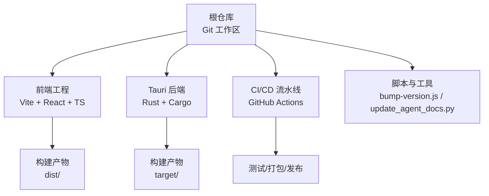
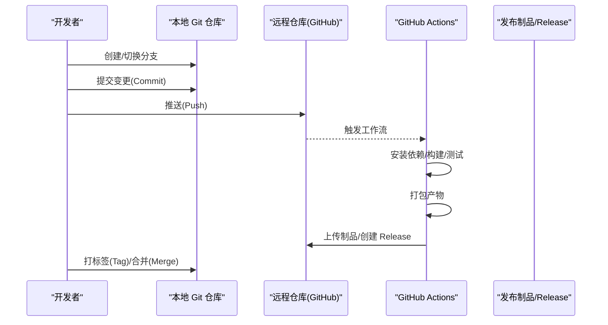
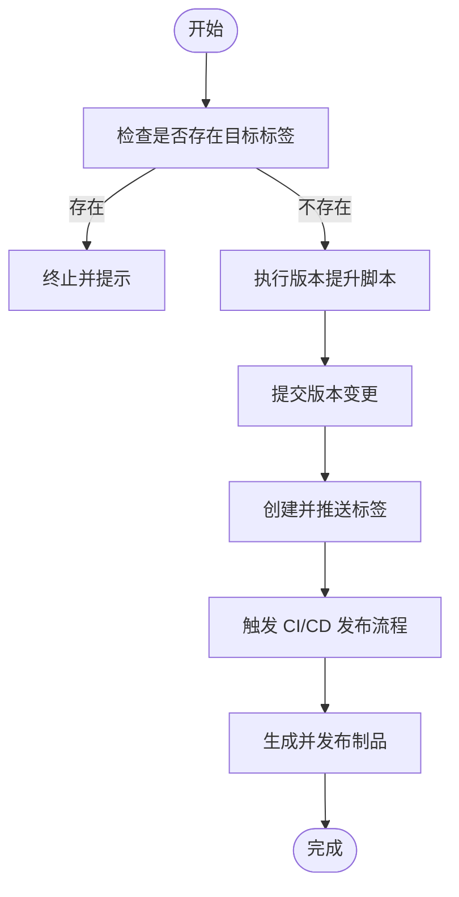
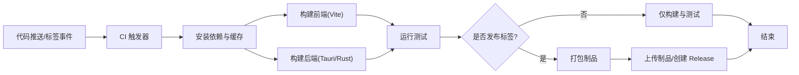
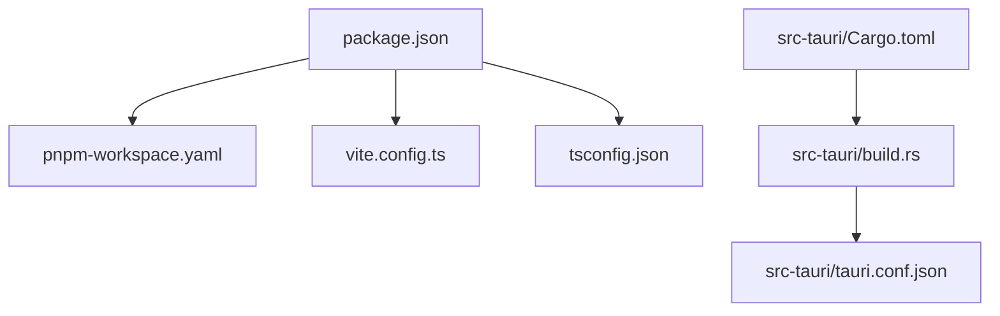

# 版本控制集成

<cite>
**本文引用的文件**   
- [README.md](file://README.md)
- [.gitignore](file://.gitignore)
- [package.json](file://package.json)
- [pnpm-workspace.yaml](file://pnpm-workspace.yaml)
- [tsconfig.json](file://tsconfig.json)
- [vite.config.ts](file://vite.config.ts)
- [src/main.tsx](file://src/main.tsx)
- [src/App.tsx](file://src/App.tsx)
- [src-tauri/Cargo.toml](file://src-tauri/Cargo.toml)
- [src-tauri/build.rs](file://src-tauri/build.rs)
- [src-tauri/tauri.conf.json](file://src-tauri/tauri.conf.json)
- [scripts/bump-version.js](file://scripts/bump-version.js)
- [scripts/update_agent_docs.py](file://scripts/update_agent_docs.py)
- [scripts/agent_doc_manifest.json](file://scripts/agent_doc_manifest.json)
- [.github/workflows/ci.yml](file://.github/workflows/ci.yml)
- [.github/workflows/package.yml](file://.github/workflows/package.yml)
- [.github/workflows/release.yml](file://.github/workflows/release.yml)
</cite>

## 目录
1. [简介](#简介)
2. [项目结构](#项目结构)
3. [核心组件](#核心组件)
4. [架构总览](#架构总览)
5. [详细组件分析](#详细组件分析)
6. [依赖分析](#依赖分析)
7. [性能考虑](#性能考虑)
8. [故障排查指南](#故障排查指南)
9. [结论](#结论)
10. [附录](#附录)

## 简介
本章节面向“版本控制集成功能”的文档目标，围绕 Git 与多语言工程（前端、Tauri/Rust）在分支管理、提交历史与变更跟踪、远程仓库同步与协作、标签与发布管理、回滚与合并冲突解决、自动化脚本与钩子、以及 CI/CD 流水线集成等方面提供系统化说明。同时为初学者提供基础操作指导，并为高级用户提供自定义工作流与自动化配置建议。

## 项目结构
该仓库采用多包工作区与前后端混合技术栈：
- 前端：Vite + React + TypeScript
- 桌面应用：Tauri（Rust）
- 包管理与工作区：pnpm workspace
- 持续集成：GitHub Actions
- 版本与发布：npm scripts 与 GitHub Releases

图表来源
- [package.json](file://package.json)
- [src-tauri/Cargo.toml](file://src-tauri/Cargo.toml)
- [.github/workflows/ci.yml](file://.github/workflows/ci.yml)
- [.github/workflows/package.yml](file://.github/workflows/package.yml)
- [.github/workflows/release.yml](file://.github/workflows/release.yml)

章节来源
- [README.md](file://README.md)
- [package.json](file://package.json)
- [pnpm-workspace.yaml](file://pnpm-workspace.yaml)
- [tsconfig.json](file://tsconfig.json)
- [vite.config.ts](file://vite.config.ts)
- [src-tauri/Cargo.toml](file://src-tauri/Cargo.toml)
- [src-tauri/build.rs](file://src-tauri/build.rs)
- [src-tauri/tauri.conf.json](file://src-tauri/tauri.conf.json)

## 核心组件
- 版本信息源
  - 前端应用入口与主组件用于渲染应用元信息（如版本号）。
  - Tauri 后端通过构建期脚本注入版本信息。
- 版本提升脚本
  - Node.js 脚本负责统一提升版本号并生成发布标签。
- 文档更新脚本
  - Python 脚本用于扫描与更新 Agent 文档清单。
- CI/CD 流水线
  - 构建、测试、打包与发布流程由 GitHub Actions 编排。

章节来源
- [src/main.tsx](file://src/main.tsx)
- [src/App.tsx](file://src/App.tsx)
- [src-tauri/build.rs](file://src-tauri/build.rs)
- [scripts/bump-version.js](file://scripts/bump-version.js)
- [scripts/update_agent_docs.py](file://scripts/update_agent_docs.py)
- [.github/workflows/ci.yml](file://.github/workflows/ci.yml)
- [.github/workflows/package.yml](file://.github/workflows/package.yml)
- [.github/workflows/release.yml](file://.github/workflows/release.yml)

## 架构总览
下图展示了从本地开发到远程仓库与 CI/CD 的版本控制与发布整体流程。

图表来源
- [.github/workflows/ci.yml](file://.github/workflows/ci.yml)
- [.github/workflows/package.yml](file://.github/workflows/package.yml)
- [.github/workflows/release.yml](file://.github/workflows/release.yml)

## 详细组件分析

### 分支管理与协作工作流
- 推荐分支模型
  - main：稳定可发布分支
  - develop：集成开发分支
  - feature/*：功能分支
  - hotfix/*：紧急修复分支
  - release/*：预发布分支
- 协作规范
  - 小步提交、清晰的提交信息
  - Pull Request 评审后合并
  - 使用 Rebase 保持线性历史或 Merge 保留分支上下文（团队约定）

章节来源
- [.github/workflows/ci.yml](file://.github/workflows/ci.yml)
- [.github/workflows/package.yml](file://.github/workflows/package.yml)
- [.github/workflows/release.yml](file://.github/workflows/release.yml)

### 提交历史与变更跟踪
- 提交粒度
  - 按逻辑单元拆分提交，避免一次性大提交
- 变更追踪
  - 使用 diff 与 log 查看变更
  - 结合 PR 描述与变更记录进行追溯
- 忽略规则
  - 通过 .gitignore 排除构建产物、依赖缓存等

章节来源
- [.gitignore](file://.gitignore)

### 远程仓库同步与协作
- 常用命令
  - clone/fetch/pull/push
  - rebase/merge 策略选择
- 冲突处理
  - 识别冲突文件，逐文件解决
  - 必要时使用交互式 rebase 修正历史

章节来源
- [.github/workflows/ci.yml](file://.github/workflows/ci.yml)

### 版本标签与发布管理
- 标签策略
  - 语义化版本：major.minor.patch
  - 使用 v 前缀（例如 v1.2.3）
- 发布流程
  - 提升版本号
  - 打标签
  - 推送标签至远程
  - 触发发布流水线，生成制品与 Release

图表来源
- [scripts/bump-version.js](file://scripts/bump-version.js)
- [.github/workflows/release.yml](file://.github/workflows/release.yml)

章节来源
- [scripts/bump-version.js](file://scripts/bump-version.js)
- [.github/workflows/release.yml](file://.github/workflows/release.yml)

### 版本回滚与合并冲突解决
- 回滚策略
  - 软回滚：重置暂存区与工作区
  - 硬回滚：丢弃未提交的变更
  - 基于标签回滚：检出特定版本并创建修复分支
- 冲突解决
  - 定位冲突区域，协商取舍
  - 使用三方合并工具辅助
  - 完成后重新提交并通过 CI 验证

章节来源
- [.github/workflows/ci.yml](file://.github/workflows/ci.yml)

### 自动化脚本与钩子集成
- 版本提升脚本
  - 统一提升版本号，便于批量更新配置文件与文档
- 文档更新脚本
  - 扫描并更新 Agent 文档清单，保证文档与代码一致
- Git 钩子（可选）
  - pre-commit：运行格式化与静态检查
  - commit-msg：校验提交信息格式
  - post-merge：自动恢复依赖或清理缓存

章节来源
- [scripts/bump-version.js](file://scripts/bump-version.js)
- [scripts/update_agent_docs.py](file://scripts/update_agent_docs.py)
- [scripts/agent_doc_manifest.json](file://scripts/agent_doc_manifest.json)

### CI/CD 流水线集成
- 构建与测试
  - 安装依赖、类型检查、单元测试、构建前端与 Tauri 应用
- 打包与发布
  - 根据标签或手动触发创建制品
  - 将制品上传至发布页面或对象存储
- 环境与安全
  - 使用缓存加速构建
  - 凭据与密钥通过 Secrets 管理

图表来源
- [.github/workflows/ci.yml](file://.github/workflows/ci.yml)
- [.github/workflows/package.yml](file://.github/workflows/package.yml)
- [.github/workflows/release.yml](file://.github/workflows/release.yml)

章节来源
- [.github/workflows/ci.yml](file://.github/workflows/ci.yml)
- [.github/workflows/package.yml](file://.github/workflows/package.yml)
- [.github/workflows/release.yml](file://.github/workflows/release.yml)

### 版本信息与注入
- 前端版本信息
  - 应用入口与主组件读取版本信息并在界面展示
- 后端版本信息
  - 构建期脚本将版本常量注入到 Rust 二进制中

章节来源
- [src/main.tsx](file://src/main.tsx)
- [src/App.tsx](file://src/App.tsx)
- [src-tauri/build.rs](file://src-tauri/build.rs)
- [src-tauri/tauri.conf.json](file://src-tauri/tauri.conf.json)

## 依赖分析
- 包管理与工作区
  - pnpm workspace 管理多包依赖与脚本
- 构建与配置
  - Vite 与 TypeScript 配置影响构建产物与路径解析
  - Tauri 配置决定打包行为与平台支持

图表来源
- [package.json](file://package.json)
- [pnpm-workspace.yaml](file://pnpm-workspace.yaml)
- [vite.config.ts](file://vite.config.ts)
- [tsconfig.json](file://tsconfig.json)
- [src-tauri/Cargo.toml](file://src-tauri/Cargo.toml)
- [src-tauri/build.rs](file://src-tauri/build.rs)
- [src-tauri/tauri.conf.json](file://src-tauri/tauri.conf.json)

章节来源
- [package.json](file://package.json)
- [pnpm-workspace.yaml](file://pnpm-workspace.yaml)
- [vite.config.ts](file://vite.config.ts)
- [tsconfig.json](file://tsconfig.json)
- [src-tauri/Cargo.toml](file://src-tauri/Cargo.toml)
- [src-tauri/build.rs](file://src-tauri/build.rs)
- [src-tauri/tauri.conf.json](file://src-tauri/tauri.conf.json)

## 性能考虑
- 构建缓存
  - 利用 CI 缓存 node_modules 与 cargo target 目录
- 增量构建
  - 合理划分任务，避免全量重建
- 并行化
  - 前端与后端构建并行执行
- 产物体积
  - 启用压缩与按需加载，减少发布包大小

[本节为通用指导，不直接分析具体文件]

## 故障排查指南
- 常见问题
  - 依赖安装失败：检查网络镜像与锁文件一致性
  - 构建失败：确认环境变量与平台依赖
  - 权限问题：检查 Secrets 与访问令牌
- 日志与诊断
  - 查看 CI 日志定位错误阶段
  - 本地复现并逐步缩小范围
- 回退与恢复
  - 基于最近稳定标签创建临时分支进行修复
  - 使用 stash 保存未提交变更后再回滚

章节来源
- [.github/workflows/ci.yml](file://.github/workflows/ci.yml)
- [.github/workflows/package.yml](file://.github/workflows/package.yml)
- [.github/workflows/release.yml](file://.github/workflows/release.yml)

## 结论
通过统一的分支模型、严格的提交规范、完善的 CI/CD 流水线与自动化脚本，本项目实现了从开发到发布的端到端版本控制集成。建议在团队内推广语义化版本与标签发布流程，并结合钩子与流水线实现质量门禁与自动化交付。

[本节为总结性内容，不直接分析具体文件]

## 附录

### 初学者基础操作指引
- 初始化与克隆
  - 首次克隆仓库，了解目录结构与 README
- 日常开发
  - 创建功能分支、提交变更、推送与发起 Pull Request
- 版本发布
  - 遵循标签命名规范，配合发布流水线生成制品

章节来源
- [README.md](file://README.md)
- [.github/workflows/release.yml](file://.github/workflows/release.yml)

### 高级用户自定义工作流与自动化配置
- 自定义脚本
  - 扩展 bump-version 脚本以支持多模块版本联动
  - 在文档更新脚本中加入更多扫描规则
- 钩子增强
  - 引入 lint-staged 与 husky 实现提交前检查
- CI 优化
  - 增加矩阵构建与缓存策略
  - 引入安全扫描与许可证检查

章节来源
- [scripts/bump-version.js](file://scripts/bump-version.js)
- [scripts/update_agent_docs.py](file://scripts/update_agent_docs.py)
- [scripts/agent_doc_manifest.json](file://scripts/agent_doc_manifest.json)
- [.github/workflows/ci.yml](file://.github/workflows/ci.yml)
- [.github/workflows/package.yml](file://.github/workflows/package.yml)
- [.github/workflows/release.yml](file://.github/workflows/release.yml)