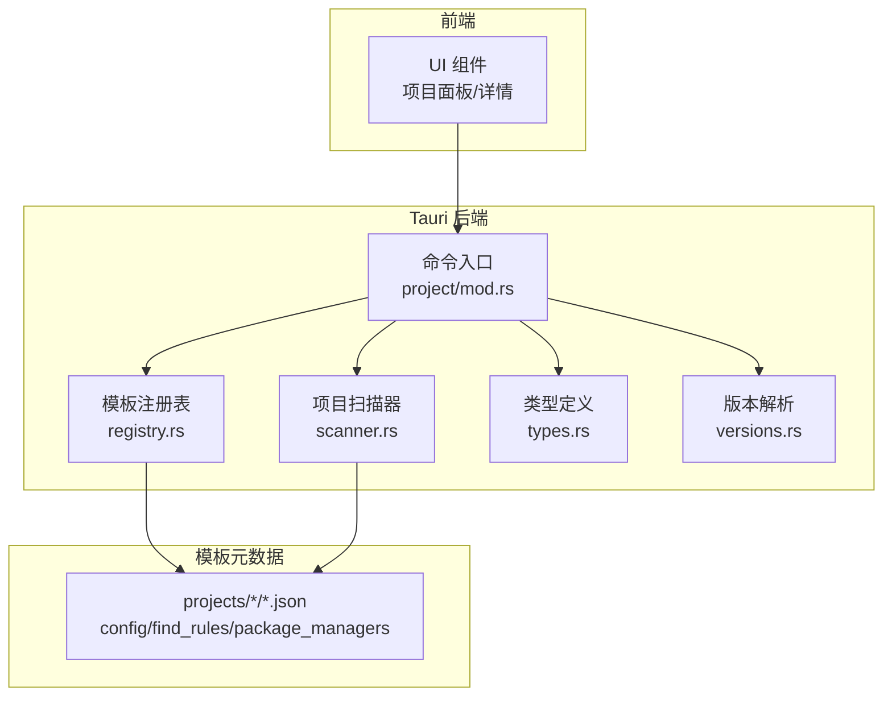
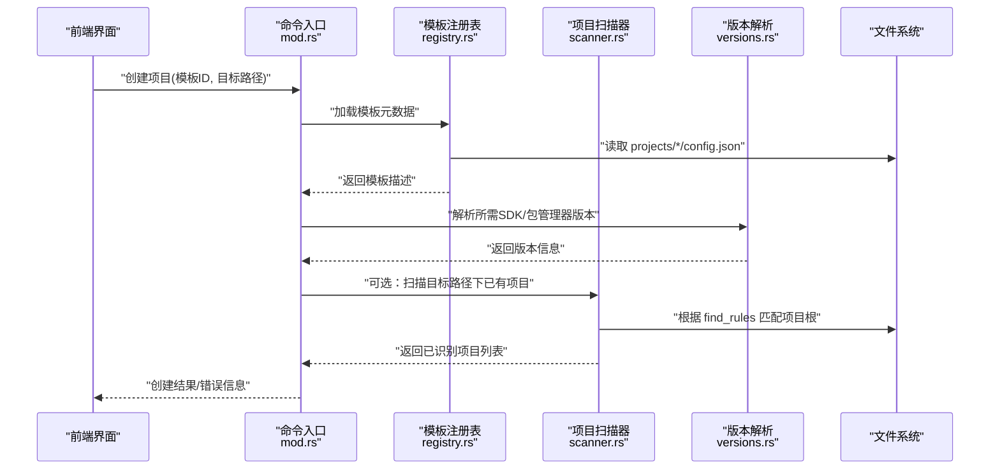
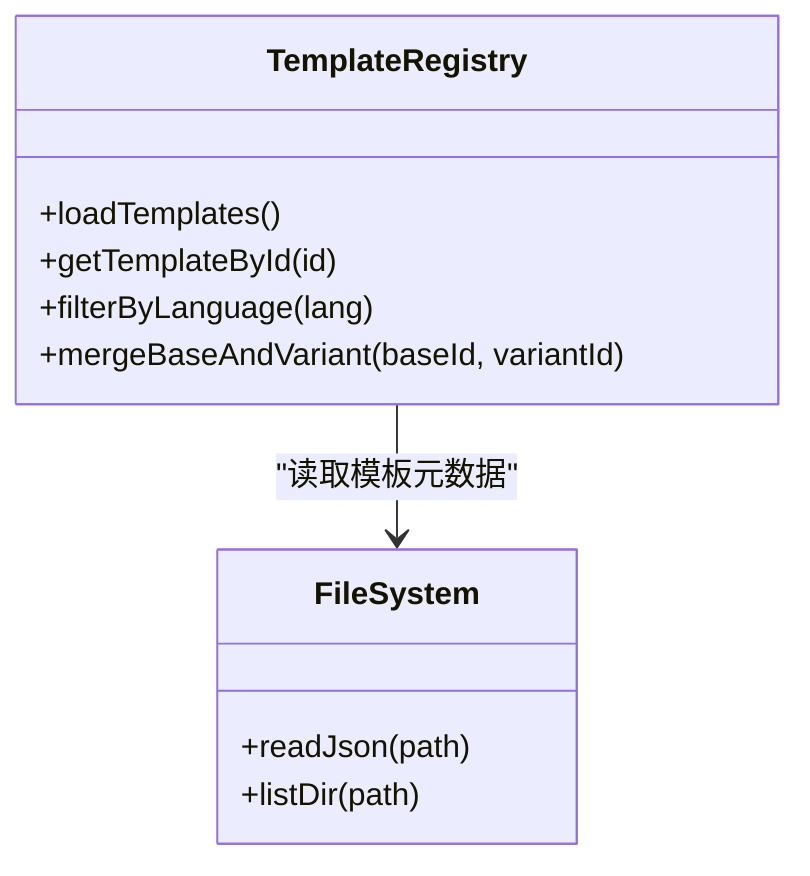
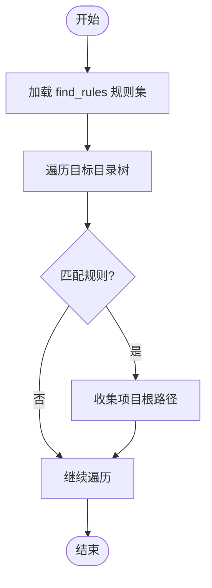
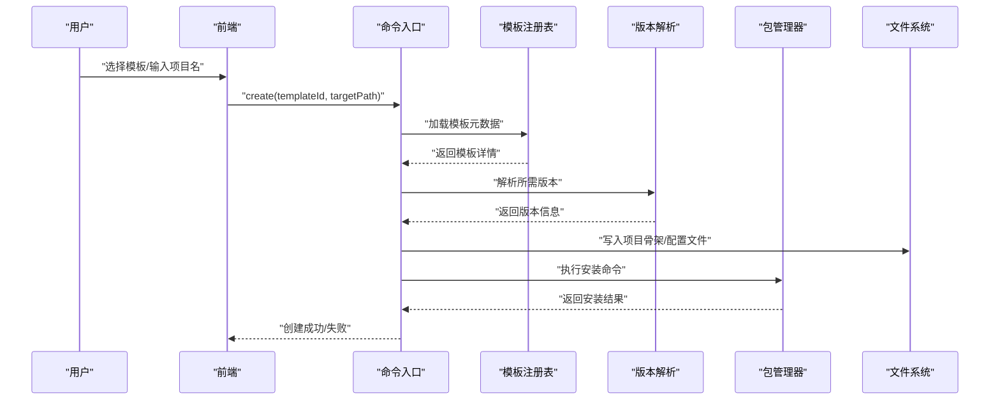
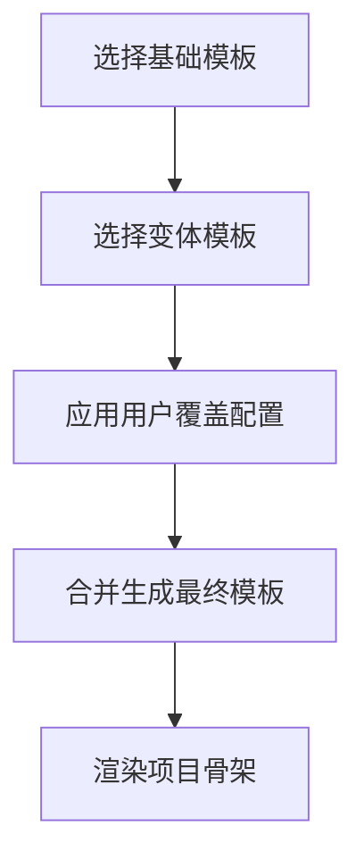
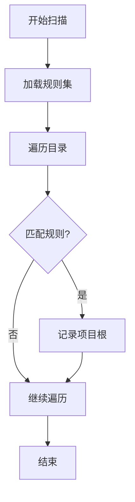
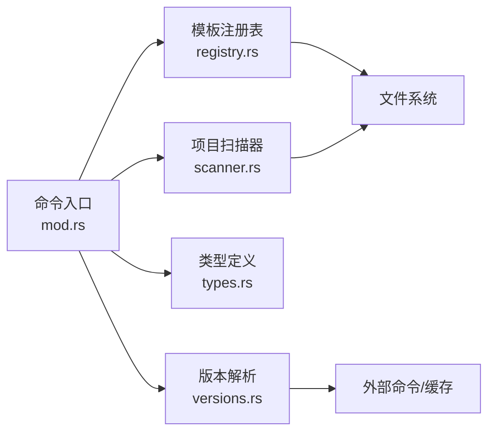

# 项目创建和模板

<cite>
**本文引用的文件**   
- [src-tauri/src/commands/project/mod.rs](file://src-tauri/src/commands/project/mod.rs)
- [src-tauri/src/commands/project/registry.rs](file://src-tauri/src/commands/project/registry.rs)
- [src-tauri/src/commands/project/scanner.rs](file://src-tauri/src/commands/project/scanner.rs)
- [src-tauri/src/commands/project/types.rs](file://src-tauri/src/commands/project/types.rs)
- [src-tauri/src/commands/project/versions.rs](file://src-tauri/src/commands/project/versions.rs)
- [projects/nodejs/config.json](file://projects/nodejs/config.json)
- [projects/nodejs/find_rules.json](file://projects/nodejs/find_rules.json)
- [projects/nodejs/package_managers.json](file://projects/nodejs/package_managers.json)
- [projects/python/config.json](file://projects/python/config.json)
- [projects/python/find_rules.json](file://projects/python/find_rules.json)
- [projects/go/config.json](file://projects/go/config.json)
- [projects/go/find_rules.json](file://projects/go/find_rules.json)
- [projects/java/config.json](file://projects/java/config.json)
- [projects/java/find_rules.json](file://projects/java/find_rules.json)
- [projects/rust/config.json](file://projects/rust/config.json)
- [projects/rust/find_rules.json](file://projects/rust/find_rules.json)
- [projects/cmake/config.json](file://projects/cmake/config.json)
- [projects/cmake/find_rules.json](file://projects/cmake/find_rules.json)
- [projects/dotnet/config.json](file://projects/dotnet/config.json)
- [projects/dotnet/find_rules.json](file://projects/dotnet/find_rules.json)
- [projects/flutter/config.json](file://projects/flutter/config.json)
- [projects/flutter/find_rules.json](file://projects/flutter/find_rules.json)
- [projects/maven/config.json](file://projects/maven/config.json)
- [projects/maven/find_rules.json](file://projects/maven/find_rules.json)
- [projects/gradle/config.json](file://projects/gradle/config.json)
- [projects/gradle/find_rules.json](file://projects/gradle/find_rules.json)
- [projects/bun/config.json](file://projects/bun/config.json)
- [projects/bun/find_rules.json](file://projects/bun/find_rules.json)
- [projects/deno/config.json](file://projects/deno/config.json)
- [projects/deno/find_rules.json](file://projects/deno/find_rules.json)
- [projects/mysql/config.json](file://projects/mysql/config.json)
- [projects/mysql/find_rules.json](file://projects/mysql/find_rules.json)
- [projects/postgresql/config.json](file://projects/postgresql/config.json)
- [projects/postgresql/find_rules.json](file://projects/postgresql/find_rules.json)
- [projects/redis/config.json](file://projects/redis/config.json)
- [projects/redis/find_rules.json](file://projects/redis/find_rules.json)
- [projects/nginx/config.json](file://projects/nginx/config.json)
- [projects/nginx/find_rules.json](file://projects/nginx/find_rules.json)
- [projects/vcpkg/config.json](file://projects/vcpkg/config.json)
- [projects/vcpkg/find_rules.json](file://projects/vcpkg/config.json)
</cite>

## 目录
1. [简介](#简介)
2. [项目结构](#项目结构)
3. [核心组件](#核心组件)
4. [架构总览](#架构总览)
5. [详细组件分析](#详细组件分析)
6. [依赖关系分析](#依赖关系分析)
7. [性能考虑](#性能考虑)
8. [故障排查指南](#故障排查指南)
9. [结论](#结论)
10. [附录](#附录)

## 简介
本章节面向“项目创建与模板”主题，系统性阐述：
- 项目创建流程：从用户选择预定义模板到生成目标项目的完整路径。
- 模板系统架构：模板目录组织、配置项含义、扩展点与继承覆盖机制。
- 项目扫描与自动检测：如何识别现有项目并加载其配置。
- 实际示例：不同语言（Node.js、Python、Go、Java、Rust、C/C++、.NET、Flutter、数据库等）的初始化过程概览。
- 模板继承与覆盖：如何在本地或全局层对模板进行定制。
- 验证与错误处理：在创建与扫描过程中的校验策略与异常恢复。
- 初学者入门与高级扩展：从零开始创建项目，以及自定义模板开发的最佳实践。

## 项目结构
仓库采用“前端 + Tauri 后端 + 多语言项目模板”的分层组织方式：
- 前端 UI 负责交互与展示（React/Vite）。
- Tauri 后端提供命令式 API，封装项目扫描、模板解析、版本管理、包管理器集成等能力。
- projects 目录集中存放各语言的“项目模板元数据”，包括发现规则、包管理器信息、环境变量与远程版本配置等。

图表来源
- [src-tauri/src/commands/project/mod.rs](file://src-tauri/src/commands/project/mod.rs)
- [src-tauri/src/commands/project/registry.rs](file://src-tauri/src/commands/project/registry.rs)
- [src-tauri/src/commands/project/scanner.rs](file://src-tauri/src/commands/project/scanner.rs)
- [src-tauri/src/commands/project/types.rs](file://src-tauri/src/commands/project/types.rs)
- [src-tauri/src/commands/project/versions.rs](file://src-tauri/src/commands/project/versions.rs)
- [projects/nodejs/config.json](file://projects/nodejs/config.json)
- [projects/nodejs/find_rules.json](file://projects/nodejs/find_rules.json)
- [projects/nodejs/package_managers.json](file://projects/nodejs/package_managers.json)

章节来源
- [src-tauri/src/commands/project/mod.rs](file://src-tauri/src/commands/project/mod.rs)
- [src-tauri/src/commands/project/registry.rs](file://src-tauri/src/commands/project/registry.rs)
- [src-tauri/src/commands/project/scanner.rs](file://src-tauri/src/commands/project/scanner.rs)
- [src-tauri/src/commands/project/types.rs](file://src-tauri/src/commands/project/types.rs)
- [src-tauri/src/commands/project/versions.rs](file://src-tauri/src/commands/project/versions.rs)
- [projects/nodejs/config.json](file://projects/nodejs/config.json)
- [projects/nodejs/find_rules.json](file://projects/nodejs/find_rules.json)
- [projects/nodejs/package_managers.json](file://projects/nodejs/package_managers.json)

## 核心组件
- 命令入口（project/mod.rs）
  - 暴露对外命令接口，协调注册表、扫描器、类型与版本模块，完成“创建/扫描/查询”等高层流程。
- 模板注册表（registry.rs）
  - 维护可用模板清单、模板元数据加载、合并与查找逻辑；支持按语言/框架筛选。
- 项目扫描器（scanner.rs）
  - 基于 find_rules 规则集遍历文件系统，识别已存在的项目根目录，并返回可被工具链识别的项目集合。
- 类型定义（types.rs）
  - 定义模板、项目、扫描结果、配置对象等数据结构，确保前后端一致。
- 版本解析（versions.rs）
  - 解析与缓存 SDK/运行时/包管理器版本，辅助模板渲染与安装流程。

章节来源
- [src-tauri/src/commands/project/mod.rs](file://src-tauri/src/commands/project/mod.rs)
- [src-tauri/src/commands/project/registry.rs](file://src-tauri/src/commands/project/registry.rs)
- [src-tauri/src/commands/project/scanner.rs](file://src-tauri/src/commands/project/scanner.rs)
- [src-tauri/src/commands/project/types.rs](file://src-tauri/src/commands/project/types.rs)
- [src-tauri/src/commands/project/versions.rs](file://src-tauri/src/commands/project/versions.rs)

## 架构总览
下图展示了“项目创建”端到端调用链：前端发起请求，后端通过注册表选择模板，结合扫描器与版本解析完成初始化。

图表来源
- [src-tauri/src/commands/project/mod.rs](file://src-tauri/src/commands/project/mod.rs)
- [src-tauri/src/commands/project/registry.rs](file://src-tauri/src/commands/project/registry.rs)
- [src-tauri/src/commands/project/scanner.rs](file://src-tauri/src/commands/project/scanner.rs)
- [src-tauri/src/commands/project/versions.rs](file://src-tauri/src/commands/project/versions.rs)

## 详细组件分析

### 模板注册表（registry.rs）
职责与行为
- 加载与聚合模板：遍历 projects 目录，读取每个语言的 config.json 与相关元数据。
- 模板筛选与匹配：根据语言、框架、运行时版本等条件过滤可用模板。
- 模板合并与优先级：支持基础模板与特定变体的组合，便于复用通用配置。
- 对外接口：提供“获取模板列表”“获取模板详情”“按条件查询”等方法。

关键数据结构（概念性）
- 模板描述：包含 ID、名称、语言、框架、依赖、环境变量、脚本命令等。
- 模板清单：所有可用模板的索引，用于快速检索。

图表来源
- [src-tauri/src/commands/project/registry.rs](file://src-tauri/src/commands/project/registry.rs)
- [projects/nodejs/config.json](file://projects/nodejs/config.json)
- [projects/python/config.json](file://projects/python/config.json)
- [projects/go/config.json](file://projects/go/config.json)

章节来源
- [src-tauri/src/commands/project/registry.rs](file://src-tauri/src/commands/project/registry.rs)
- [projects/nodejs/config.json](file://projects/nodejs/config.json)
- [projects/python/config.json](file://projects/python/config.json)
- [projects/go/config.json](file://projects/go/config.json)

### 项目扫描器（scanner.rs）
职责与行为
- 规则驱动扫描：依据 find_rules.json 中的模式匹配项目根目录。
- 增量与缓存：避免重复扫描，提升性能。
- 兼容多生态：为 Node.js、Python、Go、Java、Rust、C/C++、.NET、Flutter、数据库等提供差异化规则。

扫描流程（算法流程图）

图表来源
- [src-tauri/src/commands/project/scanner.rs](file://src-tauri/src/commands/project/scanner.rs)
- [projects/nodejs/find_rules.json](file://projects/nodejs/find_rules.json)
- [projects/python/find_rules.json](file://projects/python/find_rules.json)
- [projects/go/find_rules.json](file://projects/go/find_rules.json)
- [projects/java/find_rules.json](file://projects/java/find_rules.json)
- [projects/rust/find_rules.json](file://projects/rust/find_rules.json)
- [projects/cmake/find_rules.json](file://projects/cmake/find_rules.json)
- [projects/dotnet/find_rules.json](file://projects/dotnet/find_rules.json)
- [projects/flutter/find_rules.json](file://projects/flutter/find_rules.json)
- [projects/maven/find_rules.json](file://projects/maven/find_rules.json)
- [projects/gradle/find_rules.json](file://projects/gradle/find_rules.json)
- [projects/bun/find_rules.json](file://projects/bun/find_rules.json)
- [projects/deno/find_rules.json](file://projects/deno/find_rules.json)
- [projects/mysql/find_rules.json](file://projects/mysql/find_rules.json)
- [projects/postgresql/find_rules.json](file://projects/postgresql/find_rules.json)
- [projects/redis/find_rules.json](file://projects/redis/find_rules.json)
- [projects/nginx/find_rules.json](file://projects/nginx/find_rules.json)
- [projects/vcpkg/find_rules.json](file://projects/vcpkg/find_rules.json)

章节来源
- [src-tauri/src/commands/project/scanner.rs](file://src-tauri/src/commands/project/scanner.rs)
- [projects/nodejs/find_rules.json](file://projects/nodejs/find_rules.json)
- [projects/python/find_rules.json](file://projects/python/find_rules.json)
- [projects/go/find_rules.json](file://projects/go/find_rules.json)
- [projects/java/find_rules.json](file://projects/java/find_rules.json)
- [projects/rust/find_rules.json](file://projects/rust/find_rules.json)
- [projects/cmake/find_rules.json](file://projects/cmake/find_rules.json)
- [projects/dotnet/find_rules.json](file://projects/dotnet/find_rules.json)
- [projects/flutter/find_rules.json](file://projects/flutter/find_rules.json)
- [projects/maven/find_rules.json](file://projects/maven/find_rules.json)
- [projects/gradle/find_rules.json](file://projects/gradle/find_rules.json)
- [projects/bun/find_rules.json](file://projects/bun/find_rules.json)
- [projects/deno/find_rules.json](file://projects/deno/find_rules.json)
- [projects/mysql/find_rules.json](file://projects/mysql/find_rules.json)
- [projects/postgresql/find_rules.json](file://projects/postgresql/find_rules.json)
- [projects/redis/find_rules.json](file://projects/redis/find_rules.json)
- [projects/nginx/find_rules.json](file://projects/nginx/find_rules.json)
- [projects/vcpkg/find_rules.json](file://projects/vcpkg/find_rules.json)

### 类型定义（types.rs）
作用
- 统一定义模板、项目、扫描结果、配置对象等核心结构，保证前后端数据契约一致。
- 为序列化/反序列化提供稳定字段名与约束。

建议关注点
- 必填字段与默认值
- 枚举值与取值范围
- 嵌套结构的层级与命名规范

章节来源
- [src-tauri/src/commands/project/types.rs](file://src-tauri/src/commands/project/types.rs)

### 版本解析（versions.rs）
作用
- 解析与缓存 SDK/运行时/包管理器版本，支撑模板渲染与依赖安装。
- 提供“是否存在/是否满足最低版本”的判断能力。

典型流程
- 读取 remote_versions_config.json（若存在）
- 执行环境探测（如 node -v、python --version、go version、java -version、rustc --version、cmake --version、dotnet --version、flutter --version、mysql --version、psql --version、redis-cli --version、nginx -v、vcpkg --version）
- 缓存结果并返回

章节来源
- [src-tauri/src/commands/project/versions.rs](file://src-tauri/src/commands/project/versions.rs)
- [projects/nodejs/remote_versions_config.json](file://projects/nodejs/remote_versions_config.json)
- [projects/deno/remote_versions_config.json](file://projects/deno/remote_versions_config.json)
- [projects/go/remote_versions_config.json](file://projects/go/remote_versions_config.json)

### 模板元数据与配置选项
模板元数据主要分布在 projects/<lang>/ 目录下，常见文件：
- config.json：模板基本信息、依赖、脚本命令、环境变量等。
- find_rules.json：项目根识别规则（文件名/目录名模式）。
- package_managers.json：包管理器信息与命令映射。
- env_vars.json：运行时环境变量约定。
- remote_versions_config.json：远程版本源配置（可选）。

以 Node.js 为例，说明各文件职责：
- config.json：定义模板 ID、名称、依赖、初始化脚本等。
- find_rules.json：匹配 package.json、pnpm-lock.yaml、yarn.lock 等作为项目根标志。
- package_managers.json：声明 npm/pnpm/yarn 的命令与参数。

其他语言同理，例如：
- Python：匹配 pyproject.toml、requirements.txt、setup.py 等。
- Go：匹配 go.mod。
- Java/Maven/Gradle：匹配 pom.xml、build.gradle(.kts)。
- Rust：匹配 Cargo.toml。
- C/C++：匹配 CMakeLists.txt、Makefile 等。
- .NET：匹配 *.sln、*.csproj。
- Flutter：匹配 pubspec.yaml。
- 数据库/中间件：匹配配置文件或启动脚本。

章节来源
- [projects/nodejs/config.json](file://projects/nodejs/config.json)
- [projects/nodejs/find_rules.json](file://projects/nodejs/find_rules.json)
- [projects/nodejs/package_managers.json](file://projects/nodejs/package_managers.json)
- [projects/python/config.json](file://projects/python/config.json)
- [projects/python/find_rules.json](file://projects/python/find_rules.json)
- [projects/go/config.json](file://projects/go/config.json)
- [projects/go/find_rules.json](file://projects/go/find_rules.json)
- [projects/java/config.json](file://projects/java/config.json)
- [projects/java/find_rules.json](file://projects/java/find_rules.json)
- [projects/rust/config.json](file://projects/rust/config.json)
- [projects/rust/find_rules.json](file://projects/rust/find_rules.json)
- [projects/cmake/config.json](file://projects/cmake/config.json)
- [projects/cmake/find_rules.json](file://projects/cmake/find_rules.json)
- [projects/dotnet/config.json](file://projects/dotnet/config.json)
- [projects/dotnet/find_rules.json](file://projects/dotnet/find_rules.json)
- [projects/flutter/config.json](file://projects/flutter/config.json)
- [projects/flutter/find_rules.json](file://projects/flutter/find_rules.json)
- [projects/maven/config.json](file://projects/maven/config.json)
- [projects/maven/find_rules.json](file://projects/maven/find_rules.json)
- [projects/gradle/config.json](file://projects/gradle/config.json)
- [projects/gradle/find_rules.json](file://projects/gradle/find_rules.json)
- [projects/bun/config.json](file://projects/bun/config.json)
- [projects/bun/find_rules.json](file://projects/bun/find_rules.json)
- [projects/deno/config.json](file://projects/deno/config.json)
- [projects/deno/find_rules.json](file://projects/deno/find_rules.json)
- [projects/mysql/config.json](file://projects/mysql/config.json)
- [projects/mysql/find_rules.json](file://projects/mysql/find_rules.json)
- [projects/postgresql/config.json](file://projects/postgresql/config.json)
- [projects/postgresql/find_rules.json](file://projects/postgresql/find_rules.json)
- [projects/redis/config.json](file://projects/redis/find_rules.json)
- [projects/redis/config.json](file://projects/redis/config.json)
- [projects/nginx/config.json](file://projects/nginx/config.json)
- [projects/nginx/find_rules.json](file://projects/nginx/find_rules.json)
- [projects/vcpkg/config.json](file://projects/vcpkg/config.json)
- [projects/vcpkg/find_rules.json](file://projects/vcpkg/find_rules.json)

### 项目创建流程（含预定义模板选择）
整体步骤
- 选择模板：从注册表中列出可用模板，用户按语言/框架筛选。
- 解析依赖与版本：根据模板元数据确定需要的 SDK/包管理器版本。
- 初始化项目：在目标路径下生成项目骨架与必要配置文件。
- 安装依赖：调用对应包管理器执行安装。
- 可选扫描：在创建前扫描目标路径，提示冲突或已有项目。

图表来源
- [src-tauri/src/commands/project/mod.rs](file://src-tauri/src/commands/project/mod.rs)
- [src-tauri/src/commands/project/registry.rs](file://src-tauri/src/commands/project/registry.rs)
- [src-tauri/src/commands/project/versions.rs](file://src-tauri/src/commands/project/versions.rs)
- [projects/nodejs/package_managers.json](file://projects/nodejs/package_managers.json)

章节来源
- [src-tauri/src/commands/project/mod.rs](file://src-tauri/src/commands/project/mod.rs)
- [src-tauri/src/commands/project/registry.rs](file://src-tauri/src/commands/project/registry.rs)
- [src-tauri/src/commands/project/versions.rs](file://src-tauri/src/commands/project/versions.rs)
- [projects/nodejs/package_managers.json](file://projects/nodejs/package_managers.json)

### 模板继承与覆盖机制
设计要点
- 基础模板：提供通用骨架与默认配置。
- 变体模板：在基础模板之上叠加差异配置（如添加测试、文档、CI 等）。
- 覆盖策略：局部覆盖优先于全局，显式覆盖优先于默认值。
- 合并顺序：基础 -> 变体 -> 用户覆盖。

[此图为概念示意，不直接映射具体源码文件]

### 项目扫描与自动检测机制
工作原理
- 规则驱动：find_rules.json 定义匹配模式（文件名/目录名/内容片段）。
- 递归遍历：自顶向下扫描目标目录，命中规则即标记为项目根。
- 去重与排序：避免重复识别，按深度/时间戳排序输出。
- 结果返回：向调用方返回可操作的项目列表。

图表来源
- [src-tauri/src/commands/project/scanner.rs](file://src-tauri/src/commands/project/scanner.rs)
- [projects/nodejs/find_rules.json](file://projects/nodejs/find_rules.json)
- [projects/python/find_rules.json](file://projects/python/find_rules.json)
- [projects/go/find_rules.json](file://projects/go/find_rules.json)
- [projects/java/find_rules.json](file://projects/java/find_rules.json)
- [projects/rust/find_rules.json](file://projects/rust/find_rules.json)
- [projects/cmake/find_rules.json](file://projects/cmake/find_rules.json)
- [projects/dotnet/find_rules.json](file://projects/dotnet/find_rules.json)
- [projects/flutter/find_rules.json](file://projects/flutter/find_rules.json)
- [projects/maven/find_rules.json](file://projects/maven/find_rules.json)
- [projects/gradle/find_rules.json](file://projects/gradle/find_rules.json)
- [projects/bun/find_rules.json](file://projects/bun/find_rules.json)
- [projects/deno/find_rules.json](file://projects/deno/find_rules.json)
- [projects/mysql/find_rules.json](file://projects/mysql/find_rules.json)
- [projects/postgresql/find_rules.json](file://projects/postgresql/find_rules.json)
- [projects/redis/find_rules.json](file://projects/redis/find_rules.json)
- [projects/nginx/find_rules.json](file://projects/nginx/find_rules.json)
- [projects/vcpkg/find_rules.json](file://projects/vcpkg/find_rules.json)

章节来源
- [src-tauri/src/commands/project/scanner.rs](file://src-tauri/src/commands/project/scanner.rs)
- [projects/nodejs/find_rules.json](file://projects/nodejs/find_rules.json)
- [projects/python/find_rules.json](file://projects/python/find_rules.json)
- [projects/go/find_rules.json](file://projects/go/find_rules.json)
- [projects/java/find_rules.json](file://projects/java/find_rules.json)
- [projects/rust/find_rules.json](file://projects/rust/find_rules.json)
- [projects/cmake/find_rules.json](file://projects/cmake/find_rules.json)
- [projects/dotnet/find_rules.json](file://projects/dotnet/find_rules.json)
- [projects/flutter/find_rules.json](file://projects/flutter/find_rules.json)
- [projects/maven/find_rules.json](file://projects/maven/find_rules.json)
- [projects/gradle/find_rules.json](file://projects/gradle/find_rules.json)
- [projects/bun/find_rules.json](file://projects/bun/find_rules.json)
- [projects/deno/find_rules.json](file://projects/deno/find_rules.json)
- [projects/mysql/find_rules.json](file://projects/mysql/find_rules.json)
- [projects/postgresql/find_rules.json](file://projects/postgresql/find_rules.json)
- [projects/redis/find_rules.json](file://projects/redis/find_rules.json)
- [projects/nginx/find_rules.json](file://projects/nginx/find_rules.json)
- [projects/vcpkg/find_rules.json](file://projects/vcpkg/find_rules.json)

### 实际项目创建示例（概览）
- Node.js 项目
  - 选择模板后，根据 package_managers.json 使用 npm/pnpm/yarn 初始化与安装依赖。
  - 参考：[projects/nodejs/config.json](file://projects/nodejs/config.json)、[projects/nodejs/package_managers.json](file://projects/nodejs/package_managers.json)
- Python 项目
  - 基于 pyproject.toml/requirements.txt 识别与初始化，支持 venv/conda 等环境。
  - 参考：[projects/python/config.json](file://projects/python/config.json)、[projects/python/find_rules.json](file://projects/python/find_rules.json)
- Go 项目
  - 基于 go.mod 识别，初始化模块与依赖。
  - 参考：[projects/go/config.json](file://projects/go/config.json)、[projects/go/find_rules.json](file://projects/go/find_rules.json)
- Java/Maven/Gradle 项目
  - 基于 pom.xml/build.gradle(.kts) 识别，支持多模块构建。
  - 参考：[projects/java/config.json](file://projects/java/config.json)、[projects/maven/config.json](file://projects/maven/config.json)、[projects/gradle/config.json](file://projects/gradle/config.json)
- Rust 项目
  - 基于 Cargo.toml 识别，初始化 crate 与依赖。
  - 参考：[projects/rust/config.json](file://projects/rust/config.json)、[projects/rust/find_rules.json](file://projects/rust/find_rules.json)
- C/C++ 项目（CMake）
  - 基于 CMakeLists.txt 识别，生成构建系统与示例工程。
  - 参考：[projects/cmake/config.json](file://projects/cmake/config.json)、[projects/cmake/find_rules.json](file://projects/cmake/find_rules.json)
- .NET 项目
  - 基于 *.sln/*.csproj 识别，初始化解决方案与项目。
  - 参考：[projects/dotnet/config.json](file://projects/dotnet/config.json)、[projects/dotnet/find_rules.json](file://projects/dotnet/find_rules.json)
- Flutter 项目
  - 基于 pubspec.yaml 识别，初始化跨平台应用骨架。
  - 参考：[projects/flutter/config.json](file://projects/flutter/config.json)、[projects/flutter/find_rules.json](file://projects/flutter/find_rules.json)
- 数据库/中间件（MySQL/PostgreSQL/Redis/Nginx）
  - 基于配置文件或启动脚本识别，提供最小化配置与运行指引。
  - 参考：[projects/mysql/config.json](file://projects/mysql/config.json)、[projects/postgresql/config.json](file://projects/postgresql/config.json)、[projects/redis/config.json](file://projects/redis/config.json)、[projects/nginx/config.json](file://projects/nginx/config.json)

章节来源
- [projects/nodejs/config.json](file://projects/nodejs/config.json)
- [projects/nodejs/package_managers.json](file://projects/nodejs/package_managers.json)
- [projects/python/config.json](file://projects/python/config.json)
- [projects/python/find_rules.json](file://projects/python/find_rules.json)
- [projects/go/config.json](file://projects/go/config.json)
- [projects/go/find_rules.json](file://projects/go/find_rules.json)
- [projects/java/config.json](file://projects/java/config.json)
- [projects/maven/config.json](file://projects/maven/config.json)
- [projects/gradle/config.json](file://projects/gradle/config.json)
- [projects/rust/config.json](file://projects/rust/config.json)
- [projects/rust/find_rules.json](file://projects/rust/find_rules.json)
- [projects/cmake/config.json](file://projects/cmake/config.json)
- [projects/cmake/find_rules.json](file://projects/cmake/find_rules.json)
- [projects/dotnet/config.json](file://projects/dotnet/config.json)
- [projects/dotnet/find_rules.json](file://projects/dotnet/find_rules.json)
- [projects/flutter/config.json](file://projects/flutter/config.json)
- [projects/flutter/find_rules.json](file://projects/flutter/find_rules.json)
- [projects/mysql/config.json](file://projects/mysql/config.json)
- [projects/postgresql/config.json](file://projects/postgresql/config.json)
- [projects/redis/config.json](file://projects/redis/config.json)
- [projects/nginx/config.json](file://projects/nginx/config.json)

## 依赖关系分析
组件间依赖关系如下：
- 命令入口依赖注册表、扫描器、类型与版本模块。
- 注册表依赖文件系统与模板元数据。
- 扫描器依赖文件系统与 find_rules 规则。
- 版本解析依赖外部命令与缓存。

图表来源
- [src-tauri/src/commands/project/mod.rs](file://src-tauri/src/commands/project/mod.rs)
- [src-tauri/src/commands/project/registry.rs](file://src-tauri/src/commands/project/registry.rs)
- [src-tauri/src/commands/project/scanner.rs](file://src-tauri/src/commands/project/scanner.rs)
- [src-tauri/src/commands/project/types.rs](file://src-tauri/src/commands/project/types.rs)
- [src-tauri/src/commands/project/versions.rs](file://src-tauri/src/commands/project/versions.rs)

章节来源
- [src-tauri/src/commands/project/mod.rs](file://src-tauri/src/commands/project/mod.rs)
- [src-tauri/src/commands/project/registry.rs](file://src-tauri/src/commands/project/registry.rs)
- [src-tauri/src/commands/project/scanner.rs](file://src-tauri/src/commands/project/scanner.rs)
- [src-tauri/src/commands/project/types.rs](file://src-tauri/src/commands/project/types.rs)
- [src-tauri/src/commands/project/versions.rs](file://src-tauri/src/commands/project/versions.rs)

## 性能考虑
- 扫描优化
  - 使用规则短路：优先匹配高命中率规则，减少不必要的遍历。
  - 增量扫描：缓存上次扫描结果，仅对变更目录重新扫描。
- 模板加载优化
  - 懒加载：按需加载模板元数据，避免一次性读入全部 JSON。
  - 内存缓存：对常用模板与版本信息进行常驻缓存。
- I/O 与并发
  - 并行遍历目录树，限制并发度以避免 IO 风暴。
  - 大文件跳过：对二进制文件或超大日志文件忽略匹配。
- 版本解析优化
  - 进程复用：缓存外部命令执行结果，避免频繁 fork。
  - 超时与重试：对网络或外部命令设置合理超时与重试策略。

[本节为通用指导，无需源码引用]

## 故障排查指南
常见问题与建议
- 模板未找到
  - 检查模板 ID 是否正确，确认 registry 能加载对应 config.json。
  - 参考：[src-tauri/src/commands/project/registry.rs](file://src-tauri/src/commands/project/registry.rs)
- 项目未被识别
  - 核对 find_rules.json 规则是否与当前项目结构匹配。
  - 参考：[projects/nodejs/find_rules.json](file://projects/nodejs/find_rules.json)、[projects/python/find_rules.json](file://projects/python/find_rules.json)
- 版本解析失败
  - 检查外部命令是否在 PATH 中，或 remote_versions_config.json 配置是否正确。
  - 参考：[src-tauri/src/commands/project/versions.rs](file://src-tauri/src/commands/project/versions.rs)
- 包管理器安装失败
  - 检查网络镜像、代理与权限问题，确认 package_managers.json 命令正确。
  - 参考：[projects/nodejs/package_managers.json](file://projects/nodejs/package_managers.json)
- 权限与路径问题
  - 确认目标路径存在且可写，避免符号链接导致的循环。
  - 参考：[src-tauri/src/commands/project/scanner.rs](file://src-tauri/src/commands/project/scanner.rs)

章节来源
- [src-tauri/src/commands/project/registry.rs](file://src-tauri/src/commands/project/registry.rs)
- [src-tauri/src/commands/project/scanner.rs](file://src-tauri/src/commands/project/scanner.rs)
- [src-tauri/src/commands/project/versions.rs](file://src-tauri/src/commands/project/versions.rs)
- [projects/nodejs/find_rules.json](file://projects/nodejs/find_rules.json)
- [projects/python/find_rules.json](file://projects/python/find_rules.json)
- [projects/nodejs/package_managers.json](file://projects/nodejs/package_managers.json)

## 结论
本项目通过“模板注册表 + 规则驱动扫描 + 版本解析”的架构，实现了跨语言、跨生态的项目创建与识别能力。模板元数据集中管理，配合灵活的继承与覆盖机制，既满足初学者的开箱即用，也为高级用户提供强大的扩展空间。建议在持续迭代中完善错误诊断、性能监控与模板生态建设，以提升用户体验与可维护性。

## 附录
- 初学者快速上手
  - 选择预定义模板（如 Node.js/Python/Go），指定目标路径，一键创建。
  - 使用内置扫描功能快速定位已有项目。
- 高级用户扩展
  - 新增模板：在 projects/<lang>/ 下添加 config.json 与 find_rules.json。
  - 自定义覆盖：在用户级配置中覆盖默认变量与脚本命令。
  - 集成新包管理器：在 package_managers.json 中补充命令映射。

[本节为概念性指导，无需源码引用]