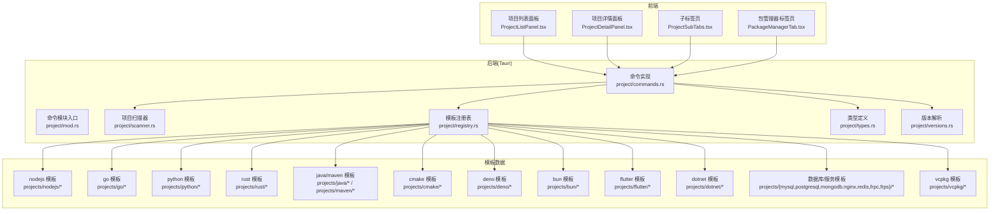
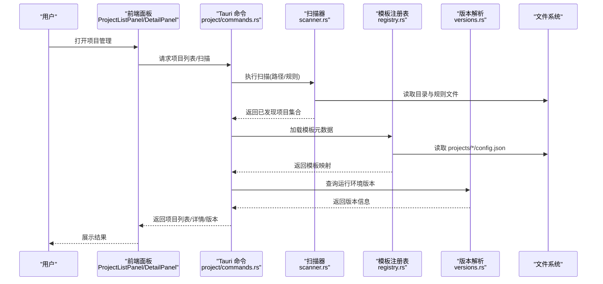
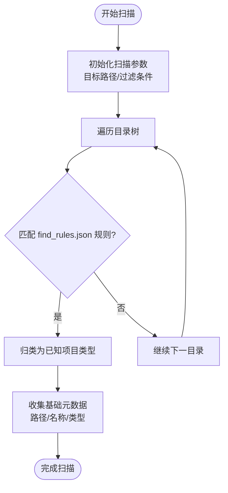
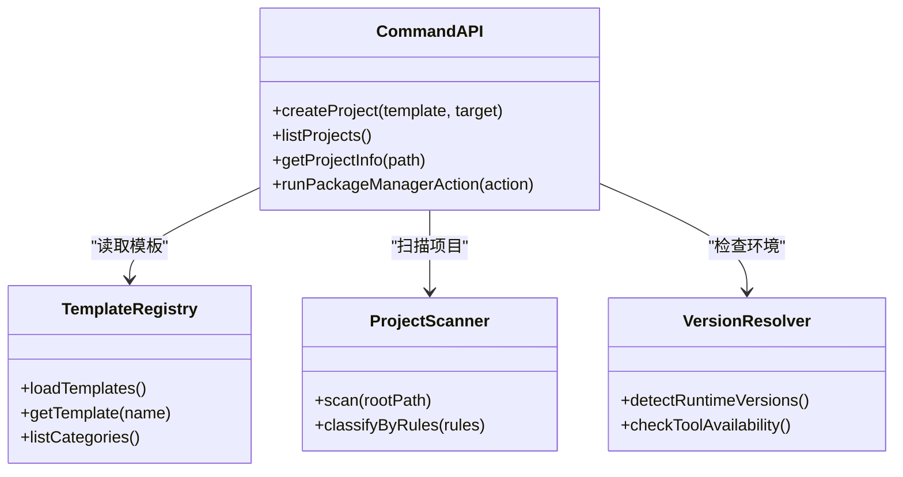
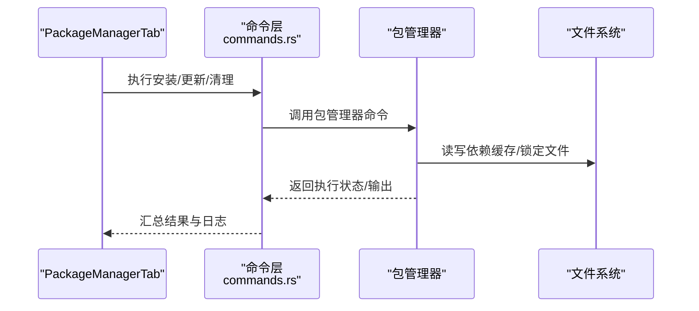
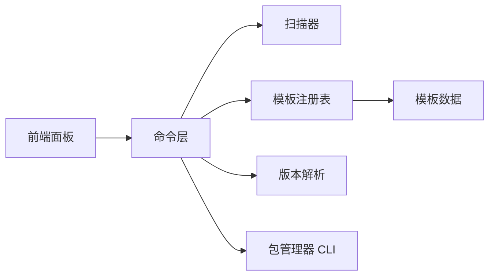

# 项目管理

<cite>
**本文引用的文件**   
- [src-tauri/src/commands/project/mod.rs](file://src-tauri/src/commands/project/mod.rs)
- [src-tauri/src/commands/project/commands.rs](file://src-tauri/src/commands/project/commands.rs)
- [src-tauri/src/commands/project/scanner.rs](file://src-tauri/src/commands/project/scanner.rs)
- [src-tauri/src/commands/project/types.rs](file://src-tauri/src/commands/project/types.rs)
- [src-tauri/src/commands/project/registry.rs](file://src-tauri/src/commands/project/registry.rs)
- [src-tauri/src/commands/project/versions.rs](file://src-tauri/src/commands/project/versions.rs)
- [projects/nodejs/config.json](file://projects/nodejs/config.json)
- [projects/nodejs/find_rules.json](file://projects/nodejs/find_rules.json)
- [projects/nodejs/package_managers.json](file://projects/nodejs/package_managers.json)
- [projects/go/config.json](file://projects/go/config.json)
- [projects/go/find_rules.json](file://projects/go/find_rules.json)
- [projects/python/config.json](file://projects/python/config.json)
- [projects/python/find_rules.json](file://projects/python/find_rules.json)
- [projects/rust/config.json](file://projects/rust/config.json)
- [projects/rust/find_rules.json](file://projects/rust/find_rules.json)
- [projects/java/config.json](file://projects/java/config.json)
- [projects/maven/config.json](file://projects/maven/config.json)
- [projects/cmake/config.json](file://projects/cmake/config.json)
- [projects/deno/config.json](file://projects/deno/config.json)
- [projects/bun/config.json](file://projects/bun/config.json)
- [projects/flutter/config.json](file://projects/flutter/config.json)
- [projects/dotnet/config.json](file://projects/dotnet/config.json)
- [projects/mysql/config.json](file://projects/mysql/config.json)
- [projects/postgresql/config.json](file://projects/postgresql/config.json)
- [projects/mongodb/config.json](file://projects/mongodb/config.json)
- [projects/nginx/config.json](file://projects/nginx/config.json)
- [projects/redis/config.json](file://projects/redis/config.json)
- [projects/frpc/config.json](file://projects/frpc/config.json)
- [projects/frps/config.json](file://projects/frps/config.json)
- [projects/vcpkg/config.json](file://projects/vcpkg/config.json)
- [src/components/project/ProjectListPanel.tsx](file://src/components/project/ProjectListPanel.tsx)
- [src/components/project/ProjectDetailPanel.tsx](file://src/components/project/ProjectDetailPanel.tsx)
- [src/components/project/ProjectSubTabs.tsx](file://src/components/project/ProjectSubTabs.tsx)
- [src/components/project/ProjectSubTabs.types.ts](file://src/components/project/ProjectSubTabs.types.ts)
- [src/components/project/tabs/PackageManagerTab.tsx](file://src/components/project/tabs/PackageManagerTab.tsx)
- [src/components/project/types.ts](file://src/components/project/types.ts)
</cite>

## 目录
1. [简介](#简介)
2. [项目结构](#项目结构)
3. [核心组件](#核心组件)
4. [架构总览](#架构总览)
5. [详细组件分析](#详细组件分析)
6. [依赖关系分析](#依赖关系分析)
7. [性能考虑](#性能考虑)
8. [故障排查指南](#故障排查指南)
9. [结论](#结论)
10. [附录](#附录)

## 简介
本章节面向“项目管理”功能，覆盖从项目创建、模板系统、配置管理、依赖与包管理器集成、版本控制集成、生命周期管理、协作与迁移、扫描与自动检测，到最佳实践与示例。文档同时兼顾初学者入门与高级用户的自定义需求。

## 项目结构
本项目采用前后端分离的 Tauri 应用结构：
- 前端（React + TypeScript）提供项目管理界面与交互
- 后端（Rust/Tauri）提供命令接口，负责项目扫描、注册、版本解析、包管理器操作等
- 预定义项目模板位于 projects 目录，每个语言/框架一个子目录，包含 config.json、find_rules.json、package_managers.json 等

图表来源
- [src-tauri/src/commands/project/mod.rs](file://src-tauri/src/commands/project/mod.rs)
- [src-tauri/src/commands/project/commands.rs](file://src-tauri/src/commands/project/commands.rs)
- [src-tauri/src/commands/project/scanner.rs](file://src-tauri/src/commands/project/scanner.rs)
- [src-tauri/src/commands/project/registry.rs](file://src-tauri/src/commands/project/registry.rs)
- [src-tauri/src/commands/project/types.rs](file://src-tauri/src/commands/project/types.rs)
- [src-tauri/src/commands/project/versions.rs](file://src-tauri/src/commands/project/versions.rs)
- [projects/nodejs/config.json](file://projects/nodejs/config.json)
- [projects/go/config.json](file://projects/go/config.json)
- [projects/python/config.json](file://projects/python/config.json)
- [projects/rust/config.json](file://projects/rust/config.json)
- [projects/java/config.json](file://projects/java/config.json)
- [projects/maven/config.json](file://projects/maven/config.json)
- [projects/cmake/config.json](file://projects/cmake/config.json)
- [projects/deno/config.json](file://projects/deno/config.json)
- [projects/bun/config.json](file://projects/bun/config.json)
- [projects/flutter/config.json](file://projects/flutter/config.json)
- [projects/dotnet/config.json](file://projects/dotnet/config.json)
- [projects/mysql/config.json](file://projects/mysql/config.json)
- [projects/postgresql/config.json](file://projects/postgresql/config.json)
- [projects/mongodb/config.json](file://projects/mongodb/config.json)
- [projects/nginx/config.json](file://projects/nginx/config.json)
- [projects/redis/config.json](file://projects/redis/config.json)
- [projects/frpc/config.json](file://projects/frpc/config.json)
- [projects/frps/config.json](file://projects/frps/config.json)
- [projects/vcpkg/config.json](file://projects/vcpkg/config.json)
- [src/components/project/ProjectListPanel.tsx](file://src/components/project/ProjectListPanel.tsx)
- [src/components/project/ProjectDetailPanel.tsx](file://src/components/project/ProjectDetailPanel.tsx)
- [src/components/project/ProjectSubTabs.tsx](file://src/components/project/ProjectSubTabs.tsx)
- [src/components/project/tabs/PackageManagerTab.tsx](file://src/components/project/tabs/PackageManagerTab.tsx)

章节来源
- [src-tauri/src/commands/project/mod.rs](file://src-tauri/src/commands/project/mod.rs)
- [src-tauri/src/commands/project/commands.rs](file://src-tauri/src/commands/project/commands.rs)
- [src-tauri/src/commands/project/scanner.rs](file://src-tauri/src/commands/project/scanner.rs)
- [src-tauri/src/commands/project/registry.rs](file://src-tauri/src/commands/project/registry.rs)
- [src-tauri/src/commands/project/types.rs](file://src-tauri/src/commands/project/types.rs)
- [src-tauri/src/commands/project/versions.rs](file://src-tauri/src/commands/project/versions.rs)
- [src/components/project/ProjectListPanel.tsx](file://src/components/project/ProjectListPanel.tsx)
- [src/components/project/ProjectDetailPanel.tsx](file://src/components/project/ProjectDetailPanel.tsx)
- [src/components/project/ProjectSubTabs.tsx](file://src/components/project/ProjectSubTabs.tsx)
- [src/components/project/tabs/PackageManagerTab.tsx](file://src/components/project/tabs/PackageManagerTab.tsx)

## 核心组件
- 项目扫描器：负责在指定路径下识别项目类型，依据 find_rules.json 匹配规则进行自动检测
- 模板注册表：加载并维护 projects 下的模板元数据，支持按语言/框架分类
- 命令层：暴露给前端的命令接口，包括项目列表、详情、扫描、版本信息、包管理器操作等
- 类型定义：统一前后端数据结构，确保一致的数据契约
- 版本解析：解析各语言的运行时/SDK 版本信息，用于环境提示与安装引导
- 前端面板：项目列表、详情、子标签页与包管理器标签页，驱动用户交互

章节来源
- [src-tauri/src/commands/project/scanner.rs](file://src-tauri/src/commands/project/scanner.rs)
- [src-tauri/src/commands/project/registry.rs](file://src-tauri/src/commands/project/registry.rs)
- [src-tauri/src/commands/project/commands.rs](file://src-tauri/src/commands/project/commands.rs)
- [src-tauri/src/commands/project/types.rs](file://src-tauri/src/commands/project/types.rs)
- [src-tauri/src/commands/project/versions.rs](file://src-tauri/src/commands/project/versions.rs)
- [src/components/project/ProjectListPanel.tsx](file://src/components/project/ProjectListPanel.tsx)
- [src/components/project/ProjectDetailPanel.tsx](file://src/components/project/ProjectDetailPanel.tsx)
- [src/components/project/ProjectSubTabs.tsx](file://src/components/project/ProjectSubTabs.tsx)
- [src/components/project/tabs/PackageManagerTab.tsx](file://src/components/project/tabs/PackageManagerTab.tsx)

## 架构总览
下图展示了从前端到后端的调用链路与数据流向，以及模板与扫描器的协作方式。

图表来源
- [src-tauri/src/commands/project/commands.rs](file://src-tauri/src/commands/project/commands.rs)
- [src-tauri/src/commands/project/scanner.rs](file://src-tauri/src/commands/project/scanner.rs)
- [src-tauri/src/commands/project/registry.rs](file://src-tauri/src/commands/project/registry.rs)
- [src-tauri/src/commands/project/versions.rs](file://src-tauri/src/commands/project/versions.rs)

## 详细组件分析

### 项目扫描与自动检测机制
- 扫描流程：根据目标根目录递归查找，结合 find_rules.json 中的匹配规则识别项目类型
- 规则匹配：基于文件名、关键配置文件或脚本标记进行判定
- 输出结构：返回项目路径、类型、基础元数据，供详情与后续操作使用

图表来源
- [src-tauri/src/commands/project/scanner.rs](file://src-tauri/src/commands/project/scanner.rs)
- [projects/nodejs/find_rules.json](file://projects/nodejs/find_rules.json)
- [projects/go/find_rules.json](file://projects/go/find_rules.json)
- [projects/python/find_rules.json](file://projects/python/find_rules.json)
- [projects/rust/find_rules.json](file://projects/rust/find_rules.json)
- [projects/java/find_rules.json](file://projects/java/find_rules.json)
- [projects/maven/find_rules.json](file://projects/maven/find_rules.json)
- [projects/cmake/find_rules.json](file://projects/cmake/find_rules.json)
- [projects/deno/find_rules.json](file://projects/deno/find_rules.json)
- [projects/bun/find_rules.json](file://projects/bun/find_rules.json)
- [projects/flutter/find_rules.json](file://projects/flutter/find_rules.json)
- [projects/dotnet/find_rules.json](file://projects/dotnet/find_rules.json)
- [projects/mysql/find_rules.json](file://projects/mysql/find_rules.json)
- [projects/postgresql/find_rules.json](file://projects/postgresql/find_rules.json)
- [projects/mongodb/find_rules.json](file://projects/mongodb/find_rules.json)
- [projects/nginx/find_rules.json](file://projects/nginx/find_rules.json)
- [projects/redis/find_rules.json](file://projects/redis/find_rules.json)
- [projects/frpc/find_rules.json](file://projects/frpc/find_rules.json)
- [projects/frps/find_rules.json](file://projects/frps/find_rules.json)
- [projects/vcpkg/find_rules.json](file://projects/vcpkg/find_rules.json)

章节来源
- [src-tauri/src/commands/project/scanner.rs](file://src-tauri/src/commands/project/scanner.rs)
- [projects/nodejs/find_rules.json](file://projects/nodejs/find_rules.json)
- [projects/go/find_rules.json](file://projects/go/find_rules.json)
- [projects/python/find_rules.json](file://projects/python/find_rules.json)
- [projects/rust/find_rules.json](file://projects/rust/find_rules.json)
- [projects/java/find_rules.json](file://projects/java/find_rules.json)
- [projects/maven/find_rules.json](file://projects/maven/find_rules.json)
- [projects/cmake/find_rules.json](file://projects/cmake/find_rules.json)
- [projects/deno/find_rules.json](file://projects/deno/find_rules.json)
- [projects/bun/find_rules.json](file://projects/bun/find_rules.json)
- [projects/flutter/find_rules.json](file://projects/flutter/find_rules.json)
- [projects/dotnet/find_rules.json](file://projects/dotnet/find_rules.json)
- [projects/mysql/find_rules.json](file://projects/mysql/find_rules.json)
- [projects/postgresql/find_rules.json](file://projects/postgresql/find_rules.json)
- [projects/mongodb/find_rules.json](file://projects/mongodb/find_rules.json)
- [projects/nginx/find_rules.json](file://projects/nginx/find_rules.json)
- [projects/redis/find_rules.json](file://projects/redis/find_rules.json)
- [projects/frpc/find_rules.json](file://projects/frpc/find_rules.json)
- [projects/frps/find_rules.json](file://projects/frps/find_rules.json)
- [projects/vcpkg/find_rules.json](file://projects/vcpkg/find_rules.json)

### 模板系统与项目创建
- 预定义模板：projects 目录下每种语言/框架对应一个模板目录，包含 config.json、find_rules.json、package_managers.json 等
- 模板元数据：config.json 描述模板名称、说明、适用场景、默认环境变量、依赖工具等
- 自定义模板开发：新增目录并在 registry 中注册；遵循现有模板结构，编写 find_rules.json 以支持自动检测
- 项目创建流程：选择模板 -> 生成项目骨架 -> 写入基础配置 -> 初始化依赖（可选）

图表来源
- [src-tauri/src/commands/project/registry.rs](file://src-tauri/src/commands/project/registry.rs)
- [src-tauri/src/commands/project/scanner.rs](file://src-tauri/src/commands/project/scanner.rs)
- [src-tauri/src/commands/project/commands.rs](file://src-tauri/src/commands/project/commands.rs)
- [src-tauri/src/commands/project/versions.rs](file://src-tauri/src/commands/project/versions.rs)

章节来源
- [src-tauri/src/commands/project/registry.rs](file://src-tauri/src/commands/project/registry.rs)
- [src-tauri/src/commands/project/commands.rs](file://src-tauri/src/commands/project/commands.rs)
- [projects/nodejs/config.json](file://projects/nodejs/config.json)
- [projects/go/config.json](file://projects/go/config.json)
- [projects/python/config.json](file://projects/python/config.json)
- [projects/rust/config.json](file://projects/rust/config.json)
- [projects/java/config.json](file://projects/java/config.json)
- [projects/maven/config.json](file://projects/maven/config.json)
- [projects/cmake/config.json](file://projects/cmake/config.json)
- [projects/deno/config.json](file://projects/deno/config.json)
- [projects/bun/config.json](file://projects/bun/config.json)
- [projects/flutter/config.json](file://projects/flutter/config.json)
- [projects/dotnet/config.json](file://projects/dotnet/config.json)
- [projects/mysql/config.json](file://projects/mysql/config.json)
- [projects/postgresql/config.json](file://projects/postgresql/config.json)
- [projects/mongodb/config.json](file://projects/mongodb/config.json)
- [projects/nginx/config.json](file://projects/nginx/config.json)
- [projects/redis/config.json](file://projects/redis/config.json)
- [projects/frpc/config.json](file://projects/frpc/config.json)
- [projects/frps/config.json](file://projects/frps/config.json)
- [projects/vcpkg/config.json](file://projects/vcpkg/config.json)

### 项目配置管理与项目级设置
- 配置来源：模板 config.json 提供默认配置；项目根目录可覆盖局部设置
- 环境变量：env_vars.json 定义常用环境变量，便于一键注入
- 远程版本：remote_versions_config.json 提供运行时/SDK 版本源配置
- 建议：将敏感信息放入本地覆盖配置，避免提交至版本库

章节来源
- [projects/nodejs/config.json](file://projects/nodejs/config.json)
- [projects/nodejs/env_vars.json](file://projects/nodejs/env_vars.json)
- [projects/nodejs/remote_versions_config.json](file://projects/nodejs/remote_versions_config.json)
- [projects/go/config.json](file://projects/go/config.json)
- [projects/go/env_vars.json](file://projects/go/env_vars.json)
- [projects/go/remote_versions_config.json](file://projects/go/remote_versions_config.json)
- [projects/python/config.json](file://projects/python/config.json)
- [projects/python/env_vars.json](file://projects/python/env_vars.json)
- [projects/python/remote_versions_config.json](file://projects/python/remote_versions_config.json)
- [projects/rust/config.json](file://projects/rust/config.json)
- [projects/rust/env_vars.json](file://projects/rust/env_vars.json)
- [projects/rust/remote_versions_config.json](file://projects/rust/remote_versions_config.json)
- [projects/java/config.json](file://projects/java/config.json)
- [projects/java/env_vars.json](file://projects/java/env_vars.json)
- [projects/java/remote_versions_config.json](file://projects/java/remote_versions_config.json)
- [projects/maven/config.json](file://projects/maven/config.json)
- [projects/maven/env_vars.json](file://projects/maven/env_vars.json)
- [projects/maven/remote_versions_config.json](file://projects/maven/remote_versions_config.json)
- [projects/cmake/config.json](file://projects/cmake/config.json)
- [projects/deno/config.json](file://projects/deno/config.json)
- [projects/deno/env_vars.json](file://projects/deno/env_vars.json)
- [projects/deno/remote_versions_config.json](file://projects/deno/remote_versions_config.json)
- [projects/bun/config.json](file://projects/bun/config.json)
- [projects/bun/remote_versions_config.json](file://projects/bun/remote_versions_config.json)
- [projects/flutter/config.json](file://projects/flutter/config.json)
- [projects/flutter/env_vars.json](file://projects/flutter/env_vars.json)
- [projects/flutter/remote_versions_config.json](file://projects/flutter/remote_versions_config.json)
- [projects/dotnet/config.json](file://projects/dotnet/config.json)
- [projects/dotnet/env_vars.json](file://projects/dotnet/env_vars.json)
- [projects/dotnet/remote_versions_config.json](file://projects/dotnet/remote_versions_config.json)
- [projects/mysql/config.json](file://projects/mysql/config.json)
- [projects/postgresql/config.json](file://projects/postgresql/config.json)
- [projects/mongodb/config.json](file://projects/mongodb/config.json)
- [projects/nginx/config.json](file://projects/nginx/config.json)
- [projects/redis/config.json](file://projects/redis/config.json)
- [projects/frpc/config.json](file://projects/frpc/config.json)
- [projects/frps/config.json](file://projects/frps/config.json)
- [projects/vcpkg/config.json](file://projects/vcpkg/config.json)

### 依赖管理与包管理器集成
- 包管理器清单：package_managers.json 定义支持的包管理器及命令映射
- 前端集成：PackageManagerTab 提供安装、更新、清理等操作入口
- 命令对接：后端命令封装具体包管理器 CLI 调用，统一错误处理与日志

图表来源
- [src/components/project/tabs/PackageManagerTab.tsx](file://src/components/project/tabs/PackageManagerTab.tsx)
- [src-tauri/src/commands/project/commands.rs](file://src-tauri/src/commands/project/commands.rs)
- [projects/nodejs/package_managers.json](file://projects/nodejs/package_managers.json)
- [projects/go/package_managers.json](file://projects/go/package_managers.json)
- [projects/python/package_managers.json](file://projects/python/package_managers.json)
- [projects/rust/package_managers.json](file://projects/rust/package_managers.json)
- [projects/maven/package_managers.json](file://projects/maven/package_managers.json)
- [projects/deno/package_managers.json](file://projects/deno/package_managers.json)
- [projects/bun/package_managers.json](file://projects/bun/package_managers.json)
- [projects/flutter/package_managers.json](file://projects/flutter/package_managers.json)
- [projects/dotnet/package_managers.json](file://projects/dotnet/package_managers.json)
- [projects/vcpkg/package_managers.json](file://projects/vcpkg/package_managers.json)

章节来源
- [src/components/project/tabs/PackageManagerTab.tsx](file://src/components/project/tabs/PackageManagerTab.tsx)
- [src-tauri/src/commands/project/commands.rs](file://src-tauri/src/commands/project/commands.rs)
- [projects/nodejs/package_managers.json](file://projects/nodejs/package_managers.json)
- [projects/go/package_managers.json](file://projects/go/package_managers.json)
- [projects/python/package_managers.json](file://projects/python/package_managers.json)
- [projects/rust/package_managers.json](file://projects/rust/package_managers.json)
- [projects/maven/package_managers.json](file://projects/maven/package_managers.json)
- [projects/deno/package_managers.json](file://projects/deno/package_managers.json)
- [projects/bun/package_managers.json](file://projects/bun/package_managers.json)
- [projects/flutter/package_managers.json](file://projects/flutter/package_managers.json)
- [projects/dotnet/package_managers.json](file://projects/dotnet/package_managers.json)
- [projects/vcpkg/package_managers.json](file://projects/vcpkg/package_managers.json)

### 版本控制集成功能
- 当前仓库未直接实现 Git 命令封装，但可通过包管理器与构建脚本间接集成
- 建议在模板中添加 .gitignore、CI 工作流与发布脚本，配合外部版本控制系统
- 可在命令层扩展 Git 相关命令，以实现分支、标签、提交信息的可视化

章节来源
- [src-tauri/src/commands/project/commands.rs](file://src-tauri/src/commands/project/commands.rs)

### 项目生命周期管理
- 阶段划分：初始化 -> 开发 -> 测试 -> 构建 -> 部署 -> 归档
- 自动化：通过模板与 CI 工作流（如 GitHub Actions）串联各阶段
- 监控与回滚：结合包管理器锁定文件与制品仓库，保障可重复构建与快速回滚

章节来源
- [src-tauri/src/commands/project/commands.rs](file://src-tauri/src/commands/project/commands.rs)

### 项目间协作
- 共享模板：团队内复用同一套模板与规则，保证一致性
- 配置分层：全局配置与项目级覆盖分离，便于团队协作与权限控制
- 文档与规范：在模板中包含 README、贡献指南与代码规范

章节来源
- [src-tauri/src/commands/project/registry.rs](file://src-tauri/src/commands/project/registry.rs)
- [src/components/project/ProjectListPanel.tsx](file://src/components/project/ProjectListPanel.tsx)
- [src/components/project/ProjectDetailPanel.tsx](file://src/components/project/ProjectDetailPanel.tsx)

### 项目迁移
- 迁移策略：使用模板重新生成骨架，逐步替换业务代码与配置
- 兼容性：保持 API 与数据格式稳定，提供迁移脚本与校验步骤
- 验证：在沙箱环境中先行验证，再推广到生产

章节来源
- [src-tauri/src/commands/project/commands.rs](file://src-tauri/src/commands/project/commands.rs)

### 实际配置示例与最佳实践
- 示例参考：
  - Node.js 模板：[projects/nodejs/config.json](file://projects/nodejs/config.json)、[projects/nodejs/find_rules.json](file://projects/nodejs/find_rules.json)、[projects/nodejs/package_managers.json](file://projects/nodejs/package_managers.json)
  - Go 模板：[projects/go/config.json](file://projects/go/config.json)、[projects/go/find_rules.json](file://projects/go/find_rules.json)、[projects/go/package_managers.json](file://projects/go/package_managers.json)
  - Python 模板：[projects/python/config.json](file://projects/python/config.json)、[projects/python/find_rules.json](file://projects/python/find_rules.json)、[projects/python/package_managers.json](file://projects/python/package_managers.json)
  - Rust 模板：[projects/rust/config.json](file://projects/rust/config.json)、[projects/rust/find_rules.json](file://projects/rust/find_rules.json)、[projects/rust/package_managers.json](file://projects/rust/package_managers.json)
  - Java/Maven 模板：[projects/java/config.json](file://projects/java/config.json)、[projects/maven/config.json](file://projects/maven/config.json)
  - CMake 模板：[projects/cmake/config.json](file://projects/cmake/config.json)
  - Deno/Bun 模板：[projects/deno/config.json](file://projects/deno/config.json)、[projects/bun/config.json](file://projects/bun/config.json)
  - Flutter/Dotnet 模板：[projects/flutter/config.json](file://projects/flutter/config.json)、[projects/dotnet/config.json](file://projects/dotnet/config.json)
  - 数据库与服务模板：[projects/mysql/config.json](file://projects/mysql/config.json)、[projects/postgresql/config.json](file://projects/postgresql/config.json)、[projects/mongodb/config.json](file://projects/mongodb/config.json)、[projects/nginx/config.json](file://projects/nginx/config.json)、[projects/redis/config.json](file://projects/redis/config.json)、[projects/frpc/config.json](file://projects/frpc/config.json)、[projects/frps/config.json](file://projects/frps/config.json)
  - vcpkg 模板：[projects/vcpkg/config.json](file://projects/vcpkg/config.json)
- 最佳实践：
  - 将公共配置抽离到模板，项目级仅保留差异化设置
  - 使用 env_vars.json 集中管理环境变量，避免硬编码
  - 锁定依赖版本，确保构建可重复
  - 在 CI 中集成静态检查与测试，提升质量

章节来源
- [projects/nodejs/config.json](file://projects/nodejs/config.json)
- [projects/nodejs/find_rules.json](file://projects/nodejs/find_rules.json)
- [projects/nodejs/package_managers.json](file://projects/nodejs/package_managers.json)
- [projects/go/config.json](file://projects/go/config.json)
- [projects/go/find_rules.json](file://projects/go/find_rules.json)
- [projects/go/package_managers.json](file://projects/go/package_managers.json)
- [projects/python/config.json](file://projects/python/config.json)
- [projects/python/find_rules.json](file://projects/python/find_rules.json)
- [projects/python/package_managers.json](file://projects/python/package_managers.json)
- [projects/rust/config.json](file://projects/rust/config.json)
- [projects/rust/find_rules.json](file://projects/rust/find_rules.json)
- [projects/rust/package_managers.json](file://projects/rust/package_managers.json)
- [projects/java/config.json](file://projects/java/config.json)
- [projects/maven/config.json](file://projects/maven/config.json)
- [projects/cmake/config.json](file://projects/cmake/config.json)
- [projects/deno/config.json](file://projects/deno/config.json)
- [projects/bun/config.json](file://projects/bun/config.json)
- [projects/flutter/config.json](file://projects/flutter/config.json)
- [projects/dotnet/config.json](file://projects/dotnet/config.json)
- [projects/mysql/config.json](file://projects/mysql/config.json)
- [projects/postgresql/config.json](file://projects/postgresql/config.json)
- [projects/mongodb/config.json](file://projects/mongodb/config.json)
- [projects/nginx/config.json](file://projects/nginx/config.json)
- [projects/redis/config.json](file://projects/redis/config.json)
- [projects/frpc/config.json](file://projects/frpc/config.json)
- [projects/frps/config.json](file://projects/frps/config.json)
- [projects/vcpkg/config.json](file://projects/vcpkg/config.json)

### 初学者指导：快速创建与配置
- 步骤：
  1) 打开项目管理界面，查看项目列表
  2) 选择合适模板（Node.js/Go/Python/Rust 等）
  3) 指定目标路径，确认生成
  4) 进入项目详情，按需调整环境变量与包管理器设置
  5) 运行构建与测试，验证环境
- 常见问题：
  - 找不到包管理器：检查 PATH 与 remote_versions_config.json
  - 扫描不到项目：确认 find_rules.json 规则是否匹配

章节来源
- [src/components/project/ProjectListPanel.tsx](file://src/components/project/ProjectListPanel.tsx)
- [src/components/project/ProjectDetailPanel.tsx](file://src/components/project/ProjectDetailPanel.tsx)
- [src-tauri/src/commands/project/scanner.rs](file://src-tauri/src/commands/project/scanner.rs)
- [src-tauri/src/commands/project/versions.rs](file://src-tauri/src/commands/project/versions.rs)

### 高级用户：自定义模板与高级配置
- 自定义模板：
  - 新建模板目录，编写 config.json、find_rules.json、package_managers.json
  - 在 registry 中注册新模板，使其出现在模板列表中
- 高级配置：
  - 使用 env_vars.json 注入复杂环境变量
  - 通过 remote_versions_config.json 指定私有镜像或版本源
  - 在命令层扩展自定义动作（如构建、部署、发布）

章节来源
- [src-tauri/src/commands/project/registry.rs](file://src-tauri/src/commands/project/registry.rs)
- [src-tauri/src/commands/project/commands.rs](file://src-tauri/src/commands/project/commands.rs)
- [projects/nodejs/config.json](file://projects/nodejs/config.json)
- [projects/nodejs/env_vars.json](file://projects/nodejs/env_vars.json)
- [projects/nodejs/remote_versions_config.json](file://projects/nodejs/remote_versions_config.json)

## 依赖关系分析
- 组件耦合：
  - 命令层依赖扫描器、注册表、版本解析
  - 前端面板依赖命令层提供的统一接口
- 外部依赖：
  - 包管理器 CLI（npm/pnpm/yarn、go mod、pip、cargo、maven、cmake、deno、bun、flutter、dotnet、vcpkg 等）
  - 文件系统访问与规则匹配引擎

图表来源
- [src-tauri/src/commands/project/commands.rs](file://src-tauri/src/commands/project/commands.rs)
- [src-tauri/src/commands/project/scanner.rs](file://src-tauri/src/commands/project/scanner.rs)
- [src-tauri/src/commands/project/registry.rs](file://src-tauri/src/commands/project/registry.rs)
- [src-tauri/src/commands/project/versions.rs](file://src-tauri/src/commands/project/versions.rs)
- [src/components/project/ProjectListPanel.tsx](file://src/components/project/ProjectListPanel.tsx)
- [src/components/project/ProjectDetailPanel.tsx](file://src/components/project/ProjectDetailPanel.tsx)

章节来源
- [src-tauri/src/commands/project/commands.rs](file://src-tauri/src/commands/project/commands.rs)
- [src-tauri/src/commands/project/scanner.rs](file://src-tauri/src/commands/project/scanner.rs)
- [src-tauri/src/commands/project/registry.rs](file://src-tauri/src/commands/project/registry.rs)
- [src-tauri/src/commands/project/versions.rs](file://src-tauri/src/commands/project/versions.rs)
- [src/components/project/ProjectListPanel.tsx](file://src/components/project/ProjectListPanel.tsx)
- [src/components/project/ProjectDetailPanel.tsx](file://src/components/project/ProjectDetailPanel.tsx)

## 性能考虑
- 扫描优化：
  - 增量扫描：记录上次扫描结果，仅对变更目录进行重扫
  - 规则短路：优先匹配高命中率的规则，减少不必要的 I/O
- 包管理器操作：
  - 并行化：对无依赖冲突的操作进行并发执行
  - 缓存：利用包管理器本地缓存与网络代理，降低下载耗时
- 前端渲染：
  - 分页与懒加载：大项目列表时按需加载详情
  - 去抖与节流：频繁输入与滚动时减少重绘

## 故障排查指南
- 常见问题定位：
  - 扫描失败：检查目标路径权限与 find_rules.json 规则
  - 包管理器不可用：确认 PATH 与 remote_versions_config.json
  - 版本解析异常：检查运行时/SDK 安装路径与版本格式
- 调试建议：
  - 启用详细日志，观察命令层与包管理器的交互输出
  - 使用最小复现项目，隔离问题范围

章节来源
- [src-tauri/src/commands/project/scanner.rs](file://src-tauri/src/commands/project/scanner.rs)
- [src-tauri/src/commands/project/versions.rs](file://src-tauri/src/commands/project/versions.rs)
- [src-tauri/src/commands/project/commands.rs](file://src-tauri/src/commands/project/commands.rs)

## 结论
项目管理功能围绕“模板驱动、规则扫描、命令封装、前端可视”展开，提供了从项目创建到依赖管理的完整链路。通过合理的模板设计与配置分层，既能满足初学者的快速上手，也能支撑高级用户的深度定制与团队协作。

## 附录
- 前端类型与标签页：
  - [src/components/project/types.ts](file://src/components/project/types.ts)
  - [src/components/project/ProjectSubTabs.types.ts](file://src/components/project/ProjectSubTabs.types.ts)
  - [src/components/project/ProjectSubTabs.tsx](file://src/components/project/ProjectSubTabs.tsx)
- 后端类型与命令：
  - [src-tauri/src/commands/project/types.rs](file://src-tauri/src/commands/project/types.rs)
  - [src-tauri/src/commands/project/mod.rs](file://src-tauri/src/commands/project/mod.rs)