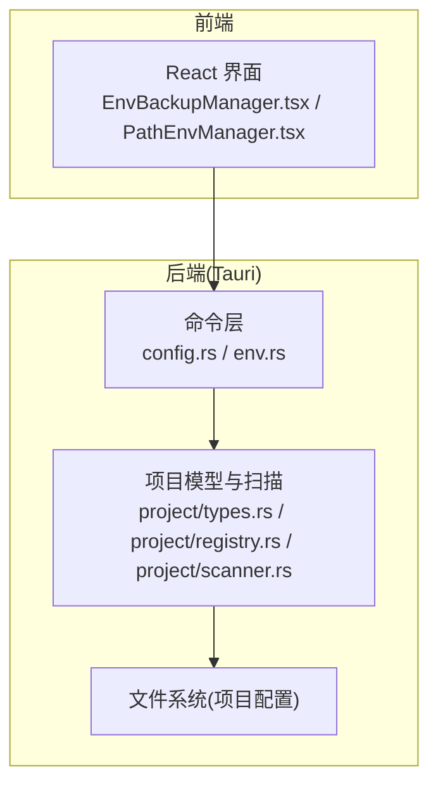
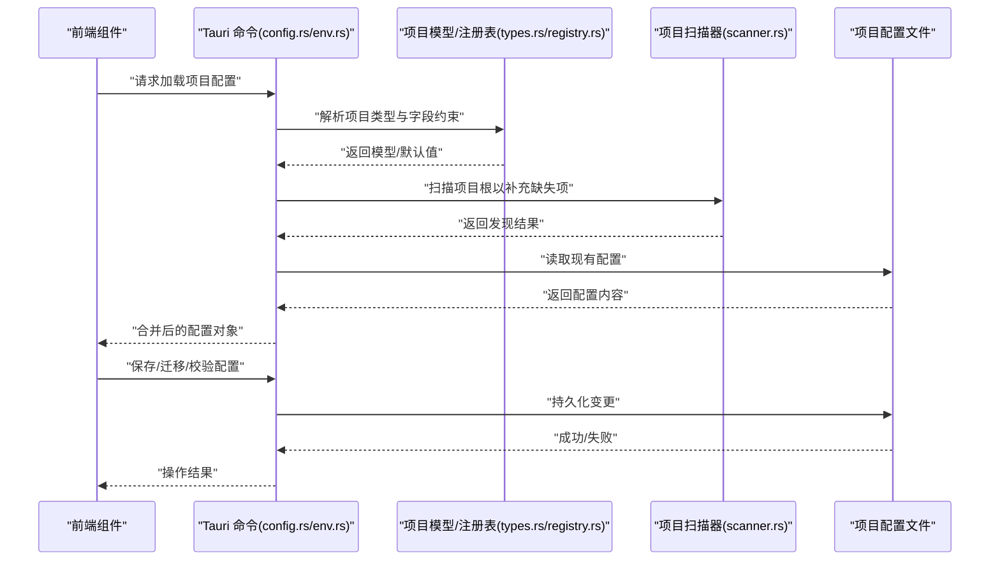
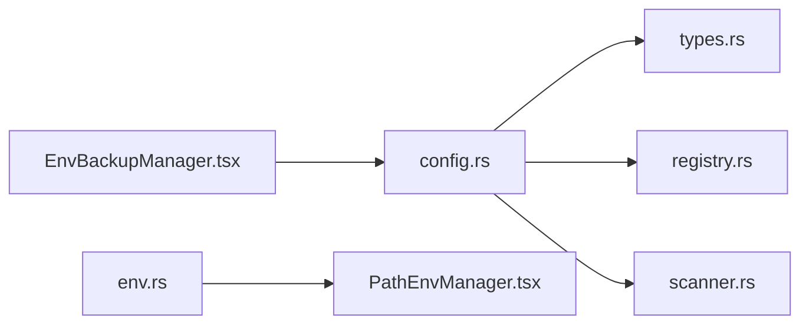

# 项目配置管理

<cite>
**本文引用的文件**   
- [src-tauri/src/commands/config.rs](file://src-tauri/src/commands/config.rs)
- [src-tauri/src/commands/env.rs](file://src-tauri/src/commands/env.rs)
- [src-tauri/src/commands/project/types.rs](file://src-tauri/src/commands/project/types.rs)
- [src-tauri/src/commands/project/registry.rs](file://src-tauri/src/commands/project/registry.rs)
- [src-tauri/src/commands/project/scanner.rs](file://src-tauri/src/commands/project/scanner.rs)
- [src/components/EnvBackupManager.tsx](file://src/components/EnvBackupManager.tsx)
- [src/components/PathEnvManager.tsx](file://src/components/PathEnvManager.tsx)
- [projects/deno/config.json](file://projects/deno/config.json)
- [projects/go/config.json](file://projects/go/config.json)
- [projects/nodejs/config.json](file://projects/nodejs/config.json)
- [projects/python/config.json](file://projects/python/config.json)
- [projects/deno/env_vars.json](file://projects/deno/env_vars.json)
- [projects/go/env_vars.json](file://projects/go/env_vars.json)
- [projects/nodejs/env_vars.json](file://projects/nodejs/env_vars.json)
- [projects/python/env_vars.json](file://projects/python/env_vars.json)
</cite>

## 目录
1. [简介](#简介)
2. [项目结构](#项目结构)
3. [核心组件](#核心组件)
4. [架构总览](#架构总览)
5. [详细组件分析](#详细组件分析)
6. [依赖关系分析](#依赖关系分析)
7. [性能考虑](#性能考虑)
8. [故障排查指南](#故障排查指南)
9. [结论](#结论)
10. [附录](#附录)

## 简介
本章节面向“项目配置管理”主题，系统性说明项目级配置的结构、含义与使用方式。内容覆盖：
- 配置文件格式与验证规则
- 环境变量管理与路径配置
- 配置继承与覆盖机制
- 配置迁移与版本兼容性处理
- 配置备份与恢复
- 语法检查与错误提示
- 初学者入门与高级最佳实践

## 项目结构
本项目采用前后端分离的桌面应用架构（Tauri + React）。配置相关能力由后端命令模块提供，前端通过 Tauri 调用暴露的命令进行读写与管理。

图表来源
- [src/components/EnvBackupManager.tsx](file://src/components/EnvBackupManager.tsx)
- [src/components/PathEnvManager.tsx](file://src/components/PathEnvManager.tsx)
- [src-tauri/src/commands/config.rs](file://src-tauri/src/commands/config.rs)
- [src-tauri/src/commands/env.rs](file://src-tauri/src/commands/env.rs)
- [src-tauri/src/commands/project/types.rs](file://src-tauri/src/commands/project/types.rs)
- [src-tauri/src/commands/project/registry.rs](file://src-tauri/src/commands/project/registry.rs)
- [src-tauri/src/commands/project/scanner.rs](file://src-tauri/src/commands/project/scanner.rs)

章节来源
- [src-tauri/src/commands/config.rs](file://src-tauri/src/commands/config.rs)
- [src-tauri/src/commands/env.rs](file://src-tauri/src/commands/env.rs)
- [src-tauri/src/commands/project/types.rs](file://src-tauri/src/commands/project/types.rs)
- [src-tauri/src/commands/project/registry.rs](file://src-tauri/src/commands/project/registry.rs)
- [src-tauri/src/commands/project/scanner.rs](file://src-tauri/src/commands/project/scanner.rs)
- [src/components/EnvBackupManager.tsx](file://src/components/EnvBackupManager.tsx)
- [src/components/PathEnvManager.tsx](file://src/components/PathEnvManager.tsx)

## 核心组件
- 配置命令接口（后端）
  - 负责加载、校验、保存项目配置；提供迁移与兼容处理入口；对外暴露统一 API。
- 环境变量命令接口（后端）
  - 负责读取/写入进程与环境变量；支持按项目隔离的环境变量集合。
- 项目类型与注册表（后端）
  - 定义项目配置的数据模型、字段约束与默认值；维护不同技术栈项目的配置模板与发现逻辑。
- 项目扫描器（后端）
  - 扫描项目根目录，识别技术栈并生成基础配置项，辅助自动补全与初始化。
- 前端配置管理面板
  - 提供可视化编辑、备份/恢复、路径与环境变量管理等交互能力。

章节来源
- [src-tauri/src/commands/config.rs](file://src-tauri/src/commands/config.rs)
- [src-tauri/src/commands/env.rs](file://src-tauri/src/commands/env.rs)
- [src-tauri/src/commands/project/types.rs](file://src-tauri/src/commands/project/types.rs)
- [src-tauri/src/commands/project/registry.rs](file://src-tauri/src/commands/project/registry.rs)
- [src-tauri/src/commands/project/scanner.rs](file://src-tauri/src/commands/project/scanner.rs)
- [src/components/EnvBackupManager.tsx](file://src/components/EnvBackupManager.tsx)
- [src/components/PathEnvManager.tsx](file://src/components/PathEnvManager.tsx)

## 架构总览
下图展示了从前端到后端的配置管理调用链路与数据流向。

图表来源
- [src-tauri/src/commands/config.rs](file://src-tauri/src/commands/config.rs)
- [src-tauri/src/commands/env.rs](file://src-tauri/src/commands/env.rs)
- [src-tauri/src/commands/project/types.rs](file://src-tauri/src/commands/project/types.rs)
- [src-tauri/src/commands/project/registry.rs](file://src-tauri/src/commands/project/registry.rs)
- [src-tauri/src/commands/project/scanner.rs](file://src-tauri/src/commands/project/scanner.rs)

## 详细组件分析

### 配置数据结构与字段语义
- 项目配置模型
  - 用于描述一个项目的通用配置项，包括语言/运行时、包管理器、工具链、环境变量、路径等。
  - 字段通常包含：标识、名称、版本策略、运行参数、环境变量映射、路径映射、扩展开关等。
- 技术栈差异
  - 不同技术栈（如 Node.js、Python、Go、Deno）在配置项上存在差异，注册表会提供对应模板与默认值。
- 示例参考
  - 可参考各技术栈下的 config.json 与 env_vars.json 了解实际字段组织方式。

章节来源
- [src-tauri/src/commands/project/types.rs](file://src-tauri/src/commands/project/types.rs)
- [src-tauri/src/commands/project/registry.rs](file://src-tauri/src/commands/project/registry.rs)
- [projects/deno/config.json](file://projects/deno/config.json)
- [projects/go/config.json](file://projects/go/config.json)
- [projects/nodejs/config.json](file://projects/nodejs/config.json)
- [projects/python/config.json](file://projects/python/config.json)
- [projects/deno/env_vars.json](file://projects/deno/env_vars.json)
- [projects/go/env_vars.json](file://projects/go/env_vars.json)
- [projects/nodejs/env_vars.json](file://projects/nodejs/env_vars.json)
- [projects/python/env_vars.json](file://projects/python/env_vars.json)

### 配置文件格式与验证规则
- 文件格式
  - 项目级配置采用 JSON 文件组织，便于人类阅读与机器解析。
- 验证规则
  - 后端在加载时执行字段类型校验、必填项检查、取值范围与枚举约束、路径合法性检查等。
  - 对不合法或冲突的配置项，返回结构化错误信息以便前端展示。
- 建议
  - 新增字段需保持向后兼容；旧字段应保留默认行为或提供迁移路径。

章节来源
- [src-tauri/src/commands/config.rs](file://src-tauri/src/commands/config.rs)
- [src-tauri/src/commands/project/types.rs](file://src-tauri/src/commands/project/types.rs)

### 环境变量管理与路径配置
- 环境变量
  - 支持按项目维度维护环境变量集合，避免全局污染。
  - 提供读取当前进程环境、写入项目级环境、合并系统环境与项目环境的接口。
- 路径配置
  - 统一管理 PATH 及工具链路径，支持多平台差异与动态追加/替换。
- 前端集成
  - 通过专用组件提供可视化编辑与即时生效能力。

章节来源
- [src-tauri/src/commands/env.rs](file://src-tauri/src/commands/env.rs)
- [src/components/PathEnvManager.tsx](file://src/components/PathEnvManager.tsx)

### 配置继承与覆盖机制
- 继承顺序
  - 默认模板（注册表）→ 项目扫描推断 → 用户显式配置 → 运行期覆盖（命令行/环境变量）。
- 覆盖策略
  - 同名字段以后置覆盖前置为原则；数组类字段支持追加或替换策略。
- 实现要点
  - 在加载阶段按优先级合并，最终输出标准化配置对象供后续流程使用。

章节来源
- [src-tauri/src/commands/project/registry.rs](file://src-tauri/src/commands/project/registry.rs)
- [src-tauri/src/commands/project/scanner.rs](file://src-tauri/src/commands/project/scanner.rs)
- [src-tauri/src/commands/config.rs](file://src-tauri/src/commands/config.rs)

### 配置迁移与版本兼容性
- 迁移目标
  - 保证历史配置在新版本中仍可被正确解析与使用。
- 迁移策略
  - 字段重命名/拆分：提供映射表与默认值填充。
  - 废弃字段：记录警告并在必要时自动清理。
  - 版本标记：在配置中声明 schema 版本，加载时根据版本选择迁移脚本。
- 回滚建议
  - 迁移前自动备份，失败时回滚至上一可用版本。

章节来源
- [src-tauri/src/commands/config.rs](file://src-tauri/src/commands/config.rs)

### 配置备份与恢复
- 备份
  - 支持导出当前项目配置为独立文件，包含元信息与时间戳。
- 恢复
  - 导入备份文件并校验完整性，成功后覆盖当前配置。
- 前端操作
  - 通过备份管理器组件触发导出/导入流程，并提供进度与结果反馈。

章节来源
- [src-tauri/src/commands/config.rs](file://src-tauri/src/commands/config.rs)
- [src/components/EnvBackupManager.tsx](file://src/components/EnvBackupManager.tsx)

### 语法检查与错误提示
- 检查时机
  - 打开配置、保存前、运行前均可触发语法与语义检查。
- 错误分类
  - 语法错误（JSON 解析）、字段缺失/类型不符、取值越界、路径不存在、权限不足等。
- 提示策略
  - 将错误定位到具体字段与行号，给出修复建议与一键修复选项（如自动补齐默认值）。

章节来源
- [src-tauri/src/commands/config.rs](file://src-tauri/src/commands/config.rs)

### 初学者入门指南
- 快速开始
  - 选择一个技术栈模板，自动生成基础配置。
  - 仅填写必要字段（如运行时版本、包管理器），其余保持默认。
- 常用设置
  - 环境变量：按需添加密钥与开关。
  - 路径：指定本地 SDK/工具路径，避免依赖全局安装。
- 验证与调试
  - 使用内置检查功能确认配置无误后再运行项目。

[本节为概念性指导，无需列出具体源码]

### 高级用户最佳实践
- 分层配置
  - 将公共配置下沉至模板，项目级仅保留差异化部分。
- 安全敏感信息
  - 使用环境变量注入敏感值，避免明文写入配置。
- 自动化
  - 在 CI 中执行配置校验与迁移脚本，确保一致性。
- 版本控制
  - 将配置纳入版本管理，配合迁移脚本实现平滑升级。

[本节为概念性指导，无需列出具体源码]

## 依赖关系分析
配置管理涉及前后端协作与多模块耦合，关键依赖如下：

图表来源
- [src-tauri/src/commands/config.rs](file://src-tauri/src/commands/config.rs)
- [src-tauri/src/commands/env.rs](file://src-tauri/src/commands/env.rs)
- [src-tauri/src/commands/project/types.rs](file://src-tauri/src/commands/project/types.rs)
- [src-tauri/src/commands/project/registry.rs](file://src-tauri/src/commands/project/registry.rs)
- [src-tauri/src/commands/project/scanner.rs](file://src-tauri/src/commands/project/scanner.rs)
- [src/components/EnvBackupManager.tsx](file://src/components/EnvBackupManager.tsx)
- [src/components/PathEnvManager.tsx](file://src/components/PathEnvManager.tsx)

章节来源
- [src-tauri/src/commands/config.rs](file://src-tauri/src/commands/config.rs)
- [src-tauri/src/commands/env.rs](file://src-tauri/src/commands/env.rs)
- [src-tauri/src/commands/project/types.rs](file://src-tauri/src/commands/project/types.rs)
- [src-tauri/src/commands/project/registry.rs](file://src-tauri/src/commands/project/registry.rs)
- [src-tauri/src/commands/project/scanner.rs](file://src-tauri/src/commands/project/scanner.rs)
- [src/components/EnvBackupManager.tsx](file://src/components/EnvBackupManager.tsx)
- [src/components/PathEnvManager.tsx](file://src/components/PathEnvManager.tsx)

## 性能考虑
- 懒加载与增量更新
  - 仅在需要时加载配置，变更时增量校验与持久化。
- 缓存策略
  - 对扫描结果与模板合并结果进行短期缓存，减少重复计算。
- I/O 优化
  - 批量读写配置与备份文件，避免频繁小文件操作。

[本节为通用性能建议，无需列出具体源码]

## 故障排查指南
- 常见问题
  - 配置无法加载：检查 JSON 语法与字段类型。
  - 环境变量未生效：确认作用域与合并顺序。
  - 路径无效：核对绝对/相对路径与平台差异。
- 诊断步骤
  - 启用详细日志，查看错误堆栈与定位字段。
  - 使用备份恢复功能回滚到上一个稳定版本。
  - 逐项禁用复杂配置项，逐步缩小问题范围。

章节来源
- [src-tauri/src/commands/config.rs](file://src-tauri/src/commands/config.rs)
- [src-tauri/src/commands/env.rs](file://src-tauri/src/commands/env.rs)

## 结论
本项目配置管理以“模板+扫描+用户配置+运行期覆盖”的分层模型为核心，结合严格的校验与迁移机制，既满足初学者的易用性，也兼顾高级用户的灵活性与可维护性。通过前后端协同与完善的备份恢复、错误提示能力，形成闭环的配置生命周期管理。

[本节为总结性内容，无需列出具体源码]

## 附录
- 术语
  - 模板：预置的技术栈配置基线
  - 扫描：基于项目特征推断配置项的过程
  - 覆盖：后置配置项对前置配置的替换或合并
- 参考样例
  - 各技术栈的 config.json 与 env_vars.json 可作为字段组织与命名约定参考。

章节来源
- [projects/deno/config.json](file://projects/deno/config.json)
- [projects/go/config.json](file://projects/go/config.json)
- [projects/nodejs/config.json](file://projects/nodejs/config.json)
- [projects/python/config.json](file://projects/python/config.json)
- [projects/deno/env_vars.json](file://projects/deno/env_vars.json)
- [projects/go/env_vars.json](file://projects/go/env_vars.json)
- [projects/nodejs/env_vars.json](file://projects/nodejs/env_vars.json)
- [projects/python/env_vars.json](file://projects/python/env_vars.json)