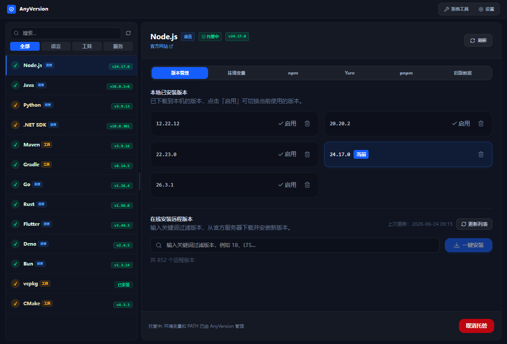
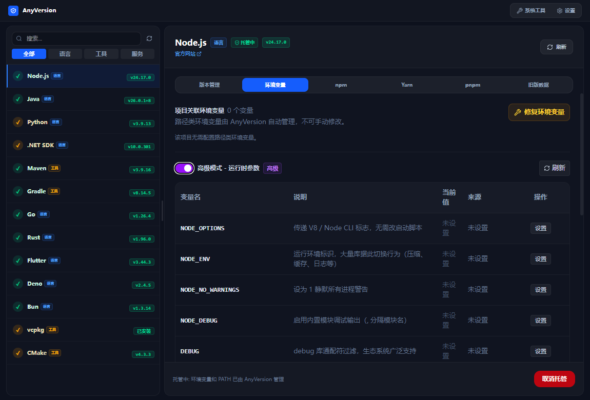
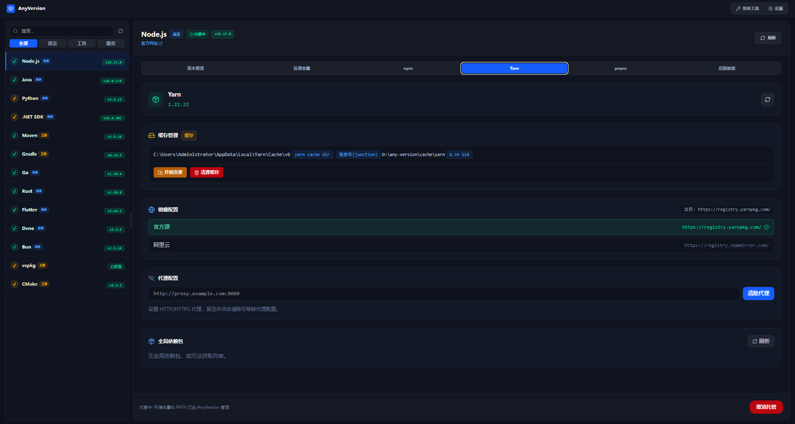
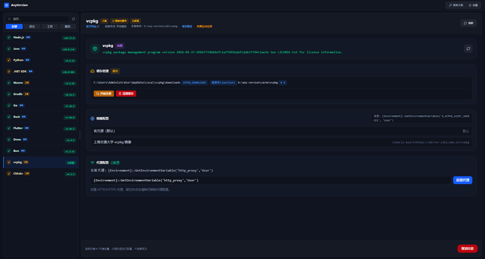
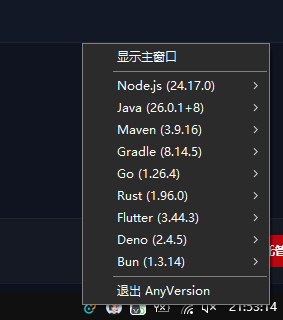

# AnyVersion

<div align="center">

Windows 多语言开发环境版本管理器

[](https://v2.tauri.app)
[](https://react.dev)
[](https://www.rust-lang.org)
[](LICENSE)

统一管理 Node.js、Java、Python、Go 等开发环境的多版本切换、环境变量、包管理器和缓存。

</div>

---

## ✨ 功能特性

- 🔀 **多版本管理** — 一键切换不同语言的 SDK 版本，支持并行安装多个版本
- 🌐 **镜像源切换** — 内置多家镜像源（官方/阿里云/腾讯云），一键切换加速下载
- 🗂️ **缓存管理** — 可视化查看和清理各语言/包管理器的缓存目录
- 📦 **全局包管理** — 查看和管理 npm、yarn、pnpm 等包管理器的全局安装包
- 🔧 **环境变量管理** — 自动管理 PATH 及相关环境变量，支持备份/恢复
- 🔍 **本地安装发现** — 自动扫描系统 PATH、注册表、常见安装目录，发现已有安装
- 🚀 **进程/服务检测** — 通过 sysinfo 枚举运行中的进程和相关系统服务
- 📋 **端口扫描** — 快速扫描占用端口的进程，方便排查端口冲突
- 🛠️ **系统工具** — 集成常用系统工具，提升开发效率
- 🔔 **通知栏快速切换** — 系统托盘图标常驻，右键菜单一键切换各语言版本，无需打开主窗口

## 🖼️ 截图

### 主界面



### 版本管理



### 镜像源切换



### 缓存与包管理



### 通知栏快速切换



系统托盘常驻，右键菜单即可快速切换各语言版本，无需打开主窗口。

## 🛠️ 技术栈

| 层级 | 技术 |
|------|------|
| **前端** | React 19 · TypeScript · Vite 7 · Tailwind CSS 4 |
| **后端** | Tauri 2 · Rust 2021 Edition |
| **核心依赖** | sysinfo · reqwest · serde · winreg · trash |

## 📦 安装

### 前置要求

- [Rust](https://www.rust-lang.org/) (建议 1.75+)
- [Node.js](https://nodejs.org/) (建议 18+)
- [pnpm](https://pnpm.io/) 或 npm

### 从 Release 下载

前往 [GitHub Releases](https://github.com/your-repo/any-version/releases) 页面下载最新版安装包。

### 从源码构建

```bash
# 克隆仓库
git clone https://github.com/your-repo/any-version.git
cd any-version

# 安装前端依赖
pnpm install

# 开发模式运行（需先启动 Vite dev server）
pnpm tauri dev

# 构建生产版本
pnpm tauri build
```

## 🚀 开发指南

### 启动开发环境

```bash
# 终端 1：启动 Vite 开发服务器
pnpm dev

# 终端 2：启动 Tauri 应用（会自动连接 localhost:1420）
pnpm tauri dev
```

### 项目结构

```
any-version/
├── src/                    # 前端 React 代码
│   ├── components/         # UI 组件
│   │   ├── project/       # 项目管理相关组件
│   │   ├── CacheManager.tsx
│   │   ├── MirrorManager.tsx
│   │   ├── PkgManager.tsx
│   │   ├── EnvBackupManager.tsx
│   │   ├── PortScanner.tsx
│   │   ├── SystemTools.tsx
│   │   └── ...
│   ├── App.tsx            # 主应用组件
│   └── main.tsx           # 入口文件
├── src-tauri/             # Tauri 后端（Rust）
│   ├── src/               # Rust 源码
│   ├── Cargo.toml         # Rust 依赖配置
│   └── tauri.conf.json    # Tauri 应用配置
├── projects.json           # 运行时定义清单（各语言 SDK 配置）
├── dist/                  # 构建输出目录
└── package.json           # 前端依赖配置
```

### 常用命令

| 命令 | 说明 |
|------|------|
| `pnpm dev` | 启动前端开发服务器 |
| `pnpm build` | 构建前端生产版本 |
| `pnpm preview` | 预览前端生产版本 |
| `pnpm tauri dev` | 启动 Tauri 开发模式 |
| `pnpm tauri build` | 构建 Tauri 生产应用 |

## 📝 projects.json 配置说明

`projects.json` 是运行时定义清单，位于项目根目录，定义了所有可管理的 SDK/工具。

> 完整的字段说明文档较长，请参考 [**projects.json Schema 文档**](docs/projects-json-schema.md)（待提取）。

### 快速示例（Node.js 条目）

```json
{
  "id": "nodejs",
  "display_name": "Node.js",
  "category": "language",
  "official_website": "https://nodejs.org",
  "version_cmd": "node --version",
  "download_url_template": "https://nodejs.org/dist/v{version}/node-v{version}-win-x64.zip",
  "remote_versions_url": "https://nodejs.org/dist/index.json",
  "package_managers": [
    {
      "id": "npm",
      "display_name": "npm",
      "built_in": true
    }
  ]
}
```

## 🤝 贡献

欢迎提交 Issue 和 Pull Request！

1. Fork 本仓库
2. 创建特性分支 (`git checkout -b feature/AmazingFeature`)
3. 提交更改 (`git commit -m 'Add some AmazingFeature'`)
4. 推送到分支 (`git push origin feature/AmazingFeature`)
5. 打开 Pull Request

## 📄 许可证

本项目采用 MIT 许可证 — 版权归 **void soul** 所有，详见 [LICENSE](LICENSE) 文件。

## 🙏 致谢

- [Tauri](https://v2.tauri.app) — 优秀的桌面应用框架
- [Scoop](https://scoop.sh) — Windows 包管理器灵感来源
- 各语言官方团队 — 提供优秀的开发工具
