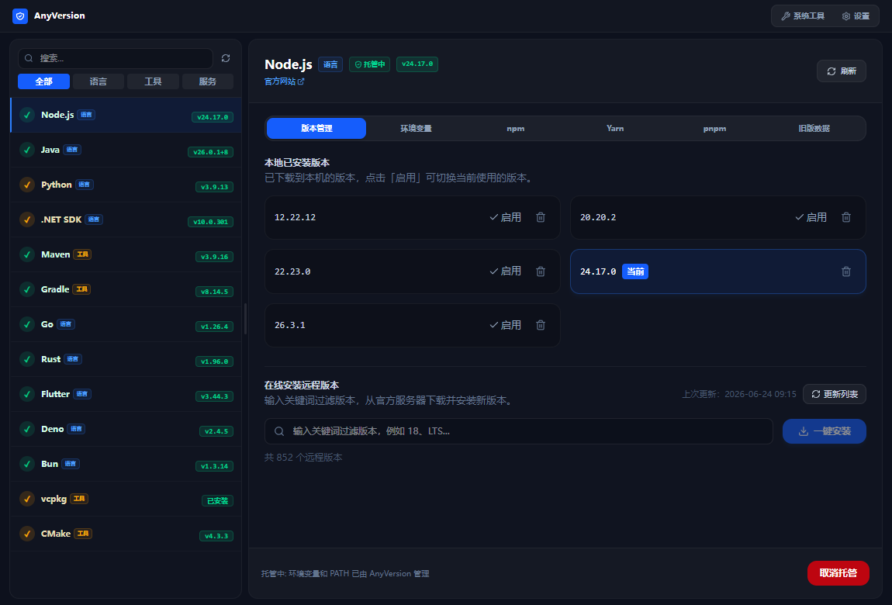
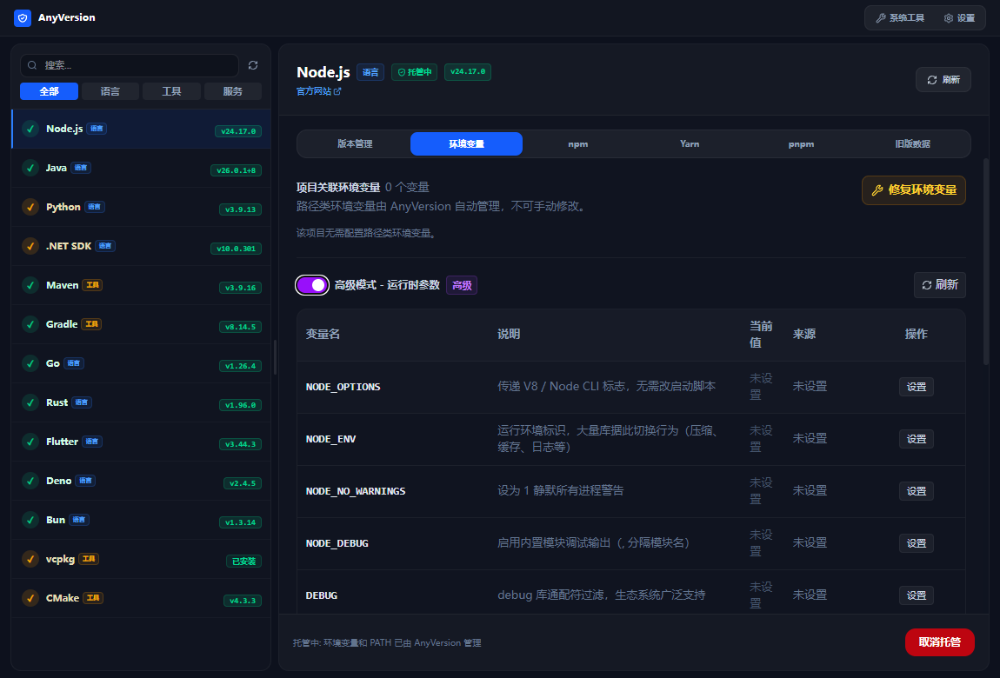
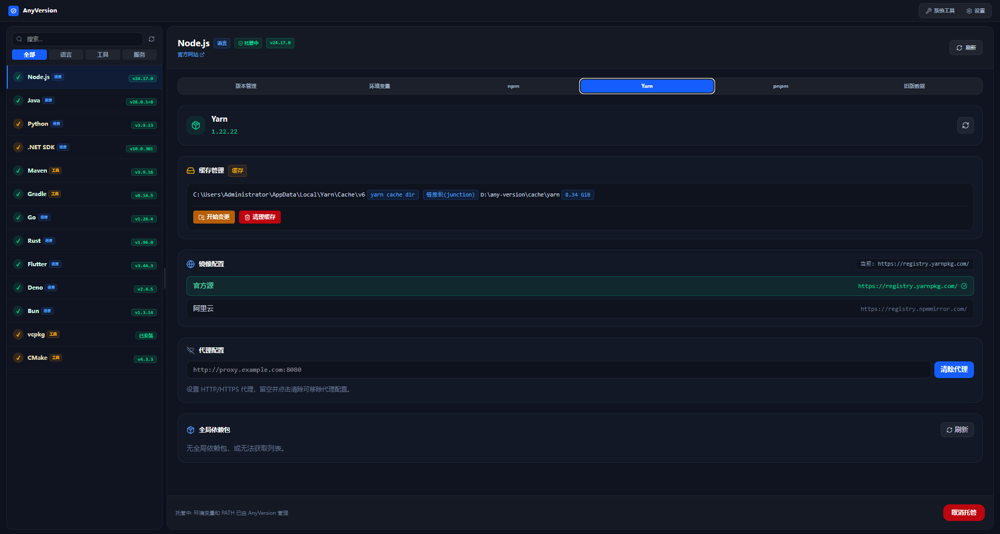
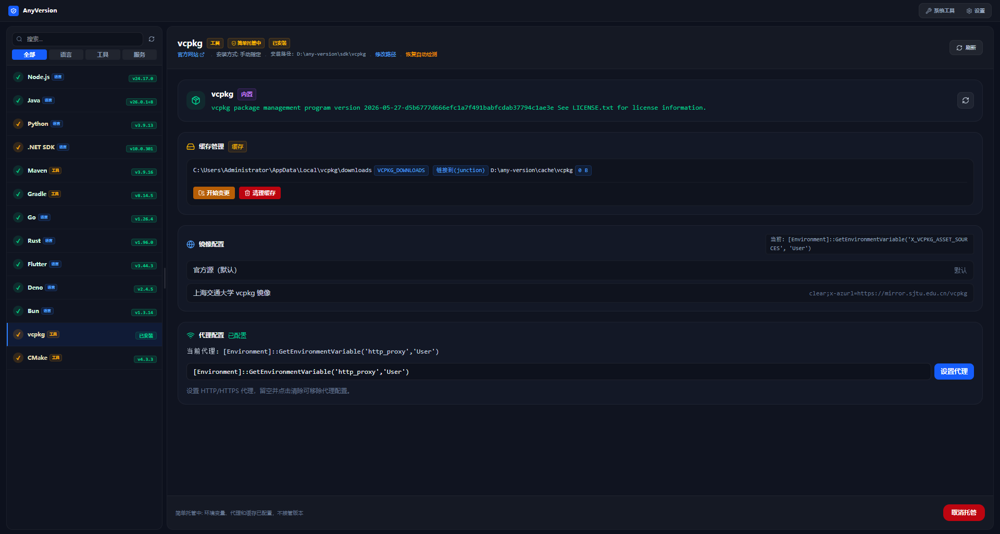
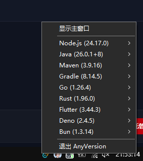

# AnyVersion

<div align="center">

Windows 开发者聚合工具箱 —— 多 SDK 版本管理 · AI Agent 桌面管理 · 代理与协作 · 任务与系统工具

[](https://v2.tauri.app)
[](https://react.dev)
[](https://www.rust-lang.org)
[](LICENSE)

一站式管理开发环境的多版本 SDK、AI 编程助手（Claude Code / Codex / Gemini / Qwen / OpenCode 等 CLI）、
本地代理与协议转换、Agent 间协作派发、任务清单与常用系统工具。

</div>

---

## ✨ 功能特性

### 🧰 版本与运行环境管理
- 🔀 **多版本管理** — 一键切换 Node.js、Java、Python、Go 等 SDK 版本，支持并行安装多个版本
- 🌐 **镜像源切换** — 内置多家镜像源（官方/阿里云/腾讯云），一键切换加速下载
- 🗂️ **缓存管理** — 可视化查看和清理各语言/包管理器的缓存目录
- 📦 **全局包管理** — 查看和管理 npm、yarn、pnpm 等包管理器的全局安装包
- 🔧 **环境变量管理** — 自动管理 PATH 及相关环境变量，支持备份/恢复
- 🔍 **本地安装发现** — 自动扫描系统 PATH、注册表、常见安装目录，发现已有安装
- 🚀 **进程/服务检测** — 通过 sysinfo 枚举运行中的进程和相关系统服务
- 📋 **端口扫描** — 快速扫描占用端口的进程，方便排查端口冲突

### 🤖 AI Agent 桌面管理
- 🛠️ **CLI 工具管理** — 集成 claude-code、codex-cli、gemini-cli、qwencode、opencode、mimocode、deveco 等 7 个 AI 编程 CLI
- ⚙️ **模型配置** — Provider CRUD（20+ 预设含供应商/中转站）、API Key、双 URL（OpenAI + Anthropic）、测速、模型别名映射
- 📊 **用量统计** — Token 统计（输入/输出/总计），按工具 / 模型 / 日期分组可视化
- 🎯 **技能管理** — 本地安装 + skills.sh 市场搜索/安装 + 按工具部署（单一真源 + 各工具 junction 链接）
- 🔌 **本地代理** — 按需启动本地代理（`start_tool_proxy`，随机端口），支持 Anthropic ↔ OpenAI 协议转换、模型别名映射、Cache Injector、Thinking 优化、Media Sanitizer 等中间件

### 💬 协作与任务
- 🤝 **Agent 协作派发（Collab）** — 房间内多工具会话绑定；支持 @唤醒 被动互聊、代理同步委派（派活并拿结果）、消息总线与任务流（open/claimed/in_progress/in_review/done）
- ✅ **任务清单** — 今日 / 复盘 / 日历 / 收集箱视图；优先级、进度、计划日期；今日列表支持**拖拽手动排序**；启动后右下角弹窗显示今日/逾期待办
- 📝 **Markdown 阅读** — 多选项卡、自动发现同目录链接文件并打开、相对链接跳转到新选项卡、右侧大纲

### 🛠️ 系统工具（系统 → 工具）
- 🔔 **通知栏快速切换** — 系统托盘图标常驻，右键菜单一键切换各语言版本
- 📄 **JSON 浏览** — 结构化查看 / 编辑 JSON 文件
- 🌐 **Mihomo 代理** — 内置 Mihomo（Clash 兼容）代理管理
- 📜 **RSS 阅读** — 资讯聚合阅读
- 🖼️ **图片 / 文本工具** — 图片 Base64 互转、JSON/URL 工具、TypeScript Playground、PM2 日志查看、HTTP/RTSP 本地服务、hosts 编辑、证书接收等

## 🖼️ 截图

> 截图位于 `pics/` 目录（部分截图可能对应早期版本管理界面，整体布局可参考）。

### 主界面



### 版本管理



### 镜像源切换



### 缓存与包管理



### 通知栏快速切换



系统托盘常驻，右键菜单即可快速切换各语言版本，无需打开主窗口。

## 🛠️ 技术栈

| 层级 | 技术 |
|------|------|
| **前端** | React 19 · TypeScript · Vite 7 · Tailwind CSS 4 |
| **后端** | Rust 2021 Edition · Tauri 2 |
| **核心依赖（前端）** | react-markdown · remark-gfm · monaco-editor · lucide-react · flag-icons · dompurify |
| **核心依赖（Rust）** | sysinfo · reqwest · serde · winreg · trash · tauri（autostart/dialog/opener/process/updater 插件） |

## 📦 安装

### 前置要求

- [Rust](https://www.rust-lang.org/) (建议 1.75+)
- [Node.js](https://nodejs.org/) (建议 18+)
- [pnpm](https://pnpm.io/) 或 npm

### 从 Release 下载

前往 [GitHub Releases](https://github.com/your-repo/any-version/releases) 页面下载最新版安装包。

### 从源码构建

```bash
# 克隆仓库
git clone https://github.com/your-repo/any-version.git
cd any-version

# 安装前端依赖
pnpm install

# 开发模式运行（Tauri 会自动启动 Vite dev server）
pnpm tauri dev

# 构建生产版本
pnpm tauri build
```

## 🚀 开发指南

### 启动开发环境

```bash
# 终端 1：启动 Vite 开发服务器
pnpm dev

# 终端 2：启动 Tauri 应用（会自动连接 localhost:1420）
pnpm tauri dev
```

### 项目结构

```
any-version/
├── src/                          # 前端 React 代码
│   ├── components/
│   │   ├── ai/                   # AI 模块（模型配置/工具启动/用量/技能/协作 CollabRoom）
│   │   ├── tasks/                # 任务模块（今日/复盘/日历/收集箱/拖拽/提醒弹窗）
│   │   ├── SystemTools/          # 系统工具（JSON 浏览 / Markdown 阅读 / Mihomo）
│   │   ├── project/              # 项目管理
│   │   ├── CacheManager.tsx      # 缓存管理
│   │   ├── MirrorManager.tsx     # 镜像源切换
│   │   ├── PkgManager.tsx        # 全局包管理
│   │   ├── EnvBackupManager.tsx  # 环境变量备份/恢复
│   │   ├── PathEnvManager.tsx    # PATH 环境变量
│   │   ├── PortScanner.tsx       # 端口扫描
│   │   ├── RssReader.tsx         # RSS 阅读
│   │   ├── HttpServer.tsx        # HTTP 服务
│   │   ├── SystemTools.tsx       # 系统工具入口
│   │   ├── GlobalSettings.tsx    # 全局设置
│   │   └── ...
│   ├── App.tsx                   # 主应用与页面路由
│   └── main.tsx                  # 入口文件
├── src-tauri/                    # Tauri 后端（Rust）
│   ├── src/commands/
│   │   ├── ai/                   # AI 配置/工具检测/会话/用量/Skills/代理/协作
│   │   ├── tasks/                # 任务模块的 DB 与命令
│   │   ├── mihomo/               # Mihomo 代理
│   │   ├── file_io.rs            # 文件读写 / 目录 / Markdown 链接解析
│   │   ├── config.rs             # 全局配置（get_base_dir 落点）
│   │   ├── cache.rs / mirror.rs / pkg.rs / env.rs / port.rs / cert.rs / hosts.rs / ...
│   │   └── ...
│   ├── Cargo.toml                # Rust 依赖配置
│   └── tauri.conf.json           # Tauri 应用配置
├── projects.json                 # 运行时定义清单（各语言 SDK 配置）
├── ai-tools/                     # AI 工具元数据
├── projects/                     # 项目数据
├── docs/                         # 文档（含 projects.json Schema 等）
├── dist/                         # 构建输出目录
└── package.json                  # 前端依赖配置
```

### 常用命令

| 命令 | 说明 |
|------|------|
| `pnpm dev` | 启动前端开发服务器 |
| `pnpm build` | 构建前端生产版本 |
| `pnpm preview` | 预览前端生产版本 |
| `pnpm tauri dev` | 启动 Tauri 开发模式 |
| `pnpm tauri build` | 构建 Tauri 生产应用 |
| `pnpm test` | 运行前端单元测试（vitest） |
| `pnpm bump` | 自增应用版本号 |

## 📝 projects.json 配置说明

`projects.json` 是运行时定义清单，位于项目根目录，定义了所有可管理的 SDK/工具。

> 完整的字段说明文档较长，请参考 [**projects.json Schema 文档**](docs/projects-json-schema.md)（待提取）。

### 快速示例（Node.js 条目）

```json
{
  "id": "nodejs",
  "display_name": "Node.js",
  "category": "language",
  "official_website": "https://nodejs.org",
  "version_cmd": "node --version",
  "download_url_template": "https://nodejs.org/dist/v{version}/node-v{version}-win-x64.zip",
  "remote_versions_url": "https://nodejs.org/dist/index.json",
  "package_managers": [
    {
      "id": "npm",
      "display_name": "npm",
      "built_in": true
    }
  ]
}
```

## 🤝 贡献

欢迎提交 Issue 和 Pull Request！

1. Fork 本仓库
2. 创建特性分支 (`git checkout -b feature/AmazingFeature`)
3. 提交更改 (`git commit -m 'Add some AmazingFeature'`)
4. 推送到分支 (`git push origin feature/AmazingFeature`)
5. 打开 Pull Request

## 🙏 致谢

- [Tauri](https://v2.tauri.app) — 优秀的桌面应用框架
- [Scoop](https://scoop.sh) — Windows 包管理器灵感来源
- [open-tag](https://github.com/) — Agent 协作派发与活动展示思路参考
- 各语言官方团队 — 提供优秀的开发工具
